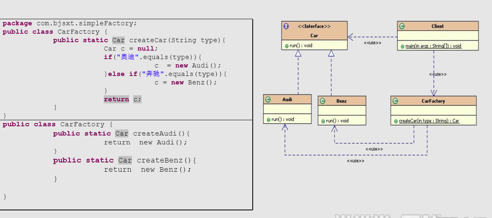
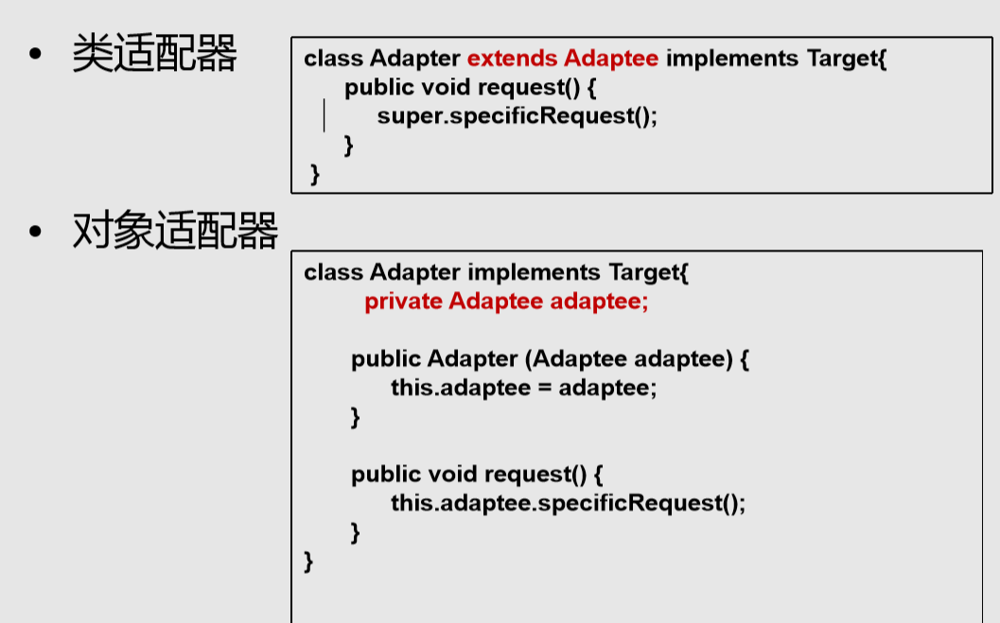
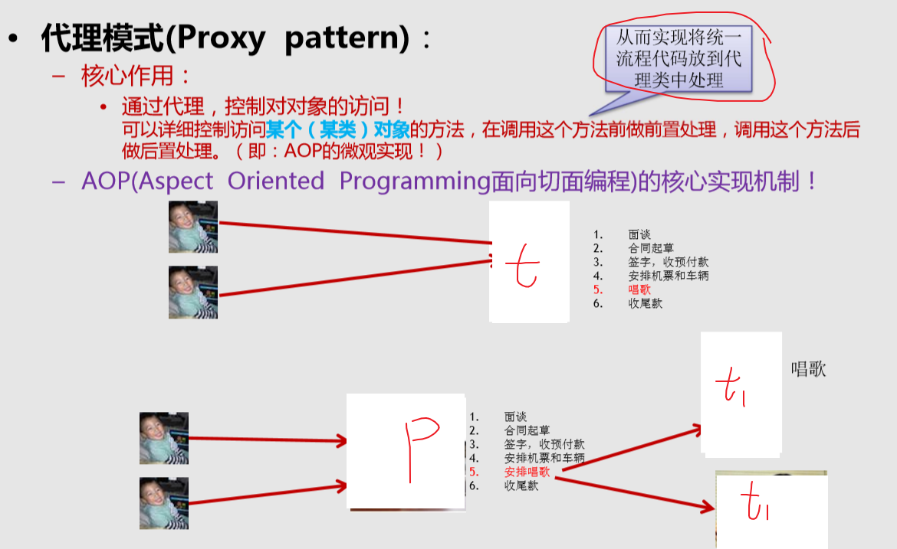
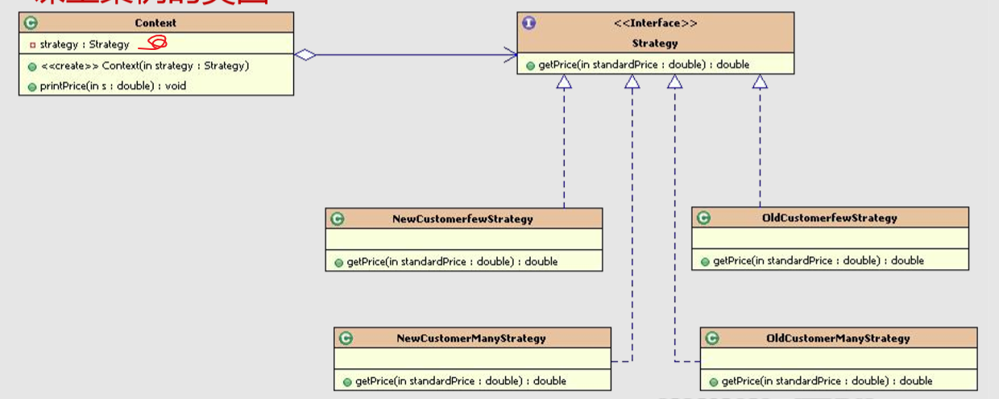

# #0 总起


# ---------------------

# 1 单例

## 1.1 介绍


只创建一个，资源占用大或功能要求只能一个。同时再考虑要不要延时和安全

```
#四个是私有构造方法，不让new创建，然后有私有属性，公开方法中只能new一次
a、构造器私有化 -->避免外部new构造器
b、提供私有的静态属性 -->存储对象的地址
c、提供公共的静态方法 --> 获取属性
```


## 1.2 分类

### 1）饿汉式

```
#啥也不管，直接就创建了对象，浪费
#线程安全，不用担心
```


### 2）懒汉式

```
#同步范围太大了。（如果已经有了对象，按理，不要等待，直接返回，但是没做到）

```


### 3）双重检测锁

```
#锁住 资源XX.class

在方法中，先判断，如果有了对象，直接返回。
然后进入锁块：在判断有没有，然后创建
```


### 4）静态内部类

```
也是可以延迟同时，也是加载类，所以也是安全的
#因为就加载静态块和静态属性（没静态内部类）
```


### 5）枚举

#（不能延迟这样浪费资源）


## 1.3 总结

```
#效率
饿汉式 > 静态内部 ，枚举 > 双重 > 懒汉式

#补充其他知识：当你计数的时候，主线程不会等其他线程，就先执行下一步了，时间

辅助类：CountDownLatch
	同步辅助类，在完成一组正在其他线程中执行的操作之前，它允许一 个或多个线程一直等待。 
	• countDown()  当前线程调此方法，则计数减一
    • await()，   调用此方法会一直阻塞当前线程，直到计时器的值为0

#final CountDownLatch  countDownLatch = new CountDownLatch(threadNum);	 先定几个
```


反射： 关闭安全检查，可以走构造器，（在类中可以在构造器里面，限定一次只能构造，解决）

​					if(instance!=null){
​									throw new RuntimeException();}

反序列化：（在类中，定义readResolve:自动解决）

​				如果类中定义了readResolve()则直接返回此方法指定的对象。而不需要单独再创建新对象！
​				private Object readResolve() throws ObjectStreamException {
​									return instance;}


------


# 2 工厂模式

## 2.1 介绍


```
#OCP：不修改源代码扩充：反射有很大作用
#DIP：不要直接接触，通过接口。
```


## 2.2 分类

### 1）不使用

调用者 和 创建者 有联系 ：（client 和 具体车类）


### 2）简单工厂

```
简单工厂模式也叫静态工厂模式，就是工厂类一般是使用静态方法， 通过接收的参数的不同来返回不同的对象实例

下面两种都是不符合OCP，但是通过反射可以符合
#调用和创建没有联系

#Car c1 = new Factory().createCar(“XX”);
```




### 3）工厂方法

```
在工厂（变接口）里面，再细节工厂
不选这个，个人绝对不实用，（在工厂方面）
	一开始是希望，创建和引用分离，是分离了（并且OCP），但是工厂更多的联系了引用
	#Car c1 = new AudiFactory().createCar();
```


### 4）抽象工厂

```
要一个产品组，算是工厂方法的扩展:多个产品
#等于就是有上面三个产品，两个具体工厂，（一个具体工厂里面完成三个产品创建）
	CarFactory  factory = new LuxuryCarFactory();
	Engine e = factory.createEngine();
	Seat e = factory.createSeat();

```


## 2.3 总结

```
#第一个工厂是类，用于分发选择产品。：不用实例化
#二三都是属于接口，调用要具体工厂。
```


# 3 创造者模式

```
#构造的对象非常复杂，里面有很多小组件。
分成构造Builder  和  装配Director
```


```
#1，实例
```


```
1）Client 只要与飞船类，和构造，装配接口打交道就行。  ：最重要是和装配类打交道（比工厂多了这个）
AirShipDirector director = new SxtAirshipDirector(new SxtAirShipBuilder());
AirShip ship = director.directAirShip();

2）飞船类：
自己有什么私有组件，以及自己有的方法，和get,set。

3）构造 接口 和 实现类：
这个实现类，有点像抽象工厂，一个工厂，有多种流水线，生产不同组件。（但是最后组装了）

4）装配 接口 和实现类：
在构造方法中，传入构造的实现类，
然后决定构造组件，同时装配给飞船类。

```


# 4 原型模式

prototype

```
#1，介绍
new 一个新对象，太耗时间了以及权限，就可以通过克隆
Cloneable接口和clone方法（Obj的本地方法 clone） 

#配合工厂组件的时候，不new  直接clone

#2，分类：深浅克隆
1）浅克隆，原值，修改，克隆的也修改 （简单实现接口方法）
2）深克隆不会：  （还要克隆属性   或者  通过反序列化）
```


```
#3，实现

X x = (X) x.clone()

1） 简单浅克隆
public class Sheep implements Cloneable{   
	private String sname;
	private Date birthday;
	
	@Override
	protected Object clone() throws CloneNotSupportedException {
		Object obj = super.clone();  //直接调用object对象的clone()方法！
		return obj;
	}

2）深克隆 ： 或者通过序列化（实现Serializable接口）
@Override
	protected Object clone() throws CloneNotSupportedException {
		Object obj = super.clone();  
		
		//添加如下代码实现深复制(deep Clone)
		Sheep2 s = (Sheep2) obj;
		s.birthday = (Date) this.birthday.clone();  //把属性也进行克隆！
		
		return obj;
	}

```


# 一-----创建型总结


# ---------------------


# 5 适配器模式

## 5.1 介绍

```
#1， 介绍
1） •什么是适配器模式? 
 – 将一个类的接口转换成客户希望的另外一个接口。Adapter模式使得原 本由于接口不兼容而不能一起工作的那些类可以在一起工作。 
 （电脑要 USB，，，而我的设备是TYPE-C，，）
 （也常常用于，，现在要新代码，，，，而之前老代码也要留着用）
 （InputStreamReader  使用了）
 
2）• 模式中的角色 
– 目标接口（Target）：客户所期待的接口。目标可以是具体的或抽象 的类，也可以是接口。 

– 需要适配的类（Adaptee）：需要适配的类或适配者类。

– 适配器（Adapter）：通过包装一个需要适配的对象，把原接口转换成 目标接口。　
```

## 5.2 分类

```
#有类实现（只能继承用的一次）  和  对象分配器（用了组合：解决多继承，不是组合模式）
```




```
# 以对象的 为例

客户端，，要目标 target 。 但是，只有自己的类。
所以，通过适配器 （实现接口（能够符合客户端目标）， 同时传入自己类的对象，调用方法）
```

#有新的功能，老的还想要，给他加个适配器（适配器，有能目标接口，同时能实现老的任务）


# 6 代理模式

## 6.1 介绍




## 6.2 分类

### 1）静态

```
#代理和真实，都是抽象类的实现，。
#核心就是代理类，传入真实类的实例。
#在流程方法上，调代理方法，核心方法调真实的

Star real = new RealStar();
Star proxy = new ProxyStar(real);
		
proxy.confer();。。。。。
		
		
```


### 2）动态

```
#动态代理(动态生成代理类) ： 运行时，在申请
	• JDK自带的动态代理 

	• javaassist字节码操作库实现 
	• CGLIB 
	• ASM(底层使用指令，可维护性较差)

```


```
#JDK实现
Proxy 是代理，，但实际是Handler去和真实对象交流的
# P 包着 H  ，H中的invoke，进行。 
#调用P.X，，自动去找H中的函数，H在找真实

#或者上面那个图，下面不用自己写Proxy
1）客户端：
Star realStar = new RealStar();
StarHandler handler = new StarHandler(realStar);

Star proxy = (Star)Proxy.newProxyInstance(ClassLoader.getSystemClassLoader(), new Class[]{Star.class}, handler);
		
proxy.sing();

2）Hanlder
public class StarHandler implements InvocationHandler {
	
	Star realStar;
	public StarHandler(Star realStar) {
		this.realStar = realStar;
	}

	@Override
	public Object invoke(Object proxy, Method method, Object[] args)
			throws Throwable {
		Object object = null;
		
		System.out.println("真正的方法执行前！");
		#!!!!!!!!
		if(method.getName().equals("sing")){
			object = method.invoke(realStar, args);
		}
		
		System.out.println("真正的方法执行后！");
		return object;
	}

}
3) 抽象 和 真实类
```


## 6.3 总结

```
#1，
用途广，能够隐藏真实，同时在前后加东西。
动态更好。
```


[详细比较]: https://www.zhihu.com/question/20794107/answer/658139129

```
#2， 面向切面变成介绍 AOP
AOP（Aspect-Oriented Programming，面向切面的编程）
它是可以通过预编译方式和运行期动态代理实现在不修改源代码的情况下
给程序动态统一添加功能的一种技术。
它是一种新的方法论，它是对传统OOP编程的一种补充。

#代理是实现的基础，就是再不改变原来的代码情况下，给所有类同一增加功能，并把一样的流程弄出来
```


# 7 桥接模式

bridge

```
#1, 介绍 ：多维度
多层继承爆炸（多个维度）
（JAVA ，没有一继承多）
```


```
#2，实现
桥接模式核心要点： （处理多层继承结构，处理多维度变化的场景）
	1将各个维度设计成独立的继承结构，使各个维度可以独立的扩展
	2在抽象层建立关联。（一个类，一个接口） 
		#(装饰器是，直接是抽象的子类，并不是同级)
```


```
1）客户端
Computer2  c = new Laptop2(new Lenovo());
c.sale();

2）Brand维度 接口，，以及实现类
public interface Brand {
	void sale();
}

class Lenovo implements Brand {
	@Override
	public void sale() {
		System.out.println("销售联想电脑");
	}	
}

3）类型维度  类型 以及继承类。
public class Computer2 {
	
	private Brand brand;	
	public Computer2(Brand b) {
		this.brand = b;
	}	
	public void sale(){
		brand.sale();
	}

----------------
class Desktop2 extends Computer2 {
	public Desktop2(Brand b) {
		super(b);
	}	
	@Override
	public void sale() {
		super.sale();                  //brand维度方法
		System.out.println("销售台式机"); //类型维度方法
	}
}
```


```
#3, 总结
```


# 8 组合模式

composite

```
#1, 介绍
目的：只是想实现客户端可以统一方式处理 部分和整体（树状结构）

核心： 
– 抽象构件(Component)角色: 定义了叶子和容器构件的共同点 
– 叶子(Leaf)构件角色：无子节点 
– 容器(Composite)构件角色： 有容器特征，可以包含子节
```

#组合(是指，不能继承多，然后用对象解决)和组合模式不一样


```
#2，实现：
（因为list，，然后遍历，，所以具有有天然递归）
#不管容器还是叶子，统一对待。 有一个共同方法


1）抽象构建
public interface AbstractFile {
	void killVirus();  //杀毒
}

2）叶子 
class ImageFile implements AbstractFile {
	private String name;
	
	public ImageFile(String name) {
		this.name = name;
	}

	@Override
	public void killVirus() {
		System.out.println("---图像文件："+name+",进行查杀！");
	}
	
}
3）容器
class Folder implements AbstractFile {
	private String name;
	//定义容器，用来存放本容器构建下的子节点
	private List<AbstractFile> list = new ArrayList<>();
	
	public Folder(String name) {
		this.name = name;
	}

	public void add(AbstractFile file){
		list.add(file);
	}
	public void remove(AbstractFile file){
		list.remove(file);
	}
	public AbstractFile getChild(int index){
		return list.get(index);
	}

	@Override
	public void killVirus() {  //天然递归
		System.out.println("---文件夹："+name+",进行查杀");		
		for (AbstractFile file : list) {
			file.killVirus();
		}		
	}	
}

```


```
#3，总结
在树状结构上，统一对待的。 应用十分广泛
```


# 9 装饰模式

decorator

```
#1，介绍
目的：
动态的为对象增加新的功能而已
无需继承，就可以扩展对象新功能（要继承的话。得有一个功能就继承一下）
（真实与装饰器关联关系，代替继承，避免类体系膨胀）
```


```
#2，实现
-Component抽象构件角色： 
	• 真实对象和装饰对象有相同的接口。这样，客户端能够以与真实对象相同的方式同装饰与对象交互。
– ConcreteComponent 具体构件角色(真实对象)：
	
– Decorator装饰角色： 
• 持有一个抽象构件的引用。装饰对象接受所有客户端的请求，并把这些请求转发给真实的对象 。这样，就能在真实对象调用前后增加新的功能。

– ConcreteDecorator具体装饰角色： 

```


```
1） 客户端
Car car  = new Car();
car.move();				
FlyCar flycar = new FlyCar(car);
flycar.move();
AIcar aicar = new AIcar(new FlyCar(car) ); // 多重装饰，一起把功能加上

2）抽象
public interface ICar {
	void move();
}

3）真实 //ConcreteComponent 
class Car implements ICar {
	@Override
	public void move() {
		System.out.println("陆地上跑！");
	}
}

3）装饰 //Decorator装饰角色
abstract class SuperCar implements ICar {
	protected ICar car;
	public SuperCar(ICar car) {

		this.car = car;
	}
	@Override
	public void move() {
		car.move();
	}
}

4）具体装饰角色 //ConcreteDecorator
class FlyCar extends SuperCar {

	public FlyCar(ICar car) {
		super(car);
	}
	
	public void fly(){
		System.out.println("天上飞！");
	}

	@Override
	public void move() {
		super.move();  // 抽象装饰的，然后再具体的组件的方法
		fly();			//附加功能
	}	
}


```


```
#3,总结
```

1）


2）


3）


4）和桥接比较

```
#都是一定程度，解决子类过多，继承问题。
a桥接是同种维度，只是相互联系而已。
把两维度的不同东西合起来。

b装饰都是继承同一抽象组件，为了实现统一管理，（抽象装饰和具体饰）
并且再是真实组件给抽象装饰联系
然后，真实装饰，可以运行真实组件，以及附加的功能
```

1.桥接模式对象自身有 沿着多个维度变化的趋势 , 本身不稳定; 
2.装饰者模式对象自身非常稳定, 只是为了增加新功能/增强原功能。 


# 10 外观模式

facade

```
#1, 介绍
– 为子系统提供统一的入口。封装子系统的复杂性，便于客户端调用。
# 迪米特法则(最少知识原则)：
– 一个软件实体应当尽可能少的与其他实体发生相互作用。
```


```
#2，实现
new RegisterFacade().register();
在那个入口，new所有对象，并且调用方法。
客户端。只用从入口调用一个方法就行
```


```
#3，总结
和代理区别：
代理是有真实对象和代理对象之分，并且都是一个接口下来的。
同时，调用自己方法，在调用真实方法。

这个可以说，全是真实的。（并且不用把真实对象传进去，自己创建）

--开发很常用
JDBC封装后的，commons提供的DBUtils类， Hibernate提供的工具类、Spring JDBC工具类等
```


# 11 享元模式

flyweight

```
#1，介绍
#空间换时间
• 场景：
– 内存属于稀缺资源，。如果有很多个完全相同或相似的对象，

• 核心： 
– 享元模式以共享的方式高效地支持大量细粒度对象的重用。
– 享元对象能做到共享的关键是区分了内部状态和外部状态。
	• 内部状态：可以共享，不会随环境变化而改变 
	• 外部状态：不可以共享，会随环境变化而改变
```


```
#2，实现
– FlyweightFactory享元工厂类 
• 创建并管理享元对象，享元池一般设计成键值对（MAP，k有获v没有建）

– FlyWeight抽象享元类 
• 通常是一个接口或抽象类，声明公共方法，这些方法可以向外界提供对象 的内部状态，设置外部状态。  (自己是内部状态，，同时可以传入外部)

– ConcreteFlyWeight具体享元类 
• 为内部状态提供成员变量进行存储

– UnsharedConcreteFlyWeight非共享享元类 
• 不能被共享的子类可以设计为非共享享元类
```


```
1) 客户端
# 工厂 看 map,,有就返回，没有就创建
ChessFlyWeight chess2=ChessFlyWeightFactory.getChess("黑");

#挂上外部状态
chess1.display(new Coordinate(10, 10));
```


```
#3，总结
享元模式开发中应用的场景： 
– 享元模式由于其共享的特性，可以在任何“池”中操作， 
比如：线程池、数据库连接池。 – String类的设计也是享元模式

 优点 
 – 相同或相似对象内存中只存一份，极大的节约资源，
 – 外部状态相对独立，不影响内部状态 
 
缺点
 – 模式较复杂，使程序逻辑复杂化 
 – 时间换取了空间。
```


# 二-----创建型总结


# ---------------------


# 12 责任链

chain of responsibility

```
#1，介绍
处理流程的，不用if else  在一个大文件。
核心思想就是，自己处理，处理不了给下家。
```


```
#2, 实现
批假条。

1） 抽象类：
自己一些属性，下一个是谁，设定下一个对象方法，抽象处理的方法

2）具体类：
实现抽象类：  if 能处理，就处理，，else 下一家

3）客户端：
先创建具体类，然后把他们串起来，，然后在传入请求，让一个处理
```


```
#3，总结
-改进：
运用反射，解析进去

-添加新的对象：
由于责任链的创建完全在客户端，因此新增新的具体处理者对原有类 库没有任何影响，只需添加新的类，然后在客户端调用时添加即可。 符合开闭原则。

-模式：
1）如上的链表定义
2）非链表： 集合数组。（更好）

```


# 13 迭代器

iterator

```
#1, 介绍
目的：
提供一种可以遍历聚合对象的方式。又称为：游标cursor模式 

– 聚合对象：存储数据 
– 迭代器：遍历数据
```


```
#2，实现

把数据变成聚合对象，在外部定义迭代器接口
内部实现迭代器类。

1）客户端：
ConcreteMyAggregate cma = new ConcreteMyAggregate();
cma.addObject("aa");
		
MyIterator iter =cma.createIterator();
while(iter.hasNext()){
	System.out.println(iter.getCurrentObj());
	iter.next();}

2）迭代器接口：
主要定义
属性：
是否有下一个hasNext()，游标指向第一个，指向下一个next()

方法：获取游标当前对象

3）聚合Aggregate类：
核心
list，，存对象的。
内部实现类：可以直接用聚合类属性。（加个游标，放这里安全，接口不行）
返回聚合类，和 迭代器类。

public class ConcreteMyAggregate {
	private List<Object> list = new ArrayList<Object>();

	public void addObject(Object obj){
		this.list.add(obj);
	}
	public void removeObject(Object obj){
		this.list.remove(obj);
	}

	public List<Object> getList() {
		return list;
	}

	public void setList(List<Object> list) {
		this.list = list;
	}
	
	
	//获得迭代器
	public MyIterator  createIterator(){
		return new ConcreteIterator();
	}
	
	
	
	//使用内部类定义迭代器，可以直接使用外部类的属性
	private class ConcreteIterator implements MyIterator {

		private int cursor;  //定义游标用于记录遍历时的位置
		
		@Override
		public void first() {
			cursor = 0;
		}

		@Override
		public Object getCurrentObj() {
			return list.get(cursor);
		}

		@Override
		public boolean hasNext() {
			if(cursor<list.size()){
				return true;
			}
			return false;
		}

		
		@Override
		public void next() {
			if(cursor<list.size()){
				cursor++;
			}
		}		
	}	
}

```


```
#3，总结
• 基本案例： 
– 实现正向遍历的迭代器 
– 实现逆向遍历的迭代器

• 开发中常见的场景： 
– JDK内置的迭代器(List/Set)：list<–容器<--实现iteror接口
```


# 14 中介者模式

mediator

```
#1, 介绍：
每两个对象，都需要来回交互，这样太乱了。
提出来一个，上级，同事级分别和上级 交互
	同事含有只含有上级，上级含有所有同事
```


```
#2, 实现

1）客户端
Mediator m = new President();		
Market   market = new Market(m);
market.selfAction();
market.outAction();

2）同事：接口和实现
核心：
含有中介
自己的方法，和其他都是交互的方法  
在构造方法，指向中介，用中介注册自己，

public void outAction() {
System.out.println("X");
m.command("finacial");  // 调用中介，与其他部门交互
		
	}

public void selfAction() {
}                     // 自己的方法
	
3）中介： 接口和实现
核心：
有map,一一对应。
交互方法，和注册
private Map<String,Department> map = new HashMap<String , Department>();
	
@Override
public void command(String dname) {
map.get(dname).selfAction();}
@Override
public void register(String dname, Department d) {
map.put(dname, d);}

```


```
#3，总结
开发中常见的场景：
（都是对象，过于多，然后过于相互打交道）
– MVC模式(其中的C，控制器就是一个中介者对象。M和V都和他打交 道)
– 窗口游戏程序，窗口软件开发中窗口对象也是一个中介者对象 – 图形界面开发GUI中，多个组件之间的交互，可以通过引入一个中介者 对象来解决，可以是整体的窗口对象或者DOM对象

– Java.lang.reflect.Method #invoke()
```


# 15 命令模式

commad  

```
#1, 介绍
和代理差不多，只不过是有了三层。
是上级 通过中间，，和下级交流
```


```
#2 实现
```


```
1）客户端：
Command c = new ConcreteCommand(new Receiver());
Invoke i = new Invoke(c);
i.call();

2）Invoke
private Command command;   //也可以通过容器List<Command>容纳很多命令对象，进行批处理。数据库底层的事务管理就是类似的结构！

public Invoke(Command command) {
this.command = command;} 
	
	//业务方法 ，用于调用命令类的方法
public void call(){
command.execute();}

3) command 和具体实现类：
具体实现类，包含 reciever类，并且调用自己的方法，实际就是调用它的方法
```


```
#3，总结
主要是能够屯一起处理数据。
开发中常见的场景： 
– Struts2中，action的整个调用过程中就有命令模式。 
– 数据库事务机制的底层实现 
– 命令的撤销和恢复
```


# 16 解释器和访问者

## 1）解释器


”1+2X3“  


## 2）访问者


```
#1，
就是希望，不改变元素结构下，定义不同的操作。（不同东西操作不同）
```


```
#2，实现

1）客户端：
ObjectStructure os = new ObjectStructure();
Hero zhuang = new ZhuangHero();
Hero zhen = new ZhenHero();
os.addHero(zhuang);
os.addHero(zhen);

Player visitorMe = new PlayerMe();
Player visitorOthers = new PlayerOthers();
// 让访问者访问对象结构中的元素  遍历
os.action(visitorMe);  //里面写元素原来的方法，或者想加的方法
os.action(visitorOthers);


对于元素新方法，不用修改元素，，只要传入不同类。
```


# 17 策略模式

```
#1，介绍
创建多个对象， 差不多的处理。
（和责任链区别，就是都是平级，不是一个个往下处理
#你传什么，我操作什么。
#避免了，条件语句
```


```
#2，实现
就是上下文（传入具体对象）
策略对象

1）客户端
Strategy s1 = new OldCustomerManyStrategy();
Context ctx = new Context(s1);
ctx.pringPrice(998);
```



```
#3，总结
简单代理模式中，代理类知道被代理类的行为，因为代理类与被代理类实现的是同一个接口，因此代理类与被代理类的结构是相同的； 

而策略模式中，策略容器并不知道内部策略的详细信息，因为容器并没有实现与内部策略相同的接口，即容器与内部策略只是简单的组合关系，容器只是将内部策略的行为抽取出来，进行了统一的实现。 
```


# 18 模板方法

```
抽象父类定义好，就需要变得部分，用抽象方法。同时不可修改流程
```


#可以子类配合匿名  new X () {}


# 19 状态模式

```
#1，介绍
一个东西，有好多状态，不同状态，不同行为

和策略区别：
虽然都有上下文，但是本上下文，还可以来回修改状态，状态之间是要转换的。
```


```
#2，实现：

客户端，上下文，具体状态类

1）客户端
HomeContext ctx = new HomeContext();
ctx.setState(new FreeState());

2）上下文
接受状态，转换状态（并操作）

3）状态

```


```
#3
```


# 20 观察者模式

```
#1，介绍
就是广播，不断同步给大家
```


```
#2，实现

1）自己实现

#就是有Subject 类：
需要的属性和观察者对象，加入和移除观察者方法，通知方法
以及set（改变属性时候，遍历通知观察者）
通知方法：调用obs 的更新方法

#Obs:
需要的属性
update，，更新自己

```


```
2）自带的 
java.util.Observable;  sub
java.util.Observer;    obs

#客户端：
//创建目标对象Obserable
ConcreteSubject subject = new ConcreteSubject();
		
//创建观察者
ObserverA obs1 = new ObserverA();
ObserverA obs2 = new ObserverA();

//将上面三个观察者对象添加到目标对象subject的观察者容器中
subject.addObserver(obs1);
subject.addObserver(obs2);

//改变subject对象的状态
subject.setState(3000);
System.out.println("===============状态修改了！");
//观察者的状态发生了变化
System.out.println(obs1.getMyState());
System.out.println(obs2.getMyState());


# sub
//目标 对象
public class ConcreteSubject extends Observable {	
	private int state; 
	
public void setState(int s){
		state = s;  //目标对象的状态发生了改变		
		setChanged();  //表示目标对象已经做了更改
		notifyObservers(state);  //通知所有的观察者}
public int getState() {
		return state;}


# obs
public class ObserverA implements Observer {
private int myState;
public void update(Observable o, Object arg) {
		myState = ((ConcreteSubject)o).getState();
	}

public int getMyState() {
		return myState;}

public void setMyState(int myState) {
		this.myState = myState;}

	
```

#3


# 21 备忘录模式

```
#1，介绍
就是能撤销，（因为你自己把对象保存成另一个类对象了）

```


```
#2，实现

负责人掌管所有的备忘点，而源是备份或恢复靠备忘点
1）客户端：
CareTaker taker = new CareTaker();
Emp emp = new Emp("a", 18, 900);
System.out.println("第一次："+emp.getEname())
		
taker.setMemento(emp.memento());   //备忘一次
		
emp.setAge(38);
emp.setEname("b");
emp.setSalary(9000);
System.out.println("第二次打印对象："+emp.getEname());
		
emp.recovery(taker.getMemento()); //恢复到备忘录对象保存的状态
		
		System.out.println("第三次打印对象："+emp.getEname()+"---"+emp.getAge()+"---"+emp.getSalary());
		

2）源：
有自己的属性。
实现了保存成另一个类
从之前另一个类恢复
。。。。
public class Emp {
	private String ename;
	private int age;
	private double salary;
	
	
	//进行备忘操作，并返回备忘录对象
	public EmpMemento  memento(){
		return new EmpMemento(this);
	}
		
	//进行数据恢复，恢复成制定备忘录对象的值
	public void recovery(EmpMemento mmt){
		this.ename = mmt.getEname();
		this.age = mmt.getAge();
		this.salary = mmt.getSalary();
	}

2) 备忘点
public class EmpMemento {
	private String ename;
	private int age;
	private double salary;
	
	
	public EmpMemento(Emp e) {
		this.ename = e.getEname();
		this.age = e.getAge();
		this.salary = e.getSalary();
	}

3）负责人
public class CareTaker {
	
	private EmpMemento memento;
	public EmpMemento getMemento() {
		return memento;
	}
	public void setMemento(EmpMemento memento) {
		this.memento = memento;
	}
	
	
```

```
#负责人：

1）多了可以用list 
private List<Memento> list = new ArrayList<>();

2）较多
```


# 三-----行为型总结


# ---------------------