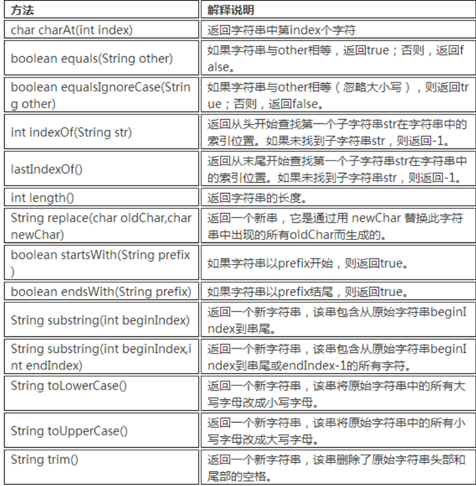
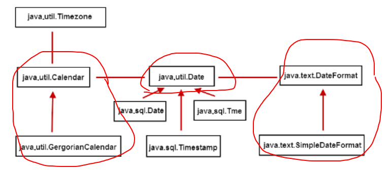
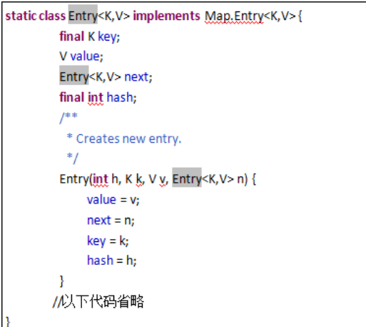

本笔记以尚学堂java课为基础。

https://www.sxt.cn/Java_jQuery_in_action/Billiards_Games.html


# 1.  Java 入门

## 1.1 版本

```
JavaSE(Java Standard Edition)：标准版
#个人计算机

JavaEE(Java Enterprise Edition)：企业版
#服务器

JavaME(Java Micro Edition)：微型版
#消费性小电子产品（已基本不用）
```


## 1.2 特性

```
跨平台：在哪都一样
#字节码在运行时通过JVM（JAVA虚拟机）做一次转换生成机器指令

安全性

面向对象

简单性：C++-将C++的一些内容去掉；比如：头文件，指针运算，结构，联合，操作符重载，虚基类等等

高性能：现在优化了，效率不再是问题

分布式：因为它能够处理TCP/IP协议

多线程：

健壮性：吸收了C/C++ 语言的优点，但去掉了其影响程序健壮性的部分（如：指针、内存的申请与释放等）。
#不可能造成计算机崩溃，即使程序错误，可以抛出异常，然后通过异常处理机制
```


## 1.3 机制

```
#计算机高级语言的类型主要有编译型和解释型两种，而Java 语言是两种类型的结合。

先写.java 源程序。再用编译器javac编译成字节码文件（.class），再利用虚拟机（JVM）解释运行
```


```
#JVM、JRE和JDK

1，JVM(Java Virtual Machine) 就是一个虚拟的用于执行bytecode字节码的”虚拟计算机”。
	#定义了指令集、寄存器集、结构栈、垃圾收集堆、内存区域。
	#JVM负责将Java字节码解释运行，边解释边运行，这样，速度就会受到一定的影响。
	#不同系统不同JVM

2，Java Runtime Environment (JRE) 包含：Java虚拟机、库函数、运行Java应用程序所必须的文件。

3，Java  Development Kit (JDK)包含：包含JRE，以及增加编译器和调试器等用于程序开发的文件。


 ·如果只是要运行Java程序，只需要JRE就可以。JRE通常非常小，其中包含了JVM。
 ·如果要开发Java程序，就需要安装JDK。
```


## 1.4 程序

```
#如果想安装双环境，网上有，到时候只用修改环境变量就行
	JAVA_HOME
	%JAVA_HOME%\bin
```

```
#第一个程序
public  class  Welcome{
    public static void main(String[] args){
        System.out.println("Hello Java!我是尚学堂学员，程许愿");
    }
}
#文件名必须和Welcome一致，保存为Welcome.java （编码用ASCI）
#cd 文件目录，运行javac Welcome.java  得编译文件Welcome.class （扩展名别隐藏了）
#java  Welcome，解释运行
```

```
大小写敏感

一个JAVA文件可以定义多个类，但是只能一个public，且名字同
	#有几个类，编译出几个.class文件

main方法是入口
	#固定格式：public static void main(String[] args){}

语句以{}一个整体，以分号断开，因此可以语句跨行

缩进，成对编程。
```


## 1.5 DOS


```
dir /?
#查看有啥参数
#例dir -Q  :使用参数
```


## 1.6 Eclipse

```
1,new java project
	#src:源码java文件
	#bin:字节码.class文件
2,src new 类class(.java文件)
	#自动给编译了在bin的.class
	#写那个第一个程序，右键run as（Ctrl + F11） 运行
	

ctrl + 左键 查看源码 
左键    描述
·	F12	固定
ctrl + / 注释该行
f4 ：看继承
ctrl + shift +o   导入import
alt  + shift +s   开个快速构造和重写equals和get/set方法等功能
alt  + shift +r   Rename
alt  + ?		  写名字，出提示
```


------

------


# 2. 类型和运算符

## 2.1 注释

```
#注释不会出现在字节码文件中，即Java编译器编译时会跳过注释语句。
#Java，主要分为单行注释、多行注释和文档注释。


单行注释：  使用“//”开头，“//”后面的单行内容均为注释。

多行注释：   以“/*”开头以“*/”结尾，在“/*”和“*/”之间的内容为注释，我们也可以使用多行注释作为行内注释。但是在使用时要注意，多行注释不能嵌套使用。

文档注释：   以“/**”开头以“*/”结尾，注释中包含一些说明性的文字及一些JavaDoc标签(后期写项目时，可以生成项目的API)
```


## 2.2 标识符

```
#标识符是用来给变量、类、方法以及包进行命名的。

标识符其它部分可以是字母、下划线“_”、美元符“$”和数字的任意组合。
标识符必须以字母、下划线_、美元符号$开头。

Java不采用通常语言使用的ASCII字符集，而是采用Unicode这样标准的国际字符集。因此，这里字母的含义不仅仅是英文，还包括汉字等等。
#一般不用中文

	#Java 标识符大小写敏感，且长度无限制。
	#标识符不可以是Java的关键字。
```


```
#标识符的使用规范
包　： （全部小写，由域名定义）

类  ：（单词首字母大写）

方法和变量： （第一个单词小写，从第二个单词开始首字母大写，驼峰）

常量  ： （全部大写加下划线）


```


关键字：


## 2.3 变量 

本质：

```
本质：“可操作的存储空间”，空间位置确定，里面是什么不确定。
	#通过变量名来访问空间

Java是强类型语言，每个变量都必须声明其数据类型。
#类型决定了变量占据存储空间的大小。 

变量作为程序中最基本的存储单元，
其要素包括变量名，变量类型和作用域。
变量在使用前必须对其声明, 只有在变量声明以后，才能为其分配相应长度的存储空间。

#[]中的内容为可选项，即可有可无
数据类型  变量名  [=初始值] [,变量名  [=初始值]…];
 #double  salary;，一般一行一个，可以定义赋值在一行。
 
 	/*每个变量都有类型，类型可以是基本类型，也可以是引用类型。
	变量名必须是合法的标识符
	变量声明是一条完整的语句，因此每一个声明都必须以分号结束*/
```


类型：

局部变量、成员变量和静态变量


```
1，局部变量(local  variable)
#局部变量在使用前必须先声明、赋初值再使用。

{} or 方法

public void test() {
   int i;
   int j = i+5 ; // 编译出错，变量i还未被初始化 
} 
  
public void test() {
   int i;
   i=10;
   int j = i+5 ; // 编译正确
}

2，成员变量（也叫实例变量  member variable）
#如果不自行初始化，它会自动初始化成该类型的默认初始值。

类内，方法外
```


​			                引用类型					   |						null

```
3，静态变量（类变量 static variable）
#使用static定义。
#如果不自行初始化，与成员变量相同会自动初始化成该类型的默认初始值
```

```
综合
/**
 * 测试变量
 */
public class TestVariable {
    int a;        //成员变量, 从属于对象； 成员变量会自动被初始化
    static  int  size;   //静态变量，从属于类     
    public static void main(String[] args) {
        {
            int age;        //局部变量，从属于语句块；
            age = 18;
        }         
        int salary = 3000;    //局部变量，从属于方法
        int gao = 13;
        System.out.println(gao); 
        int i;
    //    int j = i + 5; // 编译出错，变量i还未被初始化
         
    }
}
```


## 2.4 常量

```
#常量通常指的是一个固定的值

#一般将1、2、3、’a’、’b’、true、false、”helloWorld”等称为字面常量，而使用final修饰的PI等称为符号常量。

在Java语言中，主要是利用关键字final来定义一个常量。 常量一旦被初始化后不能再更改其值。

final  type  varName = value;
```


## 2.5 数据类型

1，基本：

```
Java是一种强类型语言，每个变量都必须声明其数据类型。 
两大类：基本数据类型（primitive data type）和引用数据类型（reference data type）。
```


```
#Boolean是位，其他都是字节。

#3类8种基本数据类型：数值型 byte short int long float double
字符型 char 布尔型 boolean 

#引用数据类型的大小统一为4个字节，记录的是其引用对象的地址！
```


2，整型：

```
整型用于表示没有小数部分的数值，它允许是负数
#与机器无关
```


```
#范围
127 --- 3W-----20亿---2**63
```

```
#整型常量四种表示
十：
八：015
十六：0xa
二：0b1011
```

```
#长整型声明：
整型常数默认为int型，声明long型常量可以后加‘ l ’或‘ L ’

long a = 55555555;  //编译成功，在int表示的范围内(21亿内)。
long b = 55555555555;//不加L编译错误，已经超过int表示的范围。

#一般这样
long b = 55555555555L;
```


3, 浮点：


```
float:1+8+23
（大于int,long）
float类型又被称作单精度类型，尾数可以精确到7位有效数字，
double表精度约是float类型的两倍，又被称作双精度类型，
绝大部分应用程序都采用double类型。浮点型常量默认类型也是double
```

```
#表示：
十进制：3.14
科学计数：314e2  314E-2
```

```
#赋值：
float类型的数值有一个后缀F或者f ，没有后缀F/f的浮点数值默认为double类型。

float  f = 3.14F;
double d1  = 3.14;
```

```
#比较：
二进制浮点数不能精确的表示0.1这样10的负次幂。
并不是所有的小数都能可以精确的用二进制浮点数表示
(舍入误差)
如果需要进行不产生舍入误差的精确浮点计算，需要使用BigDecimal类。

#java.math包下面的两个有用的类：BigInteger和BigDecimal，
	 BigDecimal bd = BigDecimal.valueOf(1.0);
	 bd2.equals(bd1)
```


4, 字符型：

```
单引号来表示字符
	在Unicode编码表中的字符
	2个字节，可允许有65536个字符
	从’\u0000’到’\uFFFF’之间的十六进制值来表示（u-Unicode） 
（直接打印是'a'）--16进制：'\u0061';

```

```
#转义 \
```


```
字符串 " "
 #" ”+'a’+'b’  不然后面自动UNCOIDE 值('a'+'b'得U值)
 
 #(int)’a'  or  0+'a’====变数字
```


5，boolean：

```
boolean类型有两个常量值，true和false，
在内存中占一位（不是一个字节），不可以使用整数表示
```


## 2.6 运算符

1，分类：


2，算术：

```
二元规则：
#1
整数：
有long 为 long，没有全是int （即使操作数全为short，byte）
浮点：
有double 为double，只有全是f，才是f
（f+整数=f）

#2
取模：和左边运算符号同。

一元规则：
++a,a++（会改变a值）
```

3，赋值扩展：

```
a+=1——a=a+1
```

4,  关系：

```
= 与 ==
==、!= 是所有（基本和引用）数据类型都可以使用
> 、>=、 <、 <= ：数值和char
```

5，逻辑：


```
#逻辑里面赋值会有改变原来值。。
```

6 ，位运算：


```
#存的都是补码
	正三合一，负的原和补码相互转化，方法一样：符号位不变，其他取反，然后最后加1.
	
#>>>：无符号右移。
	第一个（符号位）也移动，最后前面补0.（这时候变源码）

#>>,<< ：只能整数除乘2取整。（把值展开，左移1位，就等于所有都乘了2，=和乘2）
	第一个不管，移动后面的。最后前面正数补0，负数补1

#&和|和^既是逻辑运算符，也是位运算符。
	两侧操作数都是boolean类型，就作为逻辑运算符。
	如果两侧的操作数是整数类型，就是位运算符。
```

7, 字符串连接符：

```
“+”操作数中只要有一个是字符串，系统自动将另一个转换为字符串然连接。
```

```
a=" 3 ” 
	#a+3+2=332 
    #3+2+a =53    如果后面有运算先* 、/ 

d='a’
	#直接print显示字符a
	#d+4 =101显示数字(没long，就成int)
```

8， 条件运算：

```
x ? y : z
```

9，优先级：


```
#优先小括号组织
#逻辑非>逻辑与>逻辑或
```


## 2.7 转化

基本数据类型的类型：

1，自动：


（虚线代表可能有精度损失）


```
# 整数默认int,浮点默认double。
	#L or F

#分常量变量

1）整型常量：
赋值的是常量，只要表示的数大小，不超过被赋值的变量，就不会报错。
	#浮点和LONG不能向整型（int以及以下）
	#浮点内也不逆向
	
2）变量：
不管有没有超过，就是不能自动逆向赋值变量。
```


2，强制：

```
#不能在布尔类型和任何数值类型之间做强制类型转换

强制类型转换，又被称为造型，用于显式的转换一个数值的类型。
#在有可能丢失信息下进行的转换是通过造型来完成的，但可造成精度低溢出。

#处理刚刚那个自动的，不让他报错（但是结果可能不精确或溢出）

double x  = 3.14; 
int nx = (int)x;  


```


3，转化出错：

	在运算中，赋值前，先看看本身这个值有没有溢出
		#溢出L（数）或者（long）（变量）：int 表示要小于20亿左右


​	
​	int money = 1000000000; //10亿
​	int years = 20;
​	//返回的total是负数，超过了int的范围
​	int total = money*years;
​	System.out.println("total="+total);
​	
​	//返回的total仍然是负数。默认是int，因此结果会转成int值，再转成long。但是已经发生了数据丢失（后面已经超过范围，没效果）
​	long total1 = money*years; 
​	System.out.println("total1="+total1);
​	
​	//返回的total2正确:先将一个因子变成long，整个表达式发生提升。全部用long来计算。
​	long total2 = money*((long)years); 
​	System.out.println("total2="+total2);


​	
​	#四舍五入：
​	使用Math.round(1.8)实现 =2


## 2.8 键盘输入

```
import  java.util.Scanner;

Scanner   scanner =  new Scanner(System.in);
String   name =  scanner.nextLine();
int       age = scanner.nextInt();
```


------


# 3. 控制语句

## 3.1 选择结构

```，不能字符串
1，if 单选择：
	if( ) {}
	
2,if  多选择：
、	if( ) {}
	else if () {}
	else {}
#任何情况都可以用，区间和值

3,switch :
	switch () {
	case num1 :
		action;
		[break;]
	
	case num2 :
		action;
		[break;]
	
	[default:
	 	action;]
	
	}
#只能用值： 
	1.5以前只能整数（char也行）（long不行）或者枚举，不能字符串。
	1.7以后可以字符串
#没写break就接着运行下去。

/*

Math.random [0,1)
(int)( 2*Math.random)—-0 ,1

&&  (java不能 1 < x <2)

ctrl + 左键 查看源码 
ctrl + / 注释该行
```


## 3.2 循环结构

```
#当型（while , for ）和直到型(do-while)

1,while:
	while (布尔表达式) {
    	循环体;
	}

2,for:
	for (初始表达式; 布尔表达式; 迭代因子) {
     	 循环体;
	}
# Java里能用到逗号运算符的地方屈指可数，其中一处就是for循环的控制表达式(多个东西)
/*
全局变量，局部能用，且能修改。
局部不能定义全局有的了，且过了不能引用*/

3,do-while:
	do {
     	   循环体;
    	 } while(布尔表达式) ; (有这个分号)
    	 


#println  print
```


```
#break 和contine

1，一般的:
b全跳过，c跳本次

2，带标签的:
#java的标签就在循环前面（不像C的goto的标签）
b,调到标签，并且结束，C调到标签，接着运行下一次。
        outer: for (int i = 101; i < 150; i++) {
            for (int j = 2; j < i / 2; j++) {
                if (i % j == 0){
                    continue outer;
                }
            }
         }

```


## 3.3 块和方法

```
#方法就是像有名字的语句块
	块可以被嵌套在另一个块中，但是不能两个嵌套的块内声明同名的变量。
	语句块可以使用外部的变量，而外部不能使用语句块中定义的变量，
	#形参和实参类型变量转化。（注意转化情况）

一个JAVA文件，一个public class
一个main方法的入口	
其他方法：

	申明在类中，

	引用：不能直接引用，通过先new对象，调用普通方法
		#Test  t1   = new Test() ;
	或者static 方法不用new对象。
	//因为main，也是static函数，不能直接非函数。
	
[修饰符1  修饰符2  …]   返回值类型    方法名(形式参数列表){
    Java语句；… … …
 }
 
 public class Test20 {
    /** main方法：程序的入口 */
    public static void main(String[] args) {
        int num1 = 10;
        int num2 = 20;
        //调用求和的方法：将num1与num2的值传给add方法中的n1与n2
        // 求完和后将结果返回，用sum接收结果
        int sum = add(num1, num2);
        System.out.println("sum = " + sum);//输出：sum = 30
        //调用打印的方法：该方法没有返回值
        print();
    }
    /** 求和的方法 */
    public static int add(int n1, int n2) {
        int sum = n1 + n2;
        return sum;//使用return返回计算的结果
    }
    /** 打印的方法 */
    public static void print() {
        System.out.println("北京尚学堂...");
    }
}

return作用：
	返回值或者作为函数结束（可直接结束函数，不加后面）
```


```
#形参实参 
 Java中进行方法调用中传递参数时，遵循值传递的原则(传递的都是数据的副本)：（改变，不修改原来）
 	基本类型传递的是该数据值的copy值。
	引用类型传递的是该对象引用的copy值，但指向的是同一个对象。
```


## 3.4 重载

```
返回值(int func1  double func1)和形参名不同不构成重载（int n1,int n2）。
```


## 3.5 递归

```
1，结构
递归头
	什么时候结束
递归体
	什么时候调用


2，其他
#return 两个做个返回值，或者拿来结束函数	
#时间 ：System.currentTimeMills()  
#printf("%s,%n”,a,b);
	long n  其他整形：d
	
3，
任何能用递归解决的问题也能使用迭代解决。

当递归方法可以更加自然地反映问题，并且易于理解和调试，并且不强调效率问题时，可以采用递归;

在要求高性能的情况下尽量避免使用递归，递归调用既花时间又耗内存。
```


------

------


# 4.面向对象（上）

## 4.1 基本概念

```
#1 过程（PO），对象（OO）区别：
宏观上使用面向对象把握，微观处理上仍然是面向过程。

面向对象具有三大特征：封装性、继承性和多态性，而面向过程没有继承性和多态性，并且面向过程的封装只是封装功能，而面向对象可以封装数据和功能

#2 对象发展
数据无管理（简单）----数组管理（部门）---对象（项目）
	对象也可是一种数据结构（属性和方法在一起）
	是一个内存块。
#光有属性，是结构体。

```


```
#3 概念
类：我们叫做class。 对象：我们叫做Object,instance(实例)。
```

```
#3.1实例
// 每一个源文件必须有且只有一个public class，并且类名和文件名保持一致！
public class Car { 
}
class Tyre { // 一个Java文件可以同时定义多个class
}
class Engine {
}
class Seat {
}

对于一个类来说，一般有三种常见的成员：属性field、方法method、构造器constructor。这三种成员都可以定义零个或多个

public class SxtStu {
    //属性（成员变量）
    int id;
    String sname;
    int age;  
    //方法
    void study(){
        System.out.println("我正在学习！");
    }  
    //构造方法
   SxtStu(){
   }
}
```

```
#3.2属性和方法

属性不初始化，默认值，是2.3中的成员变量所列出来的。

面向过程中，函数是最基本单位，整个程序由一个个函数调用组成。
面向对象中，整个程序的基本单位是类，方法是从属于类和对象的。
```

```
class Computer {
    String brand;  //品牌
}
public class SxtStu {
    // field
    int id;
    String sname;
    int age;
    Computer comp;
    void study() {
        System.out.println("我正在学习！使用我们的电脑，"+comp.brand);
    }
    SxtStu() {
    }
    public static void main(String[] args) {
        SxtStu stu1 = new SxtStu();
        stu1.sname = "张三";
        Computer comp1 = new Computer();
         comp1.brand = "联想";
        stu1.comp = comp1;
        stu1.study();
    }
}
```


## 4.2 内存分析

```
#1，介绍
Java虚拟机的内存可以分为三个区域：栈stack、堆heap、方法区method area（也在堆里面）。

栈：
	JVM每个线程一个栈，存放该线程执行所有方法的信息（实参，局变等）
	每个方法被调用会创建个栈帧（局变，方法出口，操作数）
	
	线程私有不共享
	先进后出
	自动分配，速度快，连续内存空间

堆：
	JVM只有一个堆，所有线程共享
	堆用于存储创建好的对象和数组(数组也是对象)
	堆是一个不连续的内存空间，分配灵活，速度慢

方法区(静态区)：
	JVM只有一个方法区，被所有线程共享
	方法区实际也是堆，只是用于存储类、常量相关的信息
	用来存放程序中永远是不变或唯一的内容。(类信息【Class对象】、静态变量、字符串常量等)
```


```
#2，过程

1）
先是加载类相关信息和常量，在方法区。
2）
然后找main方法，在栈。
	一开始stu=null,然后构造方法，也开启一个栈帧，new一个对象。
3）
对象在堆里面，有地址，再赋值给stu地址，接下来一系列属性赋值。

4）
c1，也是同上栈帧

5）
构造器完了，删掉。全完了，所有东西都删了。
```


## 4.3 构造方法

```
#1，概念
#用于对象初始化
要点：
　　1. 通过new关键字调用
　　2. 构造器虽然有返回值，但是不能定义返回值类型(返回值的类型肯定是本类)，不能在构造器里使用return返回某个值（但可写return）。
　　3. 如果我们没有定义构造器，则编译器会自动定义一个无参的构造函数。如果已定义则编译器不会自动添加
　　4. 构造器的方法名必须和类名一致
```

```
class Point {
    double x, y;
    public Point(double _x, double _y) {
        x = _x;
        y = _y;  
    }
    public double getDistance(Point p) {
        return Math.sqrt((x - p.x) * (x - p.x) + (y - p.y) * (y - p.y));
    }
}
public class TestConstructor {
    public static void main(String[] args) {
        Point p = new Point(3.0, 4.0);
        Point origin = new Point(0.0, 0.0);
        System.out.println(p.getDistance(origin));
    }
}
#_x，，避免了形参和外面参数就近原则，出错。
#构造第一句都是super(),没用可省略。
```

```
#2，重载
public class User {
    int id; // id
    String name; // 账户名
    String pwd; // 密码
    public User() { 
    }
    public User(int id, String name) {
        super();
        this.id = id;
        this.name = name;
    }
    public User(int id, String name, String pwd) {
        this.id = id;
        this.name = name;
        this.pwd = pwd;
    }
    public static void main(String[] args) {
        User u1 = new User();
        User u2 = new User(101, "高小七");
        User u3 = new User(100, "高淇", "123456");     
    }
}
```

```
#构造中，形参名与属性名相同时，需要使用this关键字区分属性与形参。
	for，是全局和局部区别(修改了，变化)，
	函数是实参和形参区别（成员局部，可多次int）
```


## 4.4 垃圾回收

```
#Garbage Collection：Java引入了垃圾回收机制，令C++程序员最头疼的内存管理问题迎刃而解

#1，原理和算法

内存管理：
	很大程度是对象管理：空间分配（new）和释放(null)。

过程：
	发现无用对象和回收无用对象。
	
/*垃圾回收机制保证可以将“无用的对象”进行回收。
无用的对象指的就是没有任何变量引用该对象。
重点是Java的垃圾回收器通过相关算法发现无用对象*/

算法：
1）引用计数：堆中每个对象都有一个引用计数，引用加1，到0，则无用
	但是循环互相引用在这个方法无解。（虽然假如二者都是null，已经无用，但是引用是1）

2）引用可达法(根搜索算法)：
	程序把所有的引用关系看作一张图，从一个节点GC ROOT开始，寻找对应的引用节点，找到这个节点以后，继续寻找这个节点的引用节点，当所有的引用节点寻找完毕之后，剩余的节点则被认为是没有被引用到的节点，即无用的节点。
```


```
#2，通用的分代垃圾回收机制
不同的对象的生命周期是不一样的，不同生命周期的对象可以采取不同的回收算法

年轻代、年老代、持久代（在方法区）

JVM将堆内存划分为 Eden、Survivor 和 Tenured/Old 空间

1)
年轻代
所有新生成的对象首先都是放在Eden区。 年轻代的目标就是尽可能快速的收集掉那些生命周期短的对象，对应的是Minor GC，每次 Minor GC 会清理年轻代的内存，算法采用效率较高的复制算法，频繁的操作，但是会浪费内存空间。当“年轻代”区域存放满对象后，就将对象存放到年老代区域。

年老代
在年轻代中经历了N(默认15)次垃圾回收后仍然存活的对象，就会被放到年老代中。因此，可以认为年老代中存放的都是一些生命周期较长的对象。年老代对象越来越多，我们就需要启动Major GC和Full GC(全量回收)，来一次大扫除，全面清理年轻代区域和年老代区域。

持久代
用于存放静态文件，如Java类、方法等。持久代对垃圾回收没有显著影响。

2)
Minor GC:
用于清理年轻代区域。Eden区满了就会触发一次Minor GC。清理无用对象，将有用对象复制到“Survivor1”、“Survivor2”区中(这两个区，大小空间也相同，同一时刻Survivor1和Survivor2只有一个在用，一个为空)

Major GC：
用于清理老年代区域。

Full GC：
用于清理年轻代、年老代区域。 成本较高，会对系统性能产生影响。
```


```
过程：
1、新创建的对象，绝大多数都会存储在Eden中，
2、当Eden满了（达到一定比例）不能创建新对象，则触发垃圾回收（GC），将无用对象清理掉，
 然后剩余对象复制到某个Survivor中，如S1，同时清空Eden区。
3、当Eden区再次满了，会将S1中的不能清空的对象存到另外一个Survivor中，如S2，
同时将Eden区中的不能清空的对象，也复制到S2中，保证Eden和S1，均被清空。
4、重复多次(默认15次)Survivor中没有被清理的对象，则会复制到老年代Old(Tenured)区中，
5、当Old区满了，则会触发一个一次完整地垃圾回收（FullGC），之前新生代的垃圾回收称为（minorGC）
```


```
#3，JVM调优和FULL GC
在对JVM调优的过程中，很大一部分工作就是对于Full GC的调节。
有如下原因可能导致Full GC：
　　1.年老代(Tenured)被写满
　　2.持久代(Perm)被写满
　　3.System.gc()被显式调用（程序建议GC启动，不不一定能调用GC，看它同意不）
　　4.上一次GC之后Heap的各域分配策略动态变化
　　

#4, 内存泄露
创建大量无用对象(比如，我们在需要大量拼接字符串时，使用了String而不是StringBuilder。)

静态集合类的使用(像HashMap、Vector、List等的使用最容易出现内存泄露，这些静态变量的生命周期和应用程序一致，所有的对象Object也不能被释放)

各种连接对象(IO流对象、数据库连接对象、网络连接对象)未关闭

监听器的使用(释放对象时，没有删除相应的监听器)

要点：
　1. 程序员无权调用垃圾回收器。
　2. 程序员可以调用System.gc()，该方法只是通知JVM，并不是运行垃圾回收器。尽量少用，会申请启动Full GC，成本高，影响系统性能。
　3. finalize方法，是Java提供给程序员用来释放对象或资源的方法，但是尽量少用。
```


## 4.5 this

```
#1, 对象创建的过程和this的本质:

构造方法是创建Java对象的重要途径，通过new关键字调用构造器时，构造器也确实返回该类的对象，但这个对象并不是完全由构造器负责创建。创建一个对象分为如下四步：
	1分配对象空间，并将对象成员变量初始化为0或空
	2执行属性值的显示初始化
	3执行构造方法
	4返回对象的地址给相关的变量

（构造一直没结束，对象和属性一系列可用this指代）
#this的本质就是“创建好的对象的地址”! 由于在构造方法调用前，对象已经创建。因此，在构造方法中也可以使用this代表“当前对象” 。

#2, this最常的用法：
　　1在程序中产生二义性之处，应使用this来指明当前对象;普通方法中，this总是指向调用该方法的对象。构造方法中，this总是指向正要初始化的对象。
　　2使用this关键字调用重载的构造方法，避免相同的初始化代码。但只能在构造方法中用，并且必须位于构造方法的第一句。
　　3this不能用于static方法中。
```

```
#1）
public class User {
    int id;        //id
    String name;   //账户名
    String pwd;   //密码
 
    public User() {
    }
    public User(int id, String name) {
        System.out.println("正在初始化已经创建好的对象："+this);
        this.id = id;   //不写this，无法区分局部变量id和成员变量id
        this.name = name;
    }
    public void login(){
        System.out.println(this.name+",要登录！");  //不写this效果一样
    }  
     
    public static void main(String[] args) {
        User  u3 = new User(101,"高小七");
        System.out.println("打印高小七对象："+u3);
        u3.login();
    }
}
#this 和 u3 打印是同个地址
```


```
#2）
public class TestThis {
    int a, b, c;
    TestThis() {
        System.out.println("正要初始化一个Hello对象");
    }
    TestThis(int a, int b) {
        // TestThis(); //这样是无法调用构造方法的！
        this(); // 调用无参的构造方法，并且必须位于第一行！
       // a = a;// 这里都是指的局部变量而不是成员变量
// 这样就区分了成员变量和局部变量. 这种情况占了this使用情况大多数！
        this.a = a;
        this.b = b;
    }
    TestThis(int a, int b, int c) {
        this(a, b); // 调用带参的构造方法，并且必须位于第一行！
        this.c = c;
    }
 
    void sing() {
    }
    void eat() {
        this.sing(); // 调用本类中的sing();,写不写都行。
        System.out.println("你妈妈喊你回家吃饭！");
    }
 
    public static void main(String[] args) {
        TestThis hi = new TestThis(2, 3);
        hi.eat();
    }
}
```


## 4.6 static

```
在类中，用static声明的成员变量为静态成员变量，也称为类变量。 
类变量的生命周期和类相同，在整个应用程序执行期间都有效
 
	1. 为该类的公用变量，属于类，被该类的所有实例共享，在类被载入时被显式初始化。
　　2. 对于该类的所有对象来说，static成员变量只有一份。被该类的所有对象共享
　　3. 一般用“类名.类属性/方法”来调用。(也可以通过对象引用或类名(不需要实例化)访问静态成员。)
　　4. 在static方法中不可直接访问非static的成员。

类函数和实例函数：
类函数要引用实例函数，先new。不能用this。
实例函数，随便类函数，写不写this也随便

#要点：
static: 能自己调自己变量和方法。不能非静态
非静态可以随意静态，
```

```
public class User2 {
    int id; // id
    String name; // 账户名
    String pwd; // 密码
    static String company = "北京尚学堂"; // 公司名称
  
    public User2(int id, String name) {
        this.id = id;
        this.name = name;
    }
     
    public void login() {
        printCompany();
        System.out.println(company); 
        System.out.println("登录：" + name);
    }
     
    public static void printCompany() {
//         login();//调用非静态成员，编译就会报错
        System.out.println(company);
    }
     
    public static void main(String[] args) {
        User2 u = new User2(101, "高小七");
        User2.printCompany();
        User2.company = "北京阿里爷爷";
        User2.printCompany();
    }
}

#this只能用在非方法。
```


## 4.7 静态初始块

```
构造方法用于对象的初始化!静态初始化块，用于类的初始化操作!在静态初始化块中不能直接访问非static成员。

1. 上溯到Object类，先执行Object的静态初始化块，再向下执行子类的静态初始化块，直到我们的类的静态初始化块为止。
2. 构造方法执行顺序和上面顺序一样!!

public class User3 {
    int id;        //id
    String name;   //账户名
    String pwd;   //密码
    static String company; //公司名称
    static {
        System.out.println("执行类的初始化工作");
        company = "北京尚学堂";
        printCompany();
    }  
    public static void printCompany(){
        System.out.println(company);
    }  
    public static void main(String[] args) {
        User3  u3 = new User3();
    }
}
```


## 4.8 参数传值

```
Java中，方法中所有参数都是“值传递”，也就是“传递的是值的副本”。 
也就是说，我们得到的是“原参数的复印件，而不是原件”。因此，复印件改变不会影响原件。（大体不会变，但是细节变了，变化 和python一样）

	基本数据：不会改变
	引用类型：传递的是地址，地址指向同一个东西。
```

```
public class User4 {
    int id;        //id
    String name;   //账户名
    String pwd;   //密码
       
    public User4(int id, String name) {
        this.id = id;
        this.name = name;
    }
      
    public   void   testParameterTransfer01(User4  u){
        u.name="高小八";
    }
     
    public   void   testParameterTransfer02(User4  u){
        u  =  new  User4(200,"高三");
    }
      
    public static void main(String[] args) {
        User4   u1  =  new User4(100, "高小七");
         
         //会修改，小的变了
        u1.testParameterTransfer01(u1); 
        System.out.println(u1.name);
 		
 		//不会，指向另一个地址，大的变了
        u1.testParameterTransfer02(u1);
        System.out.println(u1.name);
    }
}
#真正解释：U，被赋值U1的所含的地址，最后U被清除。U1还是原来地址。
```


## 4.9 包

```
包机制是Java中管理类的重要手段。 
同名的类，通过包解决类重名，也可以实现对类的有效管理。 
包对于类，相当于文件夹对于文件的作用。
```


```
#1，建包
　通常是类的第一句非注释性语句。
  包名：域名倒着写即可，再加上模块名，便于内部管理类。

#com.gao和com.gao.car，这两个包没有包含关系，是两个完全独立的包
# 写项目时都要加包，不要使用默认包 package cn.sxt;
```

```
#2，JDK主要包
```


```
#3，导入
本包下，类随便直接用。

不同包：import（使得可以直接用类名调用）
#Java会默认导入java.lang包下所有的类，因此这些类我们可以直接使用。
#如果导入两个同名的类，只能用包名+类名来显示调用相关类（引用写完整）


#静态导入：（1.5以后）可以直接使用静态属性：例如Math.PI,变成PI
package cn.sxt;
 //以下两种静态导入的方式二选一即可
import static java.lang.Math.*;//导入Math类的所有静态属性
import static java.lang.Math.PI;//导入Math类的PI属性
 
public class Test2{
    public static void main(String [] args){
        System.out.println(PI);
        System.out.println(random());
    }
}
```


------

------


# 5.面向对象（下）

面向对象的三大特征：继承、封装、多态

另外还包括抽象类、接口、内部类等概念


## 5.1 继承

```
#1, 基本概念
1）实现：
class Student extends Person{}

2）要点：
	1 Java中类没有多继承（不像C++），接口有多继承。
	2 类继承父类，可得父的全属性方法 (除了父构造)，但不一定可直接访问(比如，父类私有的属性和方法)。
	3 默认继承java.lang.Object

3）instanceof是二元运算符，左边是对象，右边是类；
	是本身或者子类的对象都行。true
```

```
#2, 重写（override）
 子类通过重写父类的方法，可以用自身的行为替换父类的行为。
 方法的重写是实现多态的必要条件。
      1. “==”： 方法名、形参列表相同。

      2.“≤”：返回值类型和声明异常类型，子类小于等于父类。

      3.“≥”： 访问权限，子类大于等于父类。
```

```
#快捷键
f4 ：看继承
alt + shift +s 开个快速构造和重写equals和get/set方法等功能
```

```
#3，Object类
Object类是Java类的根基类，意味着所有对象都拥有Object类的属性方法

1）toString方法
源码：
public String toString() {
    return getClass().getName() + "@" + Integer.toHexString(hashCode());
}

System.out.println(t)=System.out.println(t.toString())
#一般对象可以不写，默认打印的是一连串16地址。

2) ==和equals
重写用快捷选择就行。
“==”代表比较双方是否相同。如果是基本类型则表示值相等，如果是引用类型则表示地址相等即是同一个对象。

Object类中定义有：public boolean equals(Object obj)方法，提供定义“对象内容相等”的逻辑（自己修改想要比较的东西）

#后者更松，前者要同一个东西。
 JDK提供的一些类，如String、Date、包装类等，重写了Object的equals方法，调用这些类的equals方法， x.equals (y) ，当x和y所引用的对象是同一类对象且属性内容相等时（并不一定是相同对象），返回 true 否则返回 false。
```

```
#4，super
1）
super是直接父类对象的引用。可以通过super来访问父类中被子类覆盖的方法或属性。

使用super调用普通方法，语句没有位置限制，可以在子类中随便调用。

若是构造方法的第一行代码没有显式的调用super(...)或者this(...);那么Java默认都会调用super(),含义是调用父类的无参数构造方法。这里的super()可以省略。

public class TestSuper01 { 
    public static void main(String[] args) {
        new ChildClass().f();
    }
}
class FatherClass {
    public int value;
    public void f(){
        value = 100;
        System.out.println ("FatherClass.value="+value);
    }
}
class ChildClass extends FatherClass {
    public int value;
    public void f() {
        super.f();  //调用父类对象的普通方法
        value = 200;
        System.out.println("ChildClass.value="+value);
        System.out.println(value);
        System.out.println(super.value); //调用父类对象的成员变量
    }
}
```


```
2）继承树追溯
构造方法调用顺序：
      构造方法第一句总是：super(…)来调用父类对应的构造方法。所以，流程就是：先向上追溯到Object，然后再依次向下执行类的初始化块和构造方法，直到当前子类为止。
	  #子--->父-->obj    里面包obj，向外构造，先obj构造
      注：静态初始化块调用顺序，与构造方法调用顺序一样，不再重复。

属性/方法查找顺序：(比如：查找变量h)
      1. 查找当前类中有没有属性h
      2. 依次上溯每个父类，查看每个父类中是否有h，直到Object
      3. 如果没找到，则出现编译错误。
      4. 上面步骤，只要找到h变量，则这个过程终止。
```


## 5.2 封装

```
高内聚，低耦合

（可以给属性一些条件限制）

#访问控制和一些细节两部分
	谁能访问和赋值条件
```

```
#1）访问控制
在整个项目下src—包---文件--类
	import只是可以简便引用，能不能引用还要看。
	属性方法类

Java是使用“访问控制符”来控制哪些细节需要封装，哪些细节需要暴露的。
```


```
#public 类不能重，文件内其他类可以和包内其它类重名，重了覆盖
```

```
#2） 一些细节
1. 一般使用private访问权限。
2.  提供相应的get/set方法来访问相关属性，这些方法通常是public修饰的，以提供对属性的赋值与读取操作(注意：boolean变量的get方法是is开头!)。
3. 一些只用于本类的辅助性方法可以用private修饰，希望其他类调用的方法用public修饰。
```

```
#JavaBean封装实例
public class Person {
    // 属性一般使用private修饰
    private String name;
    private int age;
    private boolean flag;
    // 为属性提供public修饰的set/get方法
    public String getName() {
        return name;
    }
    public void setName(String name) {
        this.name = name;
    }
    public int getAge() {
        return age;
    }
    public void setAge(int age) {
        this.age = age;
    }
    public boolean isFlag() {// 注意：boolean类型的属性get方法是is开头的
        return flag;
    }
    public void setFlag(boolean flag) {
        this.flag = flag;
    }
}
```

```
#封装实例
class Person {
    private String name;
    private int age;
    public Person() {
 
    }
    public Person(String name, int age) {
        //this.name = name;
        // this.age = age;//构造方法中不能直接赋值，应该调用setAge方法
        setAge(age);
    }
     
    public void setName(String name) {
        this.name = name;
    }
    public String getName() {
        return name;
    }
    public void setAge(int age) {
        //在赋值之前先判断年龄是否合法
        if (age > 130 || age < 0) {
            this.age = 18;//不合法赋默认值18
        } else {
            this.age = age;//合法才能赋值给属性age
        }
    }
    public int getAge() {
        return age;
    }
    @Override
    public String toString() {
        return "Person [name=" + name + ", age=" + age + "]";
    }
}
 
public class Test2 {
    public static void main(String[] args) {
        Person p1 = new Person();
        //p1.name = "小红"; //编译错误
        //p1.age = -45;  //编译错误
        p1.setName("小红");
        p1.setAge(-45);
        System.out.println(p1);
         
        Person p2 = new Person("小白", 300);
        System.out.println(p2);
    }
}
```


## 5.3 多态

多态指的是同一个方法调用，由于对象不同可能会有不同的行为

```
多态的要点：
      1. 多态是方法的多态，不是属性的多态(多态与属性无关)。
      2. 多态的存在要有3个必要条件：继承，方法重写，父类引用指向子类对象。
      3. 父类引用指向子类对象后，用该父类引用调用子类重写的方法，此时多态就出现了。
```

```
#1)
class Animal {
    public void shout() {
        System.out.println("叫了一声！");
    }
}
class Dog extends Animal {
    public void shout() {
        System.out.println("旺旺旺！");
    }
    public void seeDoor() {
        System.out.println("看门中....");
    }
}
class Cat extends Animal {
    public void shout() {
        System.out.println("喵喵喵喵！");
    }
}
public class TestPolym {
    public static void main(String[] args) {
        Animal a1 = new Cat(); // 向上可以自动转型
        //1传的具体是哪一个类就调用哪一个类的方法。大大提高了程序的可扩展性。
        animalCry(a1);
        Animal a2 = new Dog();
        animalCry(a2);//a2为编译类型，Dog对象才是运行时类型。
         
        //2编写程序时，如果想调用运行时类型的方法，只能进行强制类型转换。
        // 否则通不过编译器的检查。
        Dog dog = (Dog)a2;//向下需要强制类型转换
        dog.seeDoor();
    }
 
    // 有了多态，只需要让增加的这个类继承Animal类就可以了。
    static void animalCry(Animal a) {
        a.shout();
    }
 
    /* 如果没有多态，我们这里需要写很多重载的方法。
     * 每增加一种动物，就需要重载一种动物的喊叫方法。非常麻烦。
    static void animalCry(Dog d) {
        d.shout();
    }
    static void animalCry(Cat c) {
        c.shout();
    }*/
}
```

```
#我们可以看出多态的主要优势是提高了代码的可扩展性，符合开闭原则。但是多态也有弊端，就是无法调用子类特有的功能

没有多态的话：就要重载了。一个类，一个重载方法。有了父类引用指向子类对象，（JVM判断）

编译傻，运行聪明			
			编译虽然过了，但是运行是啥还是啥
			#Animal a2 = new Dog();
			
			如果调用Dog方法，编译不知道，直接报错，因而需要转型。
 			
```

```
#2）转型
1父类引用指向子类对象，我们称这个过程为向上转型，属于自动类型转换。
#向上转型后的父类引用变量只能调用它编译类型的方法，不能调用它运行时类型的方法。
#这时，我们就需要进行类型的强制转换，我们称之为向下转型
```

```
public class TestCasting {
    public static void main(String[] args) {
        Object obj = new String("北京尚学堂"); // 向上可以自动转型
        // obj.charAt(0) 无法调用。编译器认为obj是Object类型而不是String类型
        /* 编写程序时，如果想调用运行时类型的方法，只能进行强制类型转换。
         * 不然通不过编译器的检查。 */
        String str = (String) obj; // 向下转型
        System.out.println(str.charAt(0)); // 位于0索引位置的字符
        System.out.println(obj == str); // true.他们俩运行时是同一个对象
    }
}
```

```
2在向下转型过程中，必须将引用变量转成真实的子类类型(运行时类型)否则会出现类型转换异常ClassCastException
（是啥必须转化成啥（一步到位，或者它的几代父亲也行）） instanceof 判断
	Object obj = new Student();
	Person  b = (Person) obj;
	Student a = (Student) obj;
```


```
public +static+ final/abstract + class/interface/ +void +...
```


## 5.4 final

```
1.修饰变量: 被他修饰的变量不可改变。一旦赋了初值，就不能被重新赋值。
final  int   MAX_SPEED = 120;

2.修饰方法：该方法不可被子类重写。但是可以被重载
final  void  study(){}

3.修饰类: 修饰的类不能被继承。比如：Math、String等。
final   class  A {}
```


## 5.5 抽象

```
#1 抽象方法
abstract修饰的方法，没有方法体，只有声明。定义的是一种“规范”，就是告诉子类必须要给抽象方法提供具体的实现。

#2 抽象类
包含抽象方法的类就是抽象类。（有就一定要抽象类）
```

```
//抽象类
abstract class Animal {
    abstract public void shout();  //抽象方法
}
class Dog extends Animal { 
    //子类必须实现父类的抽象方法，否则编译错误
    public void shout() {
        System.out.println("汪汪汪！");
    }
    public void seeDoor(){
        System.out.println("看门中....");
    }
}
//测试抽象类
public class TestAbstractClass {
    public static void main(String[] args) {
        Dog a = new Dog();
        a.shout();
        a.seeDoor();
    }
}
```

```
#3 抽象类的使用要点:
     1有抽象方法的类只能定义成抽象类
     2抽象类不能实例化，即不能用new来实例化抽象类。
     3抽象类可以包含属性、普通方法、构造方法。但是构造方法不能用来new实例，只能用来被子类调用。

     4抽象类只能用来被继承。
     5抽象方法必须被子类实现。
```

提供规范模板，必须实现相关抽象方法


## 5.6 接口

```
#1 概念
1）接口就是比“抽象类”还“抽象”的“抽象类”
	普通类：具体实现
    抽象类：具体实现，规范(抽象方法)
	接口：规范

2）接口和实现类不是父子关系，是实现规则的关系
  如果是…（实现类）则必须能（接口）
接口是两个模块之间通信的标准，“面向接口”的思想来设计系统
```

```
#2 定义实现
1）
[访问修饰符]  interface 接口名   [extends  父接口1，父接口2…]  {
常量定义；  
方法定义；
}
2）
 a. 访问修饰符：只能是public或默认。                   !!!!!!
 b. 接口名：和类名采用相同命名机制。
 
 c. extends：接口可以多继承。
 
 d. 常量：接口中的属性只能是常量，总是：public static final 修饰。不写也是。
 e. 方法：接口中的方法只能是：public abstract。 省略的话，也是public abstract。
 
3)
 子类通过implements来实现接口中的规范。
 接口不能创建实例，但是可用于声明引用变量类型。
 
 一个类实现了接口，必须实现接口中所有的方法，并且这些方法只能是public的。
 
 JDK1.7之前，接口中只能包含静态常量、抽象方法，不能有普通属性、构造方法、普通方法。
 JDK1.8后，接口中包含普通的静态方法。
```

```
public class TestInterface {
    public static void main(String[] args) {
       //多态
        Volant volant = new Angel();
        volant.fly();
        #天使飞，
        System.out.println(Volant.FLY_HIGHT);
        #100
        Honest honest = new GoodMan();
        honest.helpOther();
        #过马路
        
    }
}

/**飞行接口*/
interface Volant { 
    int FLY_HIGHT = 100;  // 总是：public static final类型的；
    void fly();   //总是：public abstract void fly();
}

/**善良接口*/
interface Honest { 
    void helpOther();
}
/**Angle类实现飞行接口和善良接口*/
class Angel implements Volant, Honest{
    public void fly() {
        System.out.println("我是天使，飞起来啦！");
    }
    public void helpOther() {
        System.out.println("扶老奶奶过马路！");
    }
}
class GoodMan implements Honest {
   public void helpOther() {
        System.out.println("扶老奶奶过马路！");
    }  
}
class BirdMan implements Volant {
    public void fly() {
        System.out.println("我是鸟人，正在飞！");
    }
}
```

```
#3，接口多继承
接口完全支持多继承。和类的继承类似，子接口扩展某个父接口，将会获得父接口中所定义的一切。
#里面东西都是public而且可以访问

interface A {
    void testa();
}
interface B {
    void testb();
}
/**接口可以多继承：接口C继承接口A和B*/
interface C extends A, B {
    void testc();
}
public class Test implements C {
    public void testc() {
    }
    public void testa() {
    }
    public void testb() {
    }
}
```

```
#4，面向接口编程
面向接口编程是面向对象编程的一部分
通过面向接口编程，而不是面向实现类编程，可以大大降低程序模块间的耦合性，提高整个系统的可扩展性和和可维护性。

#自己理解就是：接口是你要的功能，先写好接口，然后具体实现放在一个类中，当功能变化时，再不断修改就行或者需要新功能时，加接口。
```


## 5.7 内部类

```
#1，概念
1)
一般，类定义成独立的单元。
有时，一个类放在另一个类的内部定义，称为内部类(innerclasses)。


！！！
内部类可以使用public、default、protected 、private以及static修饰。
而外部顶级类(我们以前接触的类)只能使用public和default修饰。

2)注意：
	内部类只是一个编译时概念，一旦我们编译成功，就会成为完全不同的两个类。
	生成不同的在bin中.class文件。A$a.class 和A.class
	其成员变量/方法名可以和外部类的相同。
/**外部类Outer*/
class Outer {
    private int age = 10;
    public void show(){
        System.out.println(age);//10
    }
    /**内部类Inner*/
    public class Inner {
        //内部类中可以声明与外部类同名的属性与方法
        private int age = 20;
        public void show(){
            System.out.println(age);//20
        }
    }
}

3)作用：
 a. 内部类提供了更好的封装。只能让外部类直接访问，不允许同一个包中的其他类直接访问。
 b. 内部类可以直接访问外部类的私有属性，内部类被当成其外部类的成员。 但外部类不能访问内部类的内部属性。（直接和内部属性）
 c. 接口只是解决了多重继承的部分问题，而内部类使得多重继承的解决方案变得更加完整。

4)应用：
  a. 由于内部类提供了更好的封装特性，并且可以很方便的访问外部类的属性。所以，在只为外部类提供服务的情况下可以优先考虑使用内部类。
  b.  使用内部类间接实现多继承：每个内部类都能独立地继承一个类或者实现某些接口，所以无论外部类是否已经继承了某个类或者实现了某些接口，对于内部类没有任何影响。
```


```
#2, 分类
在Java中内部类主要分为成员内部类(非静态内部类、静态内部类)、匿名内部类、局部内部类。

. 成员内部类(可以使用private、default、protected、public任意进行修饰。 类文件：外部类$内部类.class)
```

```
1）非静态内部类(外部类里使用非静态内部类和平时使用其他类没什么不同)

a. 依托外部对象，有非静态内部对象，就有外部对象
b. 非静态内部类不能有静态方法、静态属性和静态初始化块。

c.非静态内部类可以直接访问外部类的成员，但是外部类不能直接访问非静态内部类成员(简单new)
d.外部类的静态方法、静态代码块不能访问非静态内部类，包括不能使用非静态内部类定义变量、创建实例。（简单new，不行，要完整new）
e.内访外：属性和函数都可以直接
class Outer {
    private int age = 10;
    class Inner {
        int age = 20;
        public void show() {
            int age = 30;
            System.out.println("内部类方法里的局部变量age:" + age);// 30
            System.out.println("内部类的成员变量age:" + this.age);// 20
            System.out.println("外部类的成员变量age:" + Outer.this.age);// 10
        }
    }
}

f.外访内  ！！！！！！
外部类中定义内部类：new Inner()
外部类以外的地方使用非静态内部类： Outer.Inner  varname = new Outer().new Inner()

class Outer {
    private int age = 10;
 	void t(){}
 	
    class Inner {
        int age = 20;
        
        public void show() {
        //访问外函数（放在函数里面）
        t();
        }
    }
    //外部类引用内部非静态
    void test(){
    Inner a=new Inner();
    a.show();
    }
    /* 静态错误
      static void test1(){
    	Inner a1=new Inner();
        a1.show();
    }
    要完整：Outer.Inner a1=new Outer().new Inner();
    */
}
public class TestInnerClass {
    public static void main(String[] args) {
        //先创建外部类实例，然后使用该外部类实例创建内部类实例
        Outer.Inner inner = new Outer().new Inner();
        inner.show();
       
    }
}

？？？？
#别内类实例对象访问外类方法。
#非静态内类直接实现外类方法，要放在一个函数（不然报错）
	静态不可以直接实现（可能外实例不存在，new 个外类对象，再来）
？？？
```

```
2）静态内部类
Outer.Inner inner =new Outer.Inner()（可能外实例不存在）
a.当一个静态内部类对象存在，并不一定存在对应的外部类对象。 因此，静态内部类的实例方法不能直接访问外部类的实例方法。

b.静态内部类看做外部类的一个静态成员。 因此，外部类的方法中可以通过：“静态内部类.名字”的方式访问静态内部类的静态成员，通过 new 静态内部类()访问静态内部类的实例。
```

静态不依托对象

```
#3，匿名内部类
适合那种只需要使用一次的类。比如：键盘监听操作等等。
#省了在实现个新类，然后放入参数的步骤

new  父类构造器(实参类表) \实现接口 ()   {
           //匿名内部类类体！
}

	匿名内部类没有访问修饰符
	匿名内部类没有构造方法

```


匿名：现有AA接口，然后一个函数test01(AA a), 但是A接口还没有实现，省地方，所以在参数中，用匿名。匿名实现下接口并当做对象参数。

#可以配合多态，重写方法。

```
#4，局部类
它是定义在方法内部的，作用域只限于本方法，称为局部内部类。
局部内部类和成员内部类一样被编译，只是它的作用域发生了改变，它只能在该方法中被使用，出了该方法就会失效。

public class Test2 {
    public void show() {
        //作用域仅限于该方法
        class Inner {
            public void fun() {
                System.out.println("helloworld");
            }
        }
        new Inner().fun();
    }
    public static void main(String[] args) {
        new Test2().show();
    }
}
```

## 5.8 String类

```
#1，基础
1）
String类又称作不可变字符序列（赋值变，方法不能改变）
String位于java.lang包中
Java字符串就是Unicode字符序列，例如字符串“Java”就是4个Unicode字

2）实例
String e = " "  ;
String e = new String(" ");
#两个所在的位置不也一样，前者方法区，后者堆。所以不是同一个东西

3)链接
"+"把两个字符串按给定的顺序连接在一起，并且是完全按照给定的形式。
当"+"运算符两侧的操作数中只要有一个是字符串(String)类型，系统会自动将另一个操作数转换为字符串然后再进行连接。
```

```
#2，常量池
1）在Java的内存分析中，常量池也分了以下三种
1. 全局字符串常量池(String Pool)
      全局字符串常量池中存放的内容是在类加载完成后存到String Pool中的，在每个VM中只有一份，存放的是字符串常量的引用值(在堆中生成字符串对象实例)。

2. class文件常量池(Class Constant Pool)
      class常量池是在编译的时候每个class都有的，在编译阶段，存放的是常量(文本字符串、final常量等)和符号引用。

3. 运行时常量池(Runtime Constant Pool)
      运行时常量池是在类加载完成之后，将每个class常量池中的符号引用值转存到运行时常量池中，也就是说，每个class都有一个运行时常量池，类在解析之后，将符号引用替换成直接引用，与全局常量池中的引用值保持一致。
```

```
String str1 = "abc";
String str2 = new String("def");
String str6 =  new String("def");
String str3 = "abc";
String str4 = str2.intern();
String str5 = "def";
System.out.println(str1 == str3);// true
System.out.println(str2 == str4);// false
System.out.println(str4 == str5);// true
System.out.println(str2 == str6);// false
```

```
示例5-28的首先经过编译之后，在该类的class常量池中存放一些符号引用，然后类加载之后，将class常量池中存放的符号引用转存到运行时常量池中，然后经过验证，准备阶段之后，在堆中生成驻留字符串的实例对象(也就是上例中str1所指向的“abc”实例对象)，然后将这个对象的引用存到全局String Pool中，也就是String Pool中，最后在解析阶段，要把运行时常量池中的符号引用替换成直接引用，那么就直接查询String Pool，保证String Pool里的引用值与运行时常量池中的引用值一致，大概整个过程就是这样了。

回到示例5-28的那个程序，现在就很容易解释整个程序的内存分配过程了，首先，在堆中会有一个“abc”实例，全局String Pool中存放着“abc”的一个引用值，然后在运行第二句的时候会生成两个实例，一个是“def”的实例对象，并且String Pool中存储一个“def”的引用值，还有一个是new出来的一个“def”的实例对象，与上面那个是不同的实例，当在解析str3的时候查找String Pool，里面有“abc”的全局驻留字符串引用，所以str3的引用地址与之前的那个已存在的相同，str4是在运行的时候调用intern()函数，返回String Pool中“def”的引用值，如果没有就将str2的引用值添加进去，在这里，String Pool中已经有了“def”的引用值了，所以返回上面在new str2的时候添加到String Pool中的 “def”引用值，最后str5在解析的时候就也是指向存在于String Pool中的“def”的引用值，那么这样一分析之后，结果就容易理解了。
```

```
#"a "字符串最后就一份，在常量池里面。
#new 的字符串双份，一个常量池一个运行池。引用的是运行池的。
#所以造成了== 不一致。
```

```
#3，API阅读
#4，常用方法

	
```



`compareTo(String anotherString)`   按字典顺序比较两个字符串。 

`concat(String str)`                              将指定的字符串连接到该字符串的末尾。

```
#5，相等判断
      a. equals方法用来检测两个字符串内容是否相等。如果字符串s和t内容相等，则s.equals(t)返回true，否则返回false。
      b. 要测试两个字符串除了大小写区别外是否是相等的，需要使用equalsIgnoreCase方法。
      c. 判断字符串是否相等不要使用"=="。
```


## 5.9 原则和模式

```
#1，开闭原则
开闭原则(Open-Closed Principle)就是让设计的系统对扩展开放，对修改封闭
```

```
#2，模板方法模式和回调机制
1）
      模板方法模式很常用，其目的是在一个方法中定义一个算法骨架，而将一些步骤延迟到子类中。模板方法使得子类可以在不改变算法结构的情况下，重新定义算法的某些步骤。在标准的模板方法模式实现中，主要是使用继承的方式，来让父类在运行期间可以调用到子类的方法。 详见抽象类部分示例。

2）
      其实在Java开发中，还有另外一个方法可以实现同样的功能，那就是Java回调技术。回调是一种双向的调用模式，也就是说，被调用的接口被调用时也会调用对方的接口，简单点说明就是：A类中调用B类中的C方法，然后B类中的C方法中反过来调用A类中的D方法，那么D这个方法就叫回调方法。

      回调的具体过程如下：
      1. Class A实现接口CallBack —— 背景1
      2. class A中包含class B的引用 ——背景2
      3. class B有一个参数为CallBack的方法C ——背景3
      4. 前三条是我们的准备条件，接下来A的对象调用B的方法C
      5. 然后class B就可以在C方法中调用A的方法D

      这样说大家可能还是不太理解，下面我们根据示例5-33来说明回调机制。该示例的生活背景为：有一天小刘遇到一个很难的问题“学习Java选哪家机构呢?”，于是就打电话问小高，小高一时也不太了解行情，就跟小刘说，我现在还有事，等忙完了给你咨询咨询，小刘也不会傻傻的拿着电话去等小高的答案，于是小刘对小高说，先挂电话吧，你知道答案后再打我电话告诉我吧，于是挂了电话。小高先去办自己的事情去了，过了几个小时，小高打电话给小刘，告诉他答案是“学Java当然去北京尚学堂”。

#就是A问B关于问题c，然后B等会自己在来回复A的答案d。
```

[回调解析路径]: file:///source/回调解析.docx

```
/** 
 * 回调接口  
 */
interface CallBack {  
    /** 
     * 小高知道答案后告诉小刘时需要调用的方法，即回调方法
     * @param result 是问题的答案 
     */  
    public void answer(String result);  
}
/** 
 * 小刘类：实现了回调接口CallBack（背景一） 
 */  
class Liu implements CallBack {  
    /** 
     * 包含小高对象的引用 （背景二） 
     */  
    private Gao gao;   
  
    public Liu(Gao gao){  
        this.gao = gao;  
    }  
       
    /** 
     * 小刘通过这个方法去问小高 
     * @param question  小刘问的问题“学习Java选哪家机构呢？” 
     */  
    public void askQuestion(String question){  
        //小刘问小高问题
        gao.execute(this, question);          
    }  
    /** 
     * 小高知道答案后调用此方法告诉小刘
     */  
    @Override
    public void answer(String result) {
        System.out.println("小高告诉小刘的答案是：" + result);        
    }  
} 
/** 
 * 小高类 
 */  
class Gao {
     /** 
     * 相当于class B有一个参数为CallBack的方法C（背景三） 
     */  
    public void execute(CallBack callBack, String question){  
        System.out.println("小刘问的问题是：" + question);  
        //模拟小高挂点后先办自己的事情花了很长时间  
        try {
            Thread.sleep(10000);
        } catch (InterruptedException e) {
            e.printStackTrace();
        }
        //小高办完自己的事情后想到了答案 
        String result = "学Java当然去北京尚学堂";  
        //小高打电话把答案告诉小刘，相当于class B 反过来调用class A 的D方法 
        callBack.answer(result);         
    }  
}
 
public class Test {
    public static void main(String[] args) {
        Gao  gao= new Gao();  
        Liu liu = new Liu(gao);  
        //小刘问问题
        liu.askQuestion("学习Java选哪家机构呢？"); 
    } 
}


//小刘问的问题是：学习Java选哪家机构呢？
//小高告诉小刘的答案是：学Java当然去北京尚学堂
通过回调在接口中定义的方法，调用到具体的实现类中的方法，其本质是利用Java的动态绑定技术，在这种实现中，可以不把实现类写成单独的类，而使用内部类或匿名内部类来实现回调方法
```

```
#3, 组合模式
组合模式是将对象组合成树形结构以表示“部分-整体”的层次结构。
组合模式使得用户对单个对象和组合对象的使用具有一致性。
class Cpu {
    public void run() {
        System.out.println("quickly.........");
    }
}
class MainBoard {
    public void connect() {
        System.out.println("connect...........");
    }
}
class Memory {
    public void store() {
        System.out.println("store........");
    }
}
public class Computer {
    Cpu cpu;
    Memory memory;
    MainBoard mainBoard;
 
    public void work() {
        cpu.run();
        memory.store();
        mainBoard.connect();
    }
     
    public static void main(String[] args) {
        Computer computer = new Computer();
        computer.cpu = new Cpu();
        computer.mainBoard = new MainBoard();
        computer.memory = new Memory();
        computer.work();
    }
}
```

```
#作业解析：
继承是能得到所有东西，但是不一定能直接访问。
在限制了子类变量数量情况下，子类可以通过super构造方法，给父类的私有变量赋值。（直接赋值）
或者get方法。
```


# 6.异常


## 6.1 总起


```
JDK 中定义了很多异常类，派生于Throwable类的一个实例。
如果内置的异常类不能够满足需要，还可以创建自己的异常类。

所有异常的根类为java.lang.Throwable，
Throwable下面又派生了两个子类：Error和Exception。

Error:车发动机话了，程序员弄不好。

Exception:
	Run: 逻辑错误，需要if来处理下。
	Check：编译都出错，必须俩机制处理。


a. 我开着车走在路上，一头猪冲在路中间，我刹车。这叫一个异常。
b. 我开着车在路上，发动机坏了，我停车，这叫错误。系统处于不可恢复的崩溃状态。发动机什么时候坏?我们普通司机能管吗?不能。发动机什么时候坏是汽车厂发动机制造商的事。
```


## 6.2 Error

```
Error是程序无法处理的错误，表示运行应用程序中较严重问题
JVM(Java 虚拟机)出现的问题。
例如，Java虚拟机运行错误(Virtual MachineError)，当 JVM 不再有继续执行操作所需的内存资源时，将出现 OutOfMemoryError。这些异常发生时，Java虚拟机(JVM)一般会选择线程终止。

```


## 6.3 Exception

```
#1, 概念
本质：就是当程序出现错误，程序安全退出的机制。
好处：不用人，自己if else 判断

public class Test1 {
    public static void main(String[] args) {
        //将d:/a.txt复制到e:/a.txt
        if("d:/a.txt"这个文件存在){
            if(e盘的空间大于a.txt文件长度){
                if(文件复制一半IO流断掉){
                    停止copy，输出：IO流出问题！
                }else{
                    copyFile("d:/a.txt","e:/a.txt");
                }
            }else{
                System.out.println("e盘空间不够存放a.txt！");
            }
        }else{
            System.out.println("a.txt不存在！");
        }
    }
}
 	#逻辑代码和错误处理代码放一起!
 	#程序员本身需要考虑的例外情况较复杂，对程序员本身要求较高!
try {
    copyFile("d:/a.txt","e:/a.txt");
} catch (Exception e) {
    e.printStackTrace();
}

Java是采用面向对象的方式来处理异常的：
抛出异常，捕获异常。

```

```
#2，分类
Exception类是所有异常类的父类，其子类对应了各种各样可能出现的异常事件。 通常Java的异常可分为：
      1. RuntimeException 运行时异常
      2. CheckedException 已检查异常
```

```
1）RuntimeException运行时异常
这类异常通常是由编程错误导致的，所以在编写程序时，并不要求必须使用异常处理机制来处理这类异常,经常需要通过增加“逻辑处理来避免这些异常”。

	a.ArithmeticException异常：试图除以0
if(b!=0){
            System.out.println(1/b);
        }
        
	b.NullPointerException异常   
if(str!=null){
            System.out.println(str.charAt(0));
            }
            
	c.ClassCastException异常,在引用数据类型转换时 
Animal a = new Dog();
        if (a instanceof Cat) {
            Cat c = (Cat) a;
        }

	d.ArrayIndexOutOfBoundsException异常数组下标越界
if (a < arr.length) {
            System.out.println(arr[a]);
        }
    
    e.NumberFormatException异常 包装类将字符串转换成基本数据类型时，如果字符串的格式不正确
String str = "1234abcf";
        Pattern p = Pattern.compile("^\\d+$");
        Matcher m = p.matcher(str);
        if (m.matches()) { // 如果str匹配代表数字的正则表达式,才会转换
            System.out.println(Integer.parseInt(str));
        }
    InputMismatchException 输入不匹配异常
   1. 在方法抛出异常之后，运行时系统将转为寻找合适的异常处理器(exception handler)。潜在的异常处理器是异常发生时依次存留在调用栈中的方法的集合。当异常处理器所能处理的异常类型与方法抛出的异常类型相符时，即为合适的异常处理器。

    2. 运行时系统从发生异常的方法开始，依次回查调用栈中的方法，直至找到含有合适异常处理器的方法并执行。当运行时系统遍历调用栈而未找到合适的异常处理器，则运行时系统终止。同时，意味着Java程序的终止。  
```

```
2）CheckedException已检查异常
所有不是RuntimeException的异常，统称为Checked Exception，又被称为“已检查异常”，
如IOException、SQLException等以及用户自定义的Exception异常。 
这类异常在编译时就必须做出处理，否则无法通过编译。

```

```
异常的处理方式有两种：使用“try/catch”捕获异常、使用“throws”声明异常。
a.捕获异常
try-catch-finally：
	用try来执行一段程序，如果出现异常，系统抛出一个异常，
	可以通过它的类型来捕捉(catch)并处理它，
	最后一步是通过finally语句为异常处理提供一个统一的出口。

注意：
	有异常，就不往下try语句了，直接catch
	catch语句可有多条：并且子类放在父异常前面，并且把所有异常放在一起，不要try一下就一个。
		常用方法，这些方法均继承自Throwable类 。
          u-toString ()方法，显示异常的类名和产生异常的原因
          u-getMessage()方法，只显示产生异常的原因，但不显示类名。
          u-printStackTrace()方法，用来跟踪异常事件发生时堆栈的内容。
	finally所指定的代码都要被执行（finally语句最多只能有一条，根据自己的需要可有可无)
		通常在finally中关闭程序块已打开的资源，比如：关闭文件流、释放数据库连接等
	
	#即使try和catch块中存在return语句，finally语句也会执行。是在执行完finally语句后再通过return退出。 
	#finally语句块只有一种情况是不会执行的，那就是在执行finally之前遇到了System.exit(0)结束程序运行。
```


```
import java.io.FileNotFoundException;
import java.io.FileReader;
import java.io.IOException;
public class Test8 {
    public static void main(String[] args) {
        FileReader reader = null;
        try {
            reader = new FileReader("d:/a.txt");
            char c = (char) reader.read();
            char c2 = (char) reader.read();
            System.out.println("" + c + c2);
        } catch (FileNotFoundException e) {
            e.printStackTrace();
        } catch (IOException e) {
            e.printStackTrace();
        } finally {
            try {
                if (reader != null) {
                    reader.close();
                }
            } catch (Exception e) {
                e.printStackTrace();
            }
        }
    }
}
#try 是个语句块，变量后面能用，要在外面new。
```


```
b.申明异常
不要立即处理，先申明，抛出去，然后谁用了，也申明下。

例：
方法f，申明异常。
main函数调用f，，main可以选择Try 或者也throws申明
最后交由jre处理。

#方法重写中声明异常原则：子类重写父类方法时，如果父类方法有声明异常，那么子类声明的异常范围不能超过父类声明的范围。
```

```
3）自定义
自定义异常类如果继承Exception类，则为受检查异常，必须对其进行处理;
如果不想处理，可以让自定义异常类继承运行时异常RuntimeException类。

#习惯上，自定义异常类应该包含2个构造器：一个是默认的构造器，另一个是带有详细信息的构造器。

```

```
#checked的，要编译都处理下。
/**IllegalAgeException：非法年龄异常，继承Exception类*/
class IllegalAgeException extends Exception {
    //默认构造器
    public IllegalAgeException() {
     
    }
    //带有详细信息的构造器，信息存储在message中
    public IllegalAgeException(String message) {
        super(message);
    }
}

class Person {
    private String name;
    private int age;
 
    public void setName(String name) {
        this.name = name;
    }
 
    public void setAge(int age) throws IllegalAgeException {
        if (age < 0) {
            throw new IllegalAgeException("人的年龄不应该为负数");
        }
        this.age = age;
    }
 
    public String toString() {
        return "name is " + name + " and age is " + age;
    }
}
 
public class TestMyException {
    public static void main(String[] args) {
        Person p = new Person();
        try {
            p.setName("Lincoln");
            p.setAge(-1);
        } catch (IllegalAgeException e) {
            e.printStackTrace();
            System.exit(-1);
        }
        System.out.println(p);
    }
}
```

```
b.Run
class IllegalAgeException extends RuntimeException {
    //默认构造器
    public IllegalAgeException() {
     
    }
    //带有详细信息的构造器，信息存储在message中
    public IllegalAgeException(String message) {
        super(message);
    }
}
class Person {
    private String name;
    private int age;

    public void setName(String name) {
        this.name = name;
    } 
    public void setAge(int age)  {
        if (age < 0) {
            throw new IllegalAgeException("人的年龄不应该为负数");
        }
        this.age = age;
    }
 
    public String toString() {
        return "name is " + name + " and age is " + age;
    }
}
 
public class TestMyException {
    public static void main(String[] args) {
        Person p = new Person();
        p.setName("Lincoln");
        p.setAge(-1);      
        System.out.println(p);
 	}
}
```


------

------

# 7.数组

## 7.1 概念

```
#1, 概念特点
数组是相同类型数据的有序集合，
数组对象本身是在堆中存储的
	  -- 其长度是确定的
      -- 其元素必须是相同类型
      -- 可以存储基本数据类型和引用数据类型
      -- 数组变量属于引用类型
```

```
#2，申明
type[]   arr_name; //（推荐使用这种方式）
type    arr_name[];

 	声明的时候并没有实例化任何对象，只有在实例化数组对象时，JVM才分配空间，这时才与长度有关。
    声明一个数组的时候并没有数组真正被创建。
    构造一个数组，必须指定长度。
```

```
#3，初始化
静态初始化、动态初始化、默认初始化

1）静态
int[] a = { 1, 2, 3 };// 静态初始化基本类型数组；
Man[] mans = { new Man(1, 1), new Man(2, 2) };// 静态初始化引用类型数组；

一般不用，可省略new int[] ：
int c[];
c=new int[] {1,2,3,4};

2）动态
int[] a1 = new int[2];//动态初始化数组，先分配空间；
a1[0]=1;//给数组元素赋值；
a1[1]=2;//给数组元素赋值；
#数组定义与为数组元素分配空间并赋值的操作分开进行。

3）默认
int a2[] = new int[2]; // 默认值：0,0
boolean[] b = new boolean[2]; // 默认值：false,false
String[] s = new String[2]; // 默认值：null, null
 #数组是引用类型，它的元素相当于类的实例变量，因此数组一经分配空间，其中的每个元素也被按照实例变量同样的方式被隐式初始化。
```

```
举例
a) 基本类型 
public class Test {
    public static void main(String args[]) {
        int[] s = null; // 声明数组；
        s = new int[10]; // 给数组分配空间；
        
        for (int i = 0; i < 10; i++) {
            s[i] = 2 * i + 1;//给数组元素赋值；
            System.out.println(s[i]);
        } 
    }
}
#一开始还没有数组对象，有了先初始为0.
```


```
b）引用类型
class Man{
    private int age;
    private int id;
    public Man(int id,int age) {
        super();
        this.age = age;
        this.id = id;
    }
}
public class AppMain {
    public static void main(String[] args) {
        Man[] mans;  //声明引用类型数组； 
        mans = new Man[10];  //给引用类型数组分配空间；
         
        Man m1 = new Man(1,11);
        Man m2 = new Man(2,22);  
         
        mans[0]=m1;//给引用类型数组元素赋值；
        mans[1]=m2;//给引用类型数组元素赋值；
    }
}
#存的地址
```


## 7.2 方法

```
#1，遍历
[0, length-1]

1）普通：可初始化，可读
public class Test {
    public static void main(String[] args) {
        int[] a = new int[4];
        //初始化数组元素的值
        for(int i=0;i<a.length;i++){
            a[i] = 100*i;
        }
        //读取元素的值
        for(int i=0;i<a.length;i++){
            System.out.println(a[i]);
        }
    }
}

2）增强for循环 for-each：JDK1.5新增加的功能，专门只能用于读取数组或集合中遍历。
public class Test {
    public static void main(String[] args) {
        String[] ss = { "aa", "bbb", "ccc", "ddd" };
        for (String temp : ss) {
            System.out.println(temp);
        }
    }
}
```

```
#2，拷贝及衍生方法
1）拷贝
static void arraycopy(object src，int srcpos，object dest， int destpos，int length)

System.arraycopy()
	native；方法。调用本地C，不需要自己实现。
	从哪，第几个，到哪，第几个，有几个。

2）删减
删减也是拷贝，效率低。
自己拷贝自己，拷贝后面往前移动，最后为null

3）插入
插入：涉及扩容（把小的拷到大的）。也是拷贝
	先小的插入前，拷到大，
	赋值插入值
	拷后部分
```

```
#3，java.util.Arrays
排序、查找、填充、打印

1）打印
import java.util.Arrays;
public class Test {
    public static void main(String args[]) {
        int[] a = { 1, 2 };
        System.out.println(a); // 打印数组引用的值；
        System.out.println(a.toString());//同上，地址
       #Object[] 不一样[Ljava.lang.Object;@15db9742
       System.out.println(Arrays.toString(a)); // 打印数组元素的值；
    }
}
#Arrays.toString()方法是Arrays类的静态方法，不是Object的toString()方法

2）排序

 {
        int[] a = {1,2,323,23,543,12,59};
        System.out.println(Arrays.toString(a));
        Arrays.sort(a);
        System.out.println(Arrays.toString(a));
}
#改变

数组元素是引用类型的排序(Comparable接口的应用)
#自己指定咋排序
import java.util.Arrays;
public class Test {
    public static void main(String[] args) {
        Man[] msMans = { new Man(3, "a"), new Man(60, "b"), new Man(2, "c") };
        Arrays.sort(msMans);
        System.out.println(Arrays.toString(msMans));
    }
}
 
class Man implements Comparable {
    int age;
    int id;
    String name;
 
    public Man(int age, String name) {
        super();
        this.age = age;
        this.name = name;
    }
 
    public String toString() {
        return this.name;
    }
 
    public int compareTo(Object o) {
        Man man = (Man) o;
        if (this.age < man.age) {
            return -1;
        }
        if (this.age > man.age) {
            return 1;
        }
        return 0;
    }
}

3）二分法查找
#使用二分法查找，必须先对数组进行排序
 {
        int[] a = {1,2,323,23,543,12,59};
        System.out.println(Arrays.toString(a));
        Arrays.sort(a);   //使用二分法查找，必须先对数组进行排序;
        System.out.println(Arrays.toString(a));
        //返回排序后新的索引位置,若未找到返回负数。
        System.out.println("该元素的索引："+Arrays.binarySearch(a, 12)); 
    }

4）填充
{
        int[] a= {1,2,323,23,543,12,59};
        System.out.println(Arrays.toString(a));
        Arrays.fill(a, 2, 4, 100);  //将2到4索引的元素替换为100;
        System.out.println(Arrays.toString(a));
    }
```


## 7.3 多维

```
多维数组可以看成以数组为元素的数组。一般使用容器，二维数组用的都很少）
#1， 申明
 // Java中多维数组的声明和初始化应按从低维到高维的顺序进行
 {       int[][] a = new int[3][];
        a[0] = new int[2];
        a[1] = new int[4];
        a[2] = new int[3];
        // int a1[][]=new int[][4];//非法}

#2，初始化
1）静态
int[][] a = { { 1, 2, 3 }, { 3, 4 }, { 3, 5, 6, 7 } };
        System.out.println(a[2][3]);
2）动态
{
		int[][] a = new int[3][];
        // a[0] = {1,2,5}; //错误，没有声明类型就初始化
        a[0] = new int[] { 1, 2 };
        a[1] = new int[] { 2, 2 };
        a[2] = new int[] { 2, 2, 3, 4 };
        System.out.println(a[2][3]);
        System.out.println(Arrays.toString(a[2]));}

#Array.toString(a)  直接打印是显示各行的地址,
	要显示内容，要一行一行Array.toString(a[1])
#多维动态，先{}就没事，不然就要new int[]
#长度：

	System.out.println(a.length);//获取的二维数组第一维数组的长度。	
	System.out.println(a[0].length);//获取第二维第一个数组长度。
	不是length() 没有方法
3）应用：数据存储表格

Object[] a1 = {1001,"高淇",18,"讲师","2006-2-14"};
Object[] a2 = {1002,"高小七",19,"助教","2007-10-10"};
Object[] a3 = {1003,"高小琴",20,"班主任","2008-5-5"};
#此处基本数据类型”1001”，本质不是Object对象。JAVA编译器会自动把基本数据类型“自动装箱”成包装类对象。
Object[][]  emps = new Object[3][];
emps[0] = a1;
emps[1] = a2;
emps[2] = a3;
```


## 7.4 算法

```
#1，冒泡
两次循环:
	i:先n-1个。
	j:除了自己和已经好了n-1-i ，

#总个排n-1个数，每一轮大的数放在最后，即后面有序。

还可以加个标志优化。提前结束
	i+flag+j：j中，没有任何交互，就是排好了。

#2，二分
import java.util.Arrays;
public class Test {
    public static void main(String[] args) {
        int[] arr = { 30,20,50,10,80,9,7,12,100,40,8};
        int searchWord = 20; // 所要查找的数
        Arrays.sort(arr); //二分法查找之前，一定要对数组元素排序
        System.out.println(Arrays.toString(arr));
        System.out.println(searchWord+"元素的索引："+binarySearch(arr,searchWord));
    }
 
    public static int binarySearch(int[] array, int value){
        int low = 0;
        int high = array.length - 1;
        while(low <= high){
            int middle = (low + high) / 2;
            if(value == array[middle]){
                return middle;         //返回查询到的索引位置
            }
            else if(value > array[middle]){
                low = middle + 1;
            }
            else {
                high = middle - 1;
            }
        }
        return -1;     //上面循环完毕，说明未找到，返回-1
    }
}
```


# 8.常用类

## 8.1 包装类

```
#1，基础知识
 Java是面向对象的语言，但并不是“纯面向对象”的，经常用到的基本数据类型就不是对象。
#经常需要将基本数据转化成对象，以便于操作。
	比如：将基本数据类型存储到Object[]数组或集合中的操作等等。

八个和基本数据类型对应的类统称为包装类(Wrapper Class)（java.lang)
	除了Integer和Character类以外，其他类名的第一个字母大写而已
```


```
除了Character和Boolean以外，其他的都是“数字型”，“数字型”都是java.lang.Number的子类
Number类是抽象类，intValue()、longValue()、floatValue()、doubleValue()，意味着所有的“数字型”包装类都可以互相转型
```


```
#2，用法
对于包装类来用途主要包含：
      1. 作为和基本数据类型对应的类型存在，方便涉及到对象的操作，如Object[]、集合等的操作。
      2. 包含每种基本数据类型的相关属性如最大值、最小值等，以及相关的操作方法(这些操作方法的作用是在基本数据类型、包装类对象、字符串之间提供相互之间的转化!)。


字符串---包装类---基本：（包装类桥梁）：

 		// 基本类型转化成Integer对象
        Integer int1 = new Integer(10);
        Integer int2 = Integer.valueOf(20); // 官方推荐这种写法
         
        // Integer对象转化成int
        int a = int1.intValue();
        
        -------------------------
        // 字符串转化成Integer对象
        Integer int3 = Integer.parseInt("334");
        Integer int4 = new Integer("999");
        
        // Integer对象转化成字符串
        String str1 = int3.toString();
        
        ------------------------
        // 一些常见int类型相关的常量
        System.out.println("int能表示的最大整数：" + Integer.MAX_VALUE); 
```

```
#3，自动装箱和拆箱
1）
自动装箱和拆箱就是将基本数据类型和包装类之间进行自动的互相转换。
JDK1.5后，Java引入了自动装箱(autoboxing)/拆箱(unboxing)。

自动装箱过程是通过调用包装类的valueOf()方法实现的，
而自动拆箱过程是通过调用包装类的 xxxValue()方法实现的

自动装箱与拆箱的功能事实上是编译器来帮的忙

Integer i = 100;//自动装箱
//相当于编译器自动为您作以下的语法编译：
Integer i = Integer.valueOf(100);//调用的是valueOf(100)，而不是new Integer(100)

int j = i;//自动拆箱
int j = i.intValue();//相当于编译器自动为您作以下的语法编译：
#所以空会空指针异常
Integer i = null; //i.intValue()空指针NullPointerException
int j = i;
#运行异常错误，可以加逻辑if，解决

2）自动装箱缓存问题
整型、char类型所对应的包装类，在自动装箱时，对于-128~127之间的值会进行缓存处理，其目的是提高效率。
原理：
	在类加载时就已经为该区间的每个数值创建了对象，并将这256个对象存放到一个名为cache的数组中，
	每当自动装箱过程发生时(或者手动调用valueOf()时)，就会先判断数据是否在该区间
	如果在则直接获取数组中对应的包装类对象的引用，如果不在该区间，则通过new调用来创建对象。

	源码：
	public static Integer valueOf(int i) {
    if (i >= IntegerCache.low && i <= IntegerCache.high)
        return IntegerCache.cache[i + (-IntegerCache.low)];
    return new Integer(i);
}
		 a. IntegerCache类为Integer类的一个静态内部类，仅供Integer类使用。
    	 b. 一般情况下 IntegerCache.low为-128，IntegerCache.high为127，		IntegerCache.cache为内部类的一个静态属性，
    	 
    private static class IntegerCache {
    static final int low = -128;
    static final int high;
    static final Integer cache[];
    static {
        // high value may be configured by property
        int h = 127;
        String integerCacheHighPropValue =
                sun.misc.VM.getSavedProperty("java.lang.Integer.IntegerCache.high");
        if (integerCacheHighPropValue != null) {
            try {
                int i = parseInt(integerCacheHighPropValue);
                i = Math.max(i, 127);
                // Maximum array size is Integer.MAX_VALUE
                h = Math.min(i, Integer.MAX_VALUE - (-low) -1);
            } catch( NumberFormatException nfe) {
                // If the property cannot be parsed into an int, ignore it.
            }
        }
        high = h;
        cache = new Integer[(high - low) + 1];
        int j = low;
        for(int k = 0; k < cache.length; k++)
            cache[k] = new Integer(j++);
 
        // range [-128, 127] must be interned (JLS7 5.1.7)
        assert IntegerCache.high >= 127;
    }
    private IntegerCache() {}
}
由上面的源码我们可以看到，静态代码块的目的就是初始化数组cache的，这个过程会在类加载时完成。

测试：
public class Test3 {
    public static void main(String[] args) {
        Integer in1 = -128;
        Integer in2 = -128;
        System.out.println(in1 == in2);//true 因为在缓存范围内，同一个对象
        System.out.println(in1.equals(in2));//true
        Integer in3 = 1234;
        Integer in4 = 1234;
        System.out.println(in3 == in4);//false 因为1234不在缓存范围内，不同对象
        System.out.println(in3.equals(in4));//true
    }
}
```


## 8.2 String

```
#1, 补充
1）
String对象称为“不可变对象”：不可变是指方法用了自己不变。final value[]
如果不再赋值回去，字符串不变。
例		    str.concat("abc");
		     str=str.concat("def");
2）拼接优化
public class TestString2 {
    public static void main(String[] args) {
        //编译器做了优化,直接在编译的时候将字符串进行拼接
        String str1 = "hello" + " java";//相当于str1 = "hello java";
        String str2 = "hello java";
        System.out.println(str1 == str2);//true
        String str3 = "hello";
        String str4 = " java";
        //编译的时候不知道变量中存储的是什么,所以没办法在编译的时候优化（a+"b"）
        String str5 = str3 + str4;
        System.out.println(str2 == str5);//false
    }
}
#toString： hashcode的16进制 一般对象能省略，字符串的不一样重写了
3）常用方法
1. String类的下述方法能创建并返回一个新的String对象: concat()、 replace()、substring()、 toLowerCase()、 toUpperCase()、trim()。
2. 提供查找功能的有关方法: endsWith()、 startsWith()、 indexOf()、lastIndexOf()。
3. 提供比较功能的方法: equals()、equalsIgnoreCase()、compareTo()。
4. 其它方法: charAt() 、length()。
```

```
#2，StringBuffer和StringBuilder

StringBuffer和StringBuilder非常类似，均代表可变的字符序列。 
这两个类都是抽象类AbstractStringBuilder的子类，方法几乎一模一样。

char value[];
如果sb="a"+"b"  虽然结果显示“ab，但是分成两个索引,长度为2
1）
 	a. StringBuffer JDK1.0版本提供的类，线程安全，做线程同步检查， 效率较低。
	b. StringBuilder JDK1.5版本提供的类，线程不安全，不做线程同步检查，因此效率较高。 建议采用该类。

2）常用方法：链式调用 return this a-e
	a. 重载的public StringBuilder append(…)
	可以为该StringBuilder 对象添加字符序列，仍然返回自身对象。
	
	b. 方法 public StringBuilder delete(int start,int end)
	可以删除从start开始到end-1为止的一段字符序列，仍然返回自身对象。

    c. 方法 public StringBuilder deleteCharAt(int index)
    移除此序列指定位置上的 char，仍然返回自身对象。
	
    d. 重载的public StringBuilder insert(…)方法
	可以为该StringBuilder 对象在指定位置插入字符序列，仍然返回自身对象。

    e. 方法 public StringBuilder reverse()
	用于将字符序列逆序，仍然返回自身对象。

    f. 方法 public String toString() 返回此序列中数据的字符串表示形式。

    g. 和 String 类含义类似的方法：（原字符串不改变）
    	public int indexOf(String str)
		public int indexOf(String str,int fromIndex)
		public String substring(int start)
		public String substring(int start,int end)
		public int length() 
		char charAt(int index)
```

```
#3, 陷阱
相反，StringBuilder和StringBuffer类是对原字符串本身操作的，
可以对字符串进行修改而不产生副本拷贝或者产生少量的副本。因此可以在循环中使用。

public class Test {
    public static void main(String[] args) {
        /**使用String进行字符串的拼接*/
        String str8 = "";
        //本质上使用StringBuilder拼接, 但是每次循环都会生成一个StringBuilder对象
        long num1 = Runtime.getRuntime().freeMemory();//获取系统剩余内存空间
        long time1 = System.currentTimeMillis();//获取系统的当前时间
        for (int i = 0; i < 5000; i++) {
            str8 = str8 + i;//相当于产生了10000个对象："i"和 +后的str8 两个
        }
        long num2 = Runtime.getRuntime().freeMemory();
        long time2 = System.currentTimeMillis();
        System.out.println("String占用内存 : " + (num1 - num2));
        System.out.println("String占用时间 : " + (time2 - time1));
        /**使用StringBuilder进行字符串的拼接*/
        StringBuilder sb1 = new StringBuilder("");
        long num3 = Runtime.getRuntime().freeMemory();
        long time3 = System.currentTimeMillis();
        for (int i = 0; i < 5000; i++) {
            sb1.append(i);
        }
        long num4 = Runtime.getRuntime().freeMemory();
        long time4 = System.currentTimeMillis();
        System.out.println("StringBuilder占用内存 : " + (num3 - num4));
        System.out.println("StringBuilder占用时间 : " + (time4 - time3));
    }
}
```


## 8.3 时间类

```
#1，总起
把1970 年 1 月 1 日 00:00:00定为基准时间，每个度量单位是毫秒（1000）
现在时刻：long now = System.currentTimeMillis();
 这个“时刻数值”是所有时间类的核心值，年月日都是根据这个“数值”计算出来的。
 
 ctrl + shift +o 导入import
 
 C（日历）-----D（时间类）-----DF（格式）----String
```




```
#2, Date时间类(java.util.Date)
很多方法都已经过时了。JDK1.1之前的Date包含了：日期操作、字符串转化成时间对象等操作。

JDK1.1之后，日期操作一般使用Calendar类，而字符串的转化使用DateFormat类。

Date date1 = new Date();  //当前时刻 
Date date1_1 = new Date(2000);//给定时刻

Date date1 = new Date();
        System.out.println(date1.toString());//就是date1
        							//Wed Feb 05 20:42:54 CST 2020
        long i = date1.getTime();	//得到转化成毫秒值。1580906642227
        Date date2 = new Date(i - 1000);
        Date date3 = new Date(i + 1000);
        System.out.println(date1.after(date2));  //True
        System.out.println(date1.before(date2));
        System.out.println(date1.equals(date2));
```

```
#3, DateFormat类和SimpleDateFormat类
#月是01开始的    ！！！！！
DateFormat是一个抽象类，一般使用它的的子类SimpleDateFormat类来实现。
 把时间对象转化成指定格式的字符串。反之，把指定格式的字符串转化成时间对象。
							D-DF-S
			 (d-->s  df.format(d)) (s--->d df.parse(s))

import java.text.ParseException;
import java.text.SimpleDateFormat;
import java.util.Date;

public class TestDateFormat {
    public static void main(String[] args) throws ParseException {
        // new出SimpleDateFormat对象
        SimpleDateFormat s1 = new SimpleDateFormat("yyyy-MM-dd hh:mm:ss");
        SimpleDateFormat s2 = new SimpleDateFormat("yyyy-MM-dd");
       
       // 将时间对象转换成字符串,MM可以少输入 05 =5
        String daytime = s1.format(new Date());
        System.out.println(daytime); #2020-02-05 08:47:34
        System.out.println(s2.format(new Date())); #2020-02-05
        System.out.println(new SimpleDateFormat("hh:mm:ss").format(new Date()));										#08:47:34
        
        
        // 将符合指定格式的字符串转成成时间对象.字符串格式需要和指定格式一致。
        String time = "2007-10-7";
        Date date = s2.parse(time);
        System.out.println("date1: " + date);
        time = "2007-10-7 20:15:30";
        date = s1.parse(time);
        System.out.println("date2: " + date);
    }
}	

date1: Sun Oct 07 00:00:00 CST 2007
date2: Sun Oct 07 20:15:30 CST 2007


```


```
#4, Calendar日历类
Calendar 类是一个抽象类，为我们提供了关于日期计算的相关功能，比如：年、月、日、时、分、秒的展示和计算。
GregorianCalendar 是 Calendar 的一个具体子类，

注意月份的表示，一月是0，二月是1，以此类推，12月是11。 
星期几 这里是：1-7.周日是1，周一是2，。。。周六是7
父类Calendar使用常量来表示月份：JANUARY、FEBRUARY等等

import java.util.*;
public class TestCalendar {
    public static void main(String[] args) {
       
       // 1得到相关日期元素
        GregorianCalendar calendar = new GregorianCalendar(2999, 10, 9, 22, 10, 50); #默认是当前时刻的信息
        int year = calendar.get(Calendar.YEAR); // 打印：1999
        int month = calendar.get(Calendar.MONTH); // 打印：10 -11月
        int day = calendar.get(Calendar.DAY_OF_MONTH); // 打印：9
        int day2 = calendar.get(Calendar.DATE); // 打印：9
        // 日：Calendar.DATE和Calendar.DAY_OF_MONTH同义
        int date = calendar.get(Calendar.DAY_OF_WEEK); // 打印：3
        // 星期几 这里是：1-7.周日是1，周一是2，。。。周六是7


        // 2设置日期
        GregorianCalendar calendar2 = new GregorianCalendar();
        calendar2.set(Calendar.YEAR, 2999);
        calendar2.set(Calendar.MONTH, Calendar.FEBRUARY); // 月份数：0-11
        calendar2.set(Calendar.DATE, 3);
        calendar2.set(Calendar.HOUR_OF_DAY, 10);
        calendar2.set(Calendar.MINUTE, 20);
        calendar2.set(Calendar.SECOND, 23);
        printCalendar(calendar2);
        
        // 3日期计算
        GregorianCalendar calendar3 = new GregorianCalendar(2999, 10, 9, 22, 10, 50);
        calendar3.add(Calendar.MONTH, -7); // 月份减7
        calendar3.add(Calendar.DATE, 7); // 增加7天
        printCalendar(calendar3);
        
        // 4日历对象和时间对象转化
        Date d = calendar3.getTime();
        GregorianCalendar calendar4 = new GregorianCalendar();
        calendar4.setTime(new Date());
        long g = System.currentTimeMillis();
    }
    
    	// 5原来打印太不好了，自己封装出有用的
    static void printCalendar(Calendar calendar) {
        int year = calendar.get(Calendar.YEAR);
        int month = calendar.get(Calendar.MONTH) + 1;
        int day = calendar.get(Calendar.DAY_OF_MONTH);
        int date = calendar.get(Calendar.DAY_OF_WEEK) - 1; // 星期几
        String week = "" + ((date == 0) ? "日" : date);
        int hour = calendar.get(Calendar.HOUR);
        int minute = calendar.get(Calendar.MINUTE);
        int second = calendar.get(Calendar.SECOND);
        System.out.printf("%d年%d月%d日,星期%s %d:%d:%d\n", year, month, day,  
                        week, hour, minute, second);
    }
}
c.getActualMaximum(Calendar.DATE); 该月有多少天
```

```
#练习：
利用GregorianCalendar类，如图所示为今日所在月份的日历：
```


```
思路先写日--六，然后打印1-31.在判断六换行，然后1号判断。

import java.text.ParseException;
import java.text.SimpleDateFormat;
import java.util.Calendar;
import java.util.Date;
import java.util.GregorianCalendar;
import java.util.Scanner;

public class C {
	public static void main(String[] args) throws ParseException {
		System.out.println("请输入：（2005-06-12）");
		Scanner scanner = new Scanner(System.in);
        String dateString = scanner.nextLine(); 
        SimpleDateFormat df = new SimpleDateFormat("yyyy-MM-dd");
        
        Date d = df.parse(dateString);
        
        
        
        
		GregorianCalendar c = new GregorianCalendar();
		c.setTime(d);
		
		
		c.set(Calendar.DATE,1);
		System.out.println("日\t一\t二\t三\t四\t五\t六");
		for (int i=0;i<c.get(Calendar.DAY_OF_WEEK)-1;i++){
			System.out.print("\t");
		}
	
		for(int i =1 ; i<=c.getActualMaximum(Calendar.DATE); i++){
			c.set(Calendar.DATE,i);
		
			System.out.print(i+"\t");
			
			if(c.get(Calendar.DAY_OF_WEEK)==7){
				System.out.println();//1先打印在判断换行
			}
			
		}
	}
		
}
```

## 8.4 Math类

```
#1， Math类
java.lang.Math提供了一系列静态方法用于科学计算;
其方法的参数和返回值类型一般为double型。
如需更强的数学运算能力，计算高数中的内容，可以使用apache commons下面的Math类库。

 	  1.abs 绝对值
      2.acos,asin,atan,cos,sin,tan 三角函数
      3. sqrt 平方根
      4. pow(double a, double b) a的b次幂
      5. max(double a, double b) 取大值
      6. min(double a, double b) 取小值
      7. ceil(double a) 大于a的最小整数
      8. floor(double a) 小于a的最大整数
      9. random() 返回 0.0 到 1.0 的随机数
      10. long round(double a) double型的数据a转换为long型(四舍五入)
      11. toDegrees(double angrad) 弧度->角度
      12. toRadians(double angdeg) 角度->弧度
 实例： 
 		 //取整相关操作
        System.out.println(Math.ceil(3.2));
        System.out.println(Math.floor(3.2));
        System.out.println(Math.round(3.2));
        System.out.println(Math.round(3.8));
        //绝对值、开方、a的b次幂等操作
        System.out.println(Math.abs(-45));
        System.out.println(Math.sqrt(64));
        System.out.println(Math.pow(5, 2));
        System.out.println(Math.pow(2, 5));
        //Math类中常用的常量
        System.out.println(Math.PI);
        System.out.println(Math.E);
        //随机数
        System.out.println(Math.random());// [0,1)
```


```
#2，Random类
比Math的更复杂，而且Math.random()底层调用的就是Random的nextDouble()方法
		Random rand = new Random();
		
        //随机生成[0,1)之间的double类型的数据
        System.out.println(rand.nextDouble());
        
        //随机生成全int类型允许范围之内的整型数据
        System.out.println(rand.nextInt());
        
        //随机生成[0,1)之间的float类型的数据
        System.out.println(rand.nextFloat());
        
        //随机生成false或者true
        System.out.println(rand.nextBoolean());
        
        //随机生成[0,10)之间的int类型的数据
        System.out.print(rand.nextInt(10));
        
        //随机生成[20,30)之间的int类型的数据
        System.out.print(20 + rand.nextInt(10));

```


## 8.5 File类

```
#1，总起
 java.io.File类：代表文件和目录。 在开发中，读取文件、生成文件、删除文件、修改文件的属性时经常会用到本类。
 
 File f = new File(path) //path--d:/a.txt 或 \\a.txt（反）文件前目录要存在
 
 #给绝对地址或不给默认user.dir（就是本项目下）中存储
 #意义是给出地址的东西，接下来再决定创建目录或者文件，以及一系列操作
 
 1）访问属性的基本用法
 import java.io.File;
import java.util.Date;
public class TestFile2 {
    public static void main(String[] args) throws Exception {
        File f = new File("d:/b.txt");
        System.out.println("File是否存在："+f.exists());
        System.out.println("File是否是目录："+f.isDirectory());
        System.out.println("File是否是文件："+f.isFile());
        System.out.println("File最后修改时间："+new Date(f.lastModified()));
        System.out.println("File的大小："+f.length());
        System.out.println("File的文件名："+f.getName());
        System.out.println("File的目录路径："+f.getPath());
    }
}
#地址：直接打印f或getpath一般显示绝对地址（如果在默认地址下显示相对地址，要获得绝对要getAbsoluyePath()）


```


f.renameTo(new File("”))                                           |        改名字

getParentFile()														    |		得到上级目录得地址

listFiles()																	  |		返回该目录下有啥，包在数组里


```
2）创建空文件或目录(在该对象所指的文件或目录不存在的情况下)
import java.io.File;
public class TestFile3 {
    public static void main(String[] args) throws Exception {
        File f = new File("d:/c.txt");
        f.createNewFile(); // 会在d盘下面生成c.txt文件，
        f.delete(); // 将该文件或目录从硬盘上删除
        File f2 = new File("d:/电影/华语/大陆");
        boolean flag = f2.mkdir(); //目录结构中有一个不存在，则不会创建整个目录树		boolean flag = f2.mkdirs()//缺失也可以全建									
        System.out.println(flag);//创建失败
    }
}
```


```
#2，遍历
import java.io.File;
public class TestFile6 {
    public static void main(String[] args) {
        File f = new File("d:/电影");
        printFile(f, 0);
    }
   
    static void printFile(File file, int level) {
        //输出层次数
        for (int i = 0; i < level; i++) {
            System.out.print("-");
        }
        //输出文件名
        System.out.println(file.getName());
        //如果file是目录，则获取子文件列表，并对每个子文件进行相同的操作
        if (file.isDirectory()) {
            File[] files = file.listFiles();
            for (File temp : files) {
                //递归调用该方法：注意等+1
                printFile(temp, level + 1);
            }
        }
    }
}
#形参，每次调用改变后，原值不改变。

```

## 8.6 枚举

```
DK1.5引入了枚举类型。枚举类型的定义包括枚举声明和枚举体。格式如下：
	enum  枚举名 {
      枚举体（常量列表）}
所有的枚举类型隐性地继承自 java.lang.Enum。枚举实质上还是类!而每个被枚举的成员实质就是一个枚举类型的实例，他们默认都是public static final修饰的

	当你需要定义一组常量时，可以使用枚举类型。
	尽量不要使用枚举的高级特性，
import java.util.Random;
public class TestEnum {
    public static void main(String[] args) {
        // 枚举遍历
        for (Week k : Week.values()) {
            System.out.println(k);
        }
        // switch语句中使用枚举
        int a = new Random().nextInt(4); // 生成0，1，2，3的随机数
        switch (Season.values()[a]) {
        case SPRING:
            System.out.println("春天");
            break;
        case SUMMER:
            System.out.println("夏天");
            break;
        case AUTUMN:
            System.out.println("秋天");
            break;
        case WINDTER:
            System.out.println("冬天");
            break;
        }
    }
}
/**季节*/
enum Season {
    SPRING, SUMMER, AUTUMN, WINDTER
}
/**星期*/
enum Week {
    星期一, 星期二, 星期三, 星期四, 星期五, 星期六, 星期日
}
```

# 9. 容器

## 9.1 泛型

```
#1，介绍
 1) 向集合添加数据时保证数据安全。
 2) 遍历集合元素时不需要强制转换。
 
 泛型的本质就是“数据类型的参数化”。
 我们可以把“泛型”理解为数据类型的一个占位符(形式参数)，即告诉编译器，在调用泛型时必须传入实际类型。
 
不泛型
会出现装箱、拆箱操作，但将用到的数据类型的强制转换操作，会增加处理器的负担。
同时强制转换还有更严重问题：放入数据是A，取得时候强制转换是B，可以逃过编译器检查，但运行出现类型转换异常。
代码质量，运行效率也不高。


#2，声明
可以在类的声明处增加泛型列表，如：<T,E,V>。
class MyCollection<E> {// E:表示泛型;
    Object[] objs = new Object[5];
 
    public E get(int index) {// E:表示泛型;
        return (E) objs[index]; //要转换，不然是
    }
    public void set(E e, int index) {// E:表示泛型;
        objs[index] = e;
    }
}

public class TestGenerics {
    public static void main(String[] args) {
        // 这里的”String”就是实际传入的数据类型；
        MyCollection<String> mc = new MyCollection<String>();
        mc.set("aaa", 0);
        mc.set("bbb", 1);
        String str = mc.get(1); //加了泛型，直接返回String类型，不用强制转换;
        System.out.println(str);
    }
}

#Object数组，里面是Object对象。
#Object 随便放进，但是取出来问题大。
#不加转型，会出错，如果随便转型，能骗过编译器，但是运行报错。

#3，在容器中应用
容器相关类都定义了泛型，在使用容器类时都要使用泛型。
在容器的存储数据、读取数据时都避免了大量的类型判断，非常便捷。
public class Test {
    public static void main(String[] args) {
        // 以下代码中List、Set、Map、Iterator都是与容器相关的接口;
        List<String> list = new ArrayList<String>();
        Set<Man> mans = new HashSet<Man>();
        Map<Integer, Man> maps = new HashMap<Integer, Man>();
        Iterator<Man> iterator = mans.iterator();
    }
}
```


## 9.2 Collection

```
#1，介绍
一般通过“容器”来容纳和管理数据。（数组就是一种容器）
	数组的优势：是一种简单的线性序列，可以快速地访问数组元素，效率高。如果从效率和类型检查的角度讲，数组是最好的。
    数组的劣势：不灵活。容量需要事先定义好，不能随着需求的变化而扩容。

更强大、更灵活、容量随时可扩的容器        
```


```
#定义的方法
List、Set是Collection的子接口，意味着所有List、Set的实现类都有上面的方法
	remove 移走的对象还在，原理使用拷贝后面往前。
	直接打印容器，是直接显示容器内容（例[1,2]）
	
```


## 9.3 List

```
#1, List特点和常用方法
List接口常用的实现类有3个：ArrayList、LinkedList和Vector。

List是有序(下标)、可重复(e1.equals(e2) )的容器。

除了Collection接口中的方法，List多了一些跟顺序(索引)有关的方法
```


```
1）List的常用方法
public class TestList {
    /**
     * 测试add/remove/size/isEmpty/contains/clear/toArrays
     （没有iterator）
     */
     
    public static void test01() {
        List<String> list = new ArrayList<String>();
        System.out.println(list.isEmpty()); // true,容器里面没有元素
        list.add("高淇");
        System.out.println(list.isEmpty()); // false,容器里面有元素
        list.add("高小七");//最后加
        list.add("高小八");
        System.out.println(list);
        System.out.println("list的大小：" + list.size());
        System.out.println("是否包含指定元素：" + list.contains("高小七"));
        list.remove("高淇");
        System.out.println(list); [X,X]
        Object[] objs = list.toArray();
        System.out.println("转化成Object数组：" + Arrays.toString(objs));  //[X,X]
        list.clear();
        System.out.println("清空所有元素：" + list);
    }
    public static void main(String[] args) {
        test01();
    }
}
```

```
2) 两个List之间的元素处理
		 List<String> list = new ArrayList<String>();
        list.add("高淇");
        list.add("高小七");
        list.add("高小八");
 
        List<String> list2 = new ArrayList<String>();
        list2.add("高淇");
        list2.add("张三");
        list2.add("李四");
        
        System.out.println(list.containsAll(list2)); //false list是否包含list2中所有元素
        System.out.println(list);
        list.addAll(list2); //将list2中所有元素都添加到list中
        System.out.println(list);
        list.removeAll(list2); //从list中删除同时在list和list2中存在的元素
        System.out.println(list);
        list.retainAll(list2); //取list和list2的交集
        System.out.println(list);
```

```
3) List中操作索引的常用方法
 List<String> list = new ArrayList<String>();
        list.add("A");
        list.add("B");
        list.add("C");
        list.add("D");
        System.out.println(list); // [A, B, C, D]
        list.add(2, "高");
        System.out.println(list); // [A, B, 高, C, D]
        list.remove(2);
        System.out.println(list); // [A, B, C, D]
        list.set(2, "c");
        System.out.println(list); // [A, B, c, D]
        System.out.println(list.get(1)); // 返回：B
        list.add("B");
        System.out.println(list); // [A, B, c, D, B]
        System.out.println(list.indexOf("B")); // 1 从头到尾找到第一个"B"
        System.out.println(list.lastIndexOf("B")); // 4 从尾到头找到第一个"B"
```


```
#2, ArrayList特点和底层实现
ArrayList底层是用数组实现的存储。
特点：查询效率高，增删效率低，线程不安全。
```


```
ArrayList底层使用Object数组来存储元素数据。
所有的方法，都围绕这个核心的Object数组来开展。

扩容：数组长度是有限的，而ArrayList是可以存放任意数量的对象长度不受限制
	移动1.5倍（+的优先级大于>>）
```


```
#自己实现底层

import java.util.Arrays;
/**
 * 
 * 自定义Arraylist 3
 * 2加泛型
 *3加数组扩容
 *4 set get
 *4 自定义边界检查  set get <和正 创建：正数
 *5 remove 两种
 *5 其他方法
 *
 */

public class A5 <E>{
	private Object[] elementData;
	private Object[] elementData1;
	private int size;  //指针，最后下标的后一位

	private static final int DEFALT_CAPACITY =10;
	
	//用obj 数组，默认10，或自定义
	public A5(){
		elementData = new Object[DEFALT_CAPACITY];
	}
	
	public A5(int s){
		if (s<=0)
			throw new RuntimeException("创建不合法");
		elementData = new Object[s];
		
	}
	public boolean isEmpty(){
		return size==0?true:false;
	}
	public void remove(int index){
		judgeindex(index);
		System.arraycopy(elementData, index+1, elementData, index, size-1-index);
		elementData[--size]=null;

	}
	public void remove(E e){
		for(int i=0 ; i<size; i++){
			if (e.equals(elementData[i])){
				remove(i);
			}
		}
	}
	public void judgeindex(int index){
		if ( index <0 || index >= size)
			throw new RuntimeException("索引不合法");
	}
	
	public E get(int index){
		judgeindex(index);
		return (E)elementData[index];
	}
	public void set(E e,int index){
		judgeindex(index);
		elementData[index]=e;
	}
		public void add(E element){
		if(size > ( elementData.length-1)){		
			int l = (int)(elementData.length) + 1  ; 
			//int l = 1;
			elementData1 = new Object[l];
			System.arraycopy(elementData,0,elementData1,0,size);
			elementData = elementData1;
			//System.out.println("-");
		}
			//System.out.println(elementData.length);
			elementData[size++]=element; //后++ 
			//System.out.println("+");
				
	}
		
	@Override
	public String toString() {
		
		System.out.println(elementData.length);
		
		StringBuilder sb = new StringBuilder();
		// like [1,2]
		sb.append("[");
		for (Object obj :elementData){
			if (obj == null){
				break;
			}
			sb.append(obj+",");
			
		}
		sb.setCharAt(sb.length()-1, ']');		
		return sb.toString() ;
		
	}

	public static void main(String[] args) {
		A5<String> a1 =new A5<String>();
		a1.add("a");
		a1.add("b");
		a1.add("c");
//		System.out.println(a1); My.A1@15db9742  没重写
//		System.out.println(a1.toString());My.A1@15db9742
		System.out.println(a1);
		System.out.println(a1.get(1));
		a1.remove(1);
		System.out.println(a1);
		a1.add("d");
		a1.add("e");
		System.out.println(a1);
		System.out.println(a1.isEmpty());
	}
	
}

#断点调试debug看或者自己一个个打印判断
#容器中比较都是equals
```


```
#3, LinkedList特点和底层实现
LinkedList底层用双向链表实现的存储。特点：查询效率低，增删效率高，线程不安全。
双向链表也叫双链表，是链表的一种，它的每个数据节点中都有两个指针，分别指向前一个节点和后一个节点。(方便加减)

底层：思路，有Node类型，有Link类型。
	Node有三部分：前，内容，后。
	Link有firstN,lastN,和一般N
#涉及删，就考虑两边就行
#涉及加，考虑四边。
```

```
#N：
package My;

public class N1 {	
	N1 previous;		//上一个节点
	N1 next;				//下一个节点		
	Object element;		//元素数据	
	public N1(N1 previous, N1 next, Object element) {
		super();
		this.previous = previous;
		this.next = next;
		this.element = element;
	}
	public N1(Object element) {
		super();
		this.element = element;
	}
		
}
```

```
#L：
package My;

/**
 * 自定义一个链表
 * 2 高效两头get
 *3 remove
 *4,插入
 *5增加泛型
 */
public class L5 <E>{
	
	private N1 first ;
	private N1 last;
	
	private int length;
	
	// [a,b
	public void add(int index , E e){
		if ( index <0 || index >length)
			throw new RuntimeException("索引不合法");
		
		//末尾
		if(index==length){
			add( e);
			return;
		}
		
		N1 n = new N1(e);
		N1 temp = getN(index);		
		N1 up=temp.previous;

		if(up==null){
			first=n;
			n.next=temp;
			temp.previous=n;
		}else{
			n.previous=up;
			up.next=n;
			
			temp.previous=n;
			n.next=temp;
		}
		
		length++;
	}
	public void remove(int index){
		if ( index <0 || index >length-1)
			throw new RuntimeException("索引不合法");
		N1 temp = getN(index);
		if(first==temp){
			first=temp.next;
			first.previous=null;
		}else  if(last ==temp){
			last=temp.previous;
			last.next=null;
		}else{
			temp.previous.next=temp.next;
			temp.next.previous=temp.previous;
		}
		length--;
		
	}
	
	
	public void add(E e){
		if (first == null){
			first = new N1(e);
			last = first;
		}
		else{
		N1 temp = new N1(e);
		last.next=temp;
		temp.previous=last;
		last=temp;
		}
		length++;
	}
	//[a,b,c,d]
	public E get(int index){
		N1 temp = getN(index);
		return (E) temp.element;
		}
	
	public N1 getN(int index){
		//加个 手动异常抛出，
				
				N1 temp ;
				if (index < length>>1){
					temp = first;
					for(int i=0;i<index;i++){
						temp=temp.next;
					}
				}else{
				temp = last;
				for(int i=length-1;i>index;i--){
					temp=temp.previous;
				}
						
					}
				return temp;
	}
		

	
	@Override
	public String toString() {
		StringBuilder sb= new StringBuilder();
		sb.append("[");		
		N1 temp =first;
		while (temp !=null){
			//System.out.println(temp.element);
			sb.append(temp.element+",");
			temp=temp.next;
		}
		//System.out.println(sb);
		//System.out.println(sb.length()); 拼接之后长度是2
		sb.setCharAt(sb.length()-1, ']'); 
		return sb.toString();
	}
	public static void main(String[] args) {
		L5<String> l = new L5<>();
		l.add("1");
		l.add("2");
		l.add("3");	
		System.out.println(l);
		System.out.println(l.get(2));	
		l.remove(2);
		System.out.println(l);		
		l.add("4");
		System.out.println(l);	
		l.add(0, "0");
		System.out.println(l);
		l.add(l.length-1, "5");
		System.out.println(l);
		l.add(l.length, "6");
		System.out.println(l);
		
		
	}
		
}

```

```
#4, Vector向量
 Vector底层是用数组实现的List，(核心还是Object[])
部分相关的方法都加了同步检查，因此“线程安全,效率低”。 
比如，indexOf方法就增加了synchronized同步标记。
```


```
 如何选用ArrayList、LinkedList、Vector?
      a. 需要线程安全时，用Vector。
      b. 不存在线程安全问题时，并且查找较多用ArrayList(一般使用它)。
      c. 不存在线程安全问题时，增加或删除元素较多用LinkedList。
```


## 9.4 Map

```
#1, Map接口
Map就是用来存储“键(key)-值(value) 对”的。{ ：}
  	键值是对象。
  	键不能重复，重复覆盖。（根据equals方法）
Map 接口的实现类有HashMap、TreeMap、HashTable、Properties等。
```


```
#2，HashMap和HashTable
HashMap采用哈希算法实现，是Map接口最常用的实现类。
HashTable类和HashMap用法几乎一样，底层实现几乎一样，只不过HashTable的方法添加了synchronized关键字确保线程同步检查，效率较低。

区别：
  a. HashMap: 线程不安全，效率高。允许key或value为null。
  b. HashTable: 线程安全，效率低。不允许key或value为null。

public class TestMap {
    public static void main(String[] args) {
        Map<Integer, String> m1 = new HashMap<Integer, String>();
        Map<Integer, String> m2 = new HashMap<Integer, String>();
        m1.put(1, "one");
        m1.put(2, "two");
        m1.put(3, "three");
        m2.put(1, "一");
        m2.put(2, "二");
        System.out.println(m1.size());
        System.out.println(m1.containsKey(1));
        System.out.println(m2.containsValue("two"));
        m1.put(3, "third"); //键重复了，则会替换旧的键值对
        Map<Integer, String> m3 = new HashMap<Integer, String>();
        m3.putAll(m1);
        m3.putAll(m2);
        System.out.println("m1:" + m1);
        System.out.println("m2:" + m2);
        System.out.println("m3:" + m3);
    }
}  
```


```
#3, HashMap底层实现详解
1) 原理
HashMap底层实现采用了哈希表，这是一种非常重要的数据结构。（如redis）
 	(1)数组：占用空间连续。	寻址容易，查询速度快。但是，增加和删除效率非常低。
    (2)链表：占用空间不连续。 寻址困难，查询速度慢。但是，增加和删除效率非常高。
      那么，我结合数组和链表的优点(即查询快，增删效率也高) 
      哈希表的本质就是“数组+链表”。
```

```
a.Hashmap基本结构讲解
核心内容：Entry[] table 就是HashMap的核心数组结构，称之为“位桶数组”。
```




```
一个Entry对象存储了：
      1. key：键对象 value：值对象
      2. next:下一个节点
      3. hash: 键对象的hash值（hashcode处理后的值）
     
```


```
b.存储数据过程put(key,value)
明白了HashMap的基本结构后，继续深入学习HashMap如何存储数据。
此处的核心是如何产生hash值，该值用来对应数组的存储位置。
```


​		

```
#总的来说就是，key算出hash（code取余），放入对应数值位置，然后同时链表

目的是将”key-value两个对象”成对存放到HashMap的Entry[]数组中
	(1) 获得key对象的hashcode (hashcode是本地方法。)
    首先调用key对象的hashcode()方法，获得hashcode。
    
	(2) 根据hashcode计算出hash值(要求在[0, 数组长度-1]区间)
	hash值尽量均匀地分布在[0,数组长度-1]这个区间，减少“hash冲突”
           i. 两种极端简单和低下的算法是：
           hash值总是1。意味着，HashMap也退化成了一个“链表”。
		   hash完全分散，意味是个数组。
		   
           ii. 一种简单和常用的算法是(相除取余算法)：
           hash值 = hashcode%数组长度
           早期的HashTable就是采用这种算法。但是，这种算法由于使用了		   “除法”，效率低下。
           
           JDK后来改进了算法：数组长度必须为2的整数幂，这样采用位运算			即可实现取余的效果：hash值 = hashcode&(数组长度-1)。

取余(h%length)和位运算(h&(length-1))结果是一致的。事实上，为了获得更好的散列效果，JDK对hashcode进行了两次散列处理(核心目标就是为了分布更散更均匀)，源码如下：
```


```
 	(3) 生成Entry对象
    一个Entry对象包含4部分：key对象、value对象、hash值、指向下一个	Entry对象的引用。我们现在算出了hash值。下一个Entry对象的引用为		null。

    (4) 将Entry对象放到table数组中
    如果本Entry对象对应的数组索引位置还没有放Entry对象，则直接将Entry	对象存储进数组;如果对应索引位置已经有Entry对象，则将已有Entry对象的	   next指向本Entry对象，形成链表。
```

```
c. 取数据过程get(key)
通过key对象获得“键值对”对象，进而返回value对象
   (1) 获得key的hashcode，通过hash()散列算法得到hash值，进而定位到	  数组的位置。

   (2) 在链表上挨个比较key对象。 调用equals()方法，将key对象和链表上	所有节点的key对象进行比较，直到碰到返回true的节点对象为止。

   (3) 返回equals()为true的节点对象的value对象。

hashcode()和equals方法的关系：
      Java中规定，两个内容相同(equals()为true)的对象必须具有相等的hashCode。
      
d. 扩容问题
	HashMap的位桶数组，初始大小为16。实际使用时，显然大小是可变的。如果位桶数组中的元素达到(0.75*数组 length)， 就重新调整数组大小变为原来2倍大小。
	扩容很耗时。扩容的本质是定义新的更大的数组，并将旧数组内容挨个拷贝到新数组中

e. JDK8将链表在大于8情况下变为红黑二叉树
	JDK8中，HashMap在存储一个元素时，当对应链表长度大于8时，链表就转换为红黑树，这样又大大提高了查找的效率。
```

```
2) 自己底层实现
需要一个节点类，和M类（数组table）
	M类中各种方法，要判断重复等问题。
package My;

/**
 * 自定义一个HashMap
 * 完全实现put
 * 2，重写toString
 *
 *3.get
 *3,泛型
 */
public class M3 <K,V>{
	N2[] table;
	int size;
	
	public M3() {
		table = new N2[16];
				
	}
	
	// key---value
	public V get(K key){
		
		int hash = myHash(key.hashCode() , table.length);
		V value = null;
		
		N2 temp=table[hash];
		
		if (temp!=null){
			
			while (temp!=null){
				if(temp.key.equals(key)){
					//System.out.println(temp.value);
					value=(V) temp.value;
					break;
					
				}else{
					temp= temp.next;
				}
				
			}
		}
		
		return  value;
	}
	
	@Override // {10:"a"}
	public String toString() {

		StringBuilder sb = new StringBuilder();
		sb.append("{");
		for(N2 t : table){
			if(t==null){
				continue;
			}
			if(t.next==null){
				sb.append(t.key+":"+t.value+",");
				continue;
			}
				
	
			while(t!=null ){
				sb.append(t.key+":"+t.value+",");
				t=t.next;
			}			
		}
		sb.setCharAt(sb.length()-1,'}');
		
		return sb.toString();
		
	}
	
	public void put(K key , V value){
		//先创对象
		N2 temp = new N2();
		temp.key=key;
		temp.value=value;
		temp.hash=myHash(key.hashCode(),table.length);
		
		N2 temp1= table[temp.hash];
		//找数组，判断，没有赋值；
		//有：一个，判断重复，     多个遍历链表：不重复，加最后，重复覆盖(有两种情况加两种情况)
		if(temp1==null ){
			
			table[temp.hash]=temp;
			//System.out.println("1"+table[temp.hash].key);
		}else if(temp1.next==null){
			//System.out.println("2"+temp1.key);
			//System.out.println(temp1.key.equals(temp.key));
			if(temp1.key.equals(temp.key)){
				temp1.value=temp.value;
				return;
			}
			temp1.next=temp;
HashMap			
			
		}else{
			N2 temp2 = null;
			while(temp1 != null){
				//重复
				//System.out.println("3"+temp1.key);
				//System.out.println(temp1.key.equals(temp.key));
				if( temp1.key.equals(temp.key) ){
					temp1.value=temp.value;
					
					return;
				}else{
				//不重复
					temp2=temp1;
					temp1=temp1.next;
					}
				
			}
			temp2.next=temp;
		}
		
		
		size++;
	}
	
	private int myHash(int k , int length){		
		return k&(length-1);
	}
	
	public static void main(String[] args) {
		M3<Integer,String> m = new M3<Integer,String>();
		m.put(10, "aa");   //10
		
		m.put(36, "aa");   //4
		m.put(36, "aaa");
		
		m.put(20, "bb");   //4
		m.put(20, "cc");
		m.put(20, "ccc");
		
		m.put(52, "dd");   //4
		
		m.put(30, "cc");  //14
				
		System.out.println(m);
		System.out.println("-----");
		System.out.println(m.get(10));
		
		System.out.println(m.get(36));
		System.out.println(m.get(20));
		System.out.println(m.get(52));
				
	}			
}
	
```

```
#4，TreeMap的使用和底层实现
TreeMap是红黑二叉树的典型实现。一行核心代码：（红黑为了更平衡树）
private transient Entry<K,V> root = null;

root用来存储整个树的根节点。Entry(是TreeMap的内部类)的代码：
存储了本身数据、左节点、右节点、父节点、以及节点颜色。 
```


```
treeMap和HashMap实现了同样的接口Map，因此，用法对于调用者来说没有区别。
HashMap效率高于TreeMap;
在需要排序的Map时才选用TreeMap。
```

```
2）默认key增排序，可以自定义类排序法(Comparable接口）
```


## 9.5 Set

```
#1，Set接口
Set接口继承自Collection，（核心都是Map）
Set接口中没有新增方法，方法和Collection保持完全一致。

Set容器特点：无序、不可重复。
	能遍历查找
	equals()方法重复（null也只有一个）

HashSet、TreeSet等，一般使用HashSet。
```

```
#2，HashSet
HashSet核心HashMap，只加key，value固定了。
```


```
实现：
注意.keySet用法（map得到key的set）
package My;

import java.util.HashMap;

public class S1 {
	HashMap map;
	private static final Object PRESENT = new Object();
	public S1(){
		map=new HashMap();
	}
	public void add(Object o){
		map.put(o, PRESENT);
	}
	public int size(){
		return map.size();
	}
	public String toString(){
		StringBuilder sb= new StringBuilder();
		sb.append("[");
		for(Object k  : map.keySet()){
				sb.append(k+",");
				
			}
			sb.setCharAt(sb.length()-1, ']'); 
			return sb.toString();
			
	}
	public static void main(String[] args) {
		S1 s = new S1();
		s.add("a");
		s.add("a");
		s.add("a1");
		s.add("a2");
		System.out.println(s);
		L1 l =new L1();
	}
}
```

```
#3，TreeSet
HashSet核心TreeMap，
TreeSet对元素进行排序，因此，自定义类需要实现Comparable接口。（compareTo()方法）
TreeSet中不能放入null元素
```

## 9.6 迭代器

**使用Iterator迭代器遍历容器元素(List/Set/Map)**

```
三大都有c，c又有i接口，各自实现了

XX.iterator(); 生成迭代器
iter.hasNext();判断有没有下一个
iter.next();   下一个
```


```
#1，List
public class Test {
    public static void main(String[] args) {
        List<String> aList = new ArrayList<String>();
        for (int i = 0; i < 5; i++) {
            aList.add("a" + i);
        }
        System.out.println(aList);
        
        for (Iterator<String> iter = aList.iterator(); iter.hasNext();) {
            String temp = iter.next();
            System.out.print(temp + "\t");
            if (temp.endsWith("3")) {// 删除3结尾的字符串
                iter.remove();
            }
        }
        System.out.println();
        System.out.println(aList);
    }
}
```


```
#2，Set
public class Test {
    public static void main(String[] args) {
        Set<String> set = new HashSet<String>();
        for (int i = 0; i < 5; i++) {
            set.add("a" + i);
        }
        System.out.println(set);
        for (Iterator<String> iter = set.iterator(); iter.hasNext();) {
            String temp = iter.next();
            System.out.print(temp + "\t");
        }
        System.out.println();
        System.out.println(set);
    }
}
```

```
#3，Map

1）entrySet() 得到Entry节点类Set
public class Test {
    public static void main(String[] args) {
        Map<String, String> map = new HashMap<String, String>();
        map.put("A", "高淇");
        map.put("B", "高小七");
        
        Set<Entry<String, String>> ss = map.entrySet();
        for (Iterator<Entry<String, String>> iterator = ss.iterator(); iterator.hasNext();) {
            Entry<String, String> e = iterator.next();
            System.out.println(e.getKey() + "--" + e.getValue());
        }
    }
}
```

```
2）keySet() key获得Key的 Set
public class Test {
    public static void main(String[] args) {
        Map<String, String> map = new HashMap<String, String>();
        map.put("A", "高淇");
        map.put("B", "高小七");
        
        Set<String> ss = map.keySet();
        for (Iterator<String> iterator = ss.iterator(); iterator.hasNext();) {
            String key = iterator.next();
            System.out.println(key + "--" + map.get(key));
        }
    }
}
```


## 9.7 遍历总结


## 9.8 Collections工具类

 java.util.Collections 对Set、List、Map进行排序、填充、查找元素的辅助方法。

```
a. void sort(List) //对List容器内的元素排序，排序的规则是按照升序
b. void shuffle(List) //对List容器内的元素进行随机排列。
c. void reverse(List) //对List容器内的元素进行逆续排列 。
d. void fill(List, Object) //用一个特定的对象逐个代替原List容器。
e. int binarySearch(List, Object)//对于顺序的List容器，采用折半查找的方法查找特定对象。
```

## 9.9 表格数据存贮

[源代码]: source\9-collection	"两种实现"


```
#作业总结：
1，add(int,Object) 有自动检查，不能越界，自动抛出运行异常

2，向Hash中添加自定义类的对象信息，需要重写hashCode和equals( )。
		//快捷键生成
向Tree中添加自定义类的对象信息，需要实现Comparable接口，指定比较 规则。
	//如9.4中，C接口要加自己类的泛型<>，方法参数为类对象。
```


