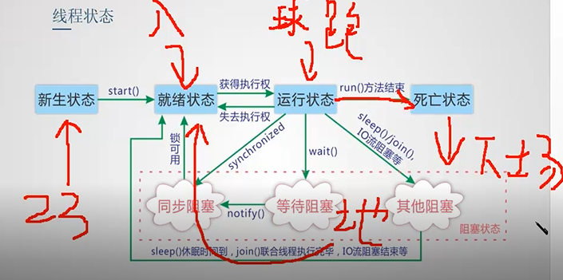
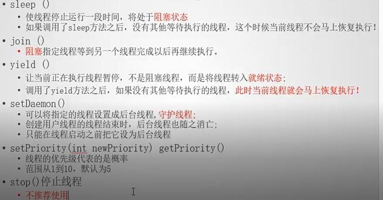
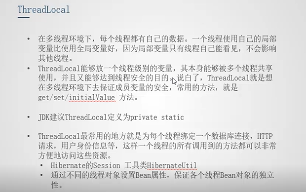

本笔记为java笔记的下部分。


# 10.IO

## 10.1 IO介绍

```
一块和服务器，一块和客户（文件上传下载，更重要）

流：程序与源中介
	一切以程序为中心，进程序为输入
	分类：
		流向 ：输入：两个，输出：两个类
		直接 ：节点流和处理流（包装下节点，提高效率）
		对象 ：字节流和字符（底层还是弄成字节，找字符集）	

源：文件。内存、网络连接，数据库，设备

#输入直接连输出就是拷贝
java.io  核心五类三接口。
	C：提醒释放系统资源（不是内存）（关了，也能刷下）
	F：刷新下	
```


## 10.2 File

### 1）API

```
File 代表文件或者文件夹，不一定存在，就是路径名抽象表示，如在8 所展示的

#1，读API：权限>default才显示 
1）介绍和继承体系：文件和目录路径名的抽象表示（io.File --lang.Object）
2）常量：
pathSeparator 路径常量（PATH路径分割的 Win; Lin:）
separator  名称分割 ：linux /  windos \ (反斜杠别忘转义)
3）构造器：
有就   直接new
没有	  a.工具类（Math）不需要
	   b.静态方法返回对象(RunTime)
4）方法： 方法名，参数，描述，返回

```


```
#2，具体：
1）路径： / 或 \\ \  或 常量拼接 （用第一个就行）

2）File构造对象：四种（还有个uri）

3）名称或路径：
有盘符绝对路径（getAbsolutePath()）。
没有盘符相对路径（直接上来就是，不要写工程名，默认在usr.dir也就是大工程下）

getPath（给啥返回啥）,getA（绝对） 
getP (父，写啥返回前一层，如果没了返回null), getP File  返回个父对象。

4）文件状态：
	e---存在前提下，然后文件，文件夹
	src = new File("xxx");
		if(null == src || !src.exists()) {
			System.out.println("没有");
		}else {
			if(src.isFile()) {
				System.out.println("是文件");
			}else {
				System.out.println("是文件夹");
			}
		}
#不能命名文件操作系统关键字（例如con），，可以不管后不后缀创建
5）其他信息：
	long--返回文件长度，文件夹返回长度或者东西不存在是0，（要文件夹，递归sum）
	创文件-- createNF:  boolea(丢异常，可能失败，不存在才创建)
    	 --	delete
		
    文件夹--  没s  boolea     s:上面没有也行。
	
	下一级---（数组）  名称String[] list      对象 File[]  listFiles()  ,
	所有盘符对象  	 File[]  listRoots

   	
   	#子孙：递归（好处简单）头，体。笔记上的8
          也可以统计大小。oop思想。弄成个类，然后方法也在构造里面。得到结果get属性就行。


```

### 2）文件编码

```
#1，编码与解码
字符---->>字节：编码(encode)
字节---->>字符：解码(decode)  

编码数组： byte[] b = c.getBytes() (默认工程的)													  			   或" ”或者特定的
解码字符串   String  c = new String (b);
				 	   new (b,offset,length,charSetNmae);//少了个数可能乱码

#2,字符集 
GBK（ANSI）（中文2，英文1）, UTF-8（1个中文3个，英文啥的1个）
#右边低地址，[X,X,X] ，大端表示右边大值（低地址是一开始，直接大，就是大端）
```


```
#3，乱码
#txt写的时候默认GBK

1) 字节数不够  2）字符集不同
```


## 10.3 流


### 1）四大抽象类

```
面向接口编程（父类）：多态
	文字：字符
	一切，表格和音频：字节

#字符串是字符数组

注意：
字节的要编解码，字符的不要
字节读的时候带点len（X，0，len） 
写不用while,	读要
写不要缓冲区，	  读要 (.read(flush[]数组)配合while（字符用char[],的缓冲用string ）)
#没关程序，就可以一直写，不是覆盖。

1.InputStream–:C

int read()
int read(byte[] b) :返回读到了几个，，配合解码,用第二种，将b解码
void close()

2.OutputStream–:C 和 F  
#都默认false（加后面）：F，默认，，Byte本身一直写入内存（不覆盖）
void write(int)
void write(b,0,len)
void flush()
close

3.Reader-: C 和 Readable（可读）

int read()：一个字符
int read(char[] c)字符数组（字符串） 读了几个字符
close

4.Writer-：C 和 F 和 Appendable(添加)
#都默认false
void write(String s/char[] c)
void write(X,0,len)
flush
close
append(...一直点下去)
#红色必须掌握
```


```
#操作步骤：
源（看要不要地址），流（选择读写和加入对象地址的方式和写是否有附加），
操作（怎么读写），释放（finally，中try）
```

```
#异同
一.节点流  
	1.
		File  ---是硬件  ：src–os–java    （无权自己，是通知操作）
		ByteAry--是内存（自己的，网络，服务器）  src–java  （自己gc释放，不用close）
		#字符串(自带的编码)，数据（数据流），对象---都可以字节数组（保证量小点）  

	2.构造方法
		File  ---Str（省去源那步）或者File对象
		ByteAry-- In:写读的字节数组,Ou:啥也不写或者写大小（创建一个新的字节数组输出流）
		#B含一个内部缓冲区，源都是数组,而且Ou流还不多态不关联源，（要获得用 流.toByteArray();）
```


#### 1.1）IS

一，直接流

```
#1，FileIS


1)操作：一个一个读

	#UTF-8：一个字符一个字节
	#read() 有返回该字符的值。没有-1
	
public class Test2 {
	public static void main(String[] args) {
	//1.创建源
	File src = new File("abc.txt");
	//2.选择流
	InputStream is =null; //全局变量
	
	try {
		is = new FileInputStream(src);
		
		//3.操作
		int temp ; 
		
		while( (temp=is.read()) != -1){
			System.out.print((char)temp);
		}	
		
	} catch (FileNotFoundException e) {
		e.printStackTrace();
	}catch (IOException e) {
		// TODO Auto-generated catch block
		e.printStackTrace();
	}finally {
		try {
			//4.释放
			if (is != null) {
				is.close();
			} 
		} catch (IOException e2) {
			// TODO: handle exception
		}
		
	}	
	
	}
}

2）操作：一段一段读
	#1024字节=1K
	#配合解码

public class Test3 {
	public static void main(String[] args) {
//		1.源
		File src =new File("abc.txt");
//		2.流
		InputStream is = null;
		
		try {
			is = new FileInputStream(src);
			
//			3.分段读
			
			byte[] flush = new byte[3]; //缓冲容器
			int len;
			while((len=is.read(flush)) !=-1  ){ //len读到几个是几个
				//解码
				String str = new String(flush,0,len);
			    System.out.println(str);
			}
		} catch (FileNotFoundException e) {
			// TODO: handle exception
			e.printStackTrace();
		} catch (IOException e) {
			// TODO Auto-generated catch block
			e.printStackTrace();
		}finally{
			//4.释放资源
			try {
				if(is != null){
					is.close();
				} 
			}catch (IOException e) {
					// TODO Auto-generated catch block
					e.printStackTrace();
				}
			}
		}
		
	}
```

```
#2，ByteArrayInputStream
#ByteArrayInputStream(byte[] buf) 或（buf,0,len）

/**
 * 四个步骤:字节数组输入流
 * 1、创建源  : 字节数组 不要太大
 * 2、选择流
 * 3、操作
 * 4、释放资源: 可以不用处理
 * /
public class Test7 {
	public static void main(String[] args) {
//		1,源
		byte[] src ="talk with me or die".getBytes();
//		2,流
		InputStream is = null;
		
		is = new ByteArrayInputStream(src);
		
		byte[] flush = new byte[5];
		int len ;
		
		try {
			while( (len = is.read(flush)) !=-1 ){
				String str = new String(flush,0,len);
				System.out.println(str);
			}
		} catch (IOException e) {
			// TODO Auto-generated catch block
			e.printStackTrace();
		}
		
	}
}
 
```


二，处理流

```
字节缓冲流

字节的没有新增方法
	1，有缓冲区   减少频繁读写  8k默认，
	2，套在，底层都是节点流就行。
	3.从里往外释放，，但写只要释放外面就行（它还是会释放里面的）（和字节数组一样是JVM）

#性能比字节流，快，套几层都差不多。（就套一层就好）
#缓冲的容器数组只是决定一次读写多少，但是快慢还是靠缓冲区


#1，BufferedInputStream

构造方法：
(InputStream in)  或 (InputStream in, int size)  有大小

public class B1 {
	public static void main(String[] args) {
		
		//1,源：
		File src = new File("abc.txt");
		
		
//		2,流  :配合try ，套流
		InputStream  is =null;
		try {is = new BufferedInputStream(
								new FileInputStream(src) );
//				3.操作
			  int len;
			  byte[] flush = new byte[1024];
			  while ( (len = is.read(flush)) != -1 ){
				  String str = new String(flush,0,len);
				  System.out.println(str);
			  }
		} catch (FileNotFoundException e) {
			// TODO Auto-generated catch block
			e.printStackTrace();
		} catch (IOException e) {
			// TODO Auto-generated catch block
			e.printStackTrace();
		}finally {
//			4,释放
			try {
				if(null!=is) {
					is.close();
				}
			} catch (IOException e) {
				e.printStackTrace();
			}			
		}
		
	}
}
```


```
数据流：（不用自己后面转换数据类型）（先写出后读取）
有新增方法
以独立于机器的方式从底层输入流读取原始Java数据类型。 
应用程序使用数据输出流来写入稍后可以被数据输入流读取的数据。 


	读写顺序一致
	操作数据类型方法+数据
#2，DataInputStream
构造方法：
DataInputStream(InputStream in) 

对于多线程访问来说不一定是安全的
#弄个字节数组，可以文件统计大小，

public static void main(String[] args) throws IOException {
		//写出
		ByteArrayOutputStream baos =new ByteArrayOutputStream();
		DataOutputStream dos =new DataOutputStream(new BufferedOutputStream(baos));
		//操作数据类型 +数据
		dos.writeUTF("编码辛酸泪");
		dos.writeInt(18);
		dos.writeBoolean(false);
		dos.writeChar('a');
		dos.flush();
		byte[] datas =baos.toByteArray();
		System.out.println(datas.length);
		
		//读取
		DataInputStream dis =new DataInputStream(new BufferedInputStream(new ByteArrayInputStream(datas)));
		//顺序与写出一致
		String msg = dis.readUTF(); 
		int age = dis.readInt();
		boolean flag = dis.readBoolean();
		char ch = dis.readChar();
		System.out.println(flag);
	}
```


```
对象流：
新增方法：比Data流多个writeObject(), readObj
 
Object---序列化，输出流-------DB，内存，文件-------反序列，输入------Obj   （也叫持久）
	不是所有的都可以序列化（要通行证给虚拟机看），自己定义的对象想序列化，必须实现那个接口。
	必须先写后读,顺序一致  （有的不要序列化（不保存的意思），关键字：transient ）。
	不用也要读出来，后面类要自己强转。

内存中，立马用（字节数组）
硬盘中，先存着（Fin Fos ） 

#1，ObjectInputStream

构造方法：一般(InputStream in) ：创建从指定的InputStream读取的ObjectInputStream。 
或 ObjectInputStream() ？？？ 
为完全重新实现ObjectInputStream的子类提供一种方法，不必分配刚刚被ObjectInputStream实现使用的私有数据。  
 

1）内存中
public class O1 {
	public static void main(String[] args) throws IOException, ClassNotFoundException {
	//写出 -->序列化
		ByteArrayOutputStream baos =new ByteArrayOutputStream();
		ObjectOutputStream oos =new ObjectOutputStream(new BufferedOutputStream(baos));
		//操作数据类型 +数据
		oos.writeUTF("编码辛酸泪");
		oos.writeInt(18);
		oos.writeBoolean(false);
		oos.writeChar('a');
		//对象
		oos.writeObject("谁解其中味");
		oos.writeObject(new Date());
		Employee emp =new Employee("马云",400);
		oos.writeObject(emp);
		oos.flush();
		byte[] datas =baos.toByteArray();
		System.out.println(datas.length);	
		
//读取 -->反序列化
		ObjectInputStream ois =new ObjectInputStream(new BufferedInputStream(new ByteArrayInputStream(datas)));
		//顺序与写出一致
		String msg = ois.readUTF(); 
		int age = ois.readInt();
		boolean flag = ois.readBoolean();
		char ch = ois.readChar();
		System.out.println(flag);
		//对象的数据还原  
		Object str = ois.readObject();
		Object date = ois.readObject();
		Object employee = ois.readObject();
				
		if(str instanceof String) {
			String strObj = (String) str;
			System.out.println(strObj);
		}
		if(date instanceof Date) {
			Date dateObj = (Date) date;
			System.out.println(dateObj);
		}
		if(employee instanceof Employee) {
			Employee empObj = (Employee) employee;
			System.out.println(empObj.getName()+"-->"+empObj.getSalary());
		}		
	}
}

///javabean 封装数据
class Employee implements java.io.Serializable{
	private transient String name; //该数据不需要序列化
	private double salary;
	public Employee() {
	}
	public Employee(String name, double salary) {
		this.name = name;
		this.salary = salary;
	}
	public String getName() {
		return name;
	}
	public void setName(String name) {
		this.name = name;
	}
	public double getSalary() {
		return salary;
	}
	public void setSalary(double salary) {
		this.salary = salary;
	}
	
}

2）硬盘
public class O2 {
	public static void main(String[] args) throws IOException, ClassNotFoundException {
		// 写出 -->序列化
		ObjectOutputStream oos = new ObjectOutputStream(new BufferedOutputStream(new FileOutputStream("obj.ser")));
		// 操作数据类型 +数据
		oos.writeUTF("编码辛酸泪");
		oos.writeInt(18);
		oos.writeBoolean(false);
		oos.writeChar('a');
		// 对象
		oos.writeObject("谁解其中味");
		oos.writeObject(new Date());
		Employee emp = new Employee("马云", 400);
		oos.writeObject(emp);
		oos.flush();
		oos.close();
		// 读取 -->反序列化
		ObjectInputStream ois = new ObjectInputStream(new BufferedInputStream(new FileInputStream("obj.ser")));
		// 顺序与写出一致
		String msg = ois.readUTF();
		int age = ois.readInt();
		boolean flag = ois.readBoolean();
		char ch = ois.readChar();
		
		System.out.println(flag);
		// 对象的数据还原
		Object str = ois.readObject();
		Object date = ois.readObject();
		Object employee = ois.readObject();

		if (str instanceof String) {
			String strObj = (String) str;
			System.out.println(strObj);
		}
		if (date instanceof Date) {
			Date dateObj = (Date) date;
			System.out.println(dateObj);
		}
		if (employee instanceof Employee) {
			Employee empObj = (Employee) employee;
			System.out.println(empObj.getName() + "-->" + empObj.getSalary());
		}
		ois.close();
	}
}
```


#### 1.2）OS

一，直接流

```
#1，FileOS

1)操作： 写入
	#没有就创建           
	#os构造方法，（（File或者地址str），append 默认false）
	#字符串解码得数组b
			os.write(b,0，len)—
			flush

public class Test4 {

	public static void main(String[] args) {
//		1.源
		File dest =new File("dest.txt");
		
//		2.流
		
		OutputStream os =null  ;
		
		try {
			os = new FileOutputStream(dest,true);
//			3.操作
			String str = new String ("asdsa dsads");
			byte[] b = str.getBytes();
			
			os.write(b, 0, b.length);
			os.flush();
			
		} catch (FileNotFoundException e) {
			// TODO Auto-generated catch block
			e.printStackTrace();
		} catch (IOException e) {
			// TODO Auto-generated catch block
			e.printStackTrace();
		}finally {
			try{
				if(os != null) {
					os.close() ;
					}
				
			}catch (Exception e) {
				}
			}		
	
		}
	}
```

```
#2，ByteArrayOutputStream
#构造方法：ByteArrayOutputStream() ，或 ByteArrayOutputStream(int size) 
#不要面向父类编程。
/**
 * 字节数组输出流 ByteArrayOutputStream
 *1、创建源  : 内部维护(字节数组)
 *2、选择流  : 不关联源
 *3、操作		(写出内容)
 *4、释放资源 :可以不用
 *
 * 获取数据:  toByteArray()
*/

public class Test8 {
	public static void main(String[] args) {
//		1，源
		byte[] dest = null;
//		2,流
		ByteArrayOutputStream bao = null;
		
		bao = new ByteArrayOutputStream();
		
//		3,操作
		String str = new String("asas sdsad");
		byte[] b = str.getBytes();
		
		try {
			bao.write(b);
			
			dest = bao.toByteArray();
			System.out.println(new String(dest));
			
		} catch (IOException e) {
			// TODO Auto-generated catch block
			e.printStackTrace();
		}
	}
}
```


二，处理流

```
# 1，BufferedOutputStream

public static void main(String[] args) {
		//1、创建源
		File dest = new File("dest.txt");
		//2、选择流
		OutputStream os =null;
		try {
			os =new BufferedOutputStream( new FileOutputStream(dest));
			//3、操作(写出)
			String msg ="IO is so easy\r\n";
			byte[] datas =msg.getBytes(); // 字符串-->字节数组(编码)
			os.write(datas,0,datas.length);
			os.flush();
		}catch(FileNotFoundException e) {		
			e.printStackTrace();
		}catch (IOException e) {
			e.printStackTrace();
		}finally{
			//4、释放资源
			try {
				if (null != os) {
					os.close();
				} 
			} catch (Exception e) {
			}
		}
	}
```


```
#2，DataOutputStream
构造：DataOutputStream(OutputStream out) 

#3，ObjectOutputStream
构造方法：同In 有两种。
```


```
打印流：
都有新增方法。常用println（不多态）

方便地打印各种数据值的表示（还提供了两特点）：
		不异常IO
		有自动刷新。
		


有两种。PS ,PW
	PW 可以多包装 Writer流，其他一致。

#4，
构造方法：
(File file) 或(File file, String csn)  :指定字符集，，自己有自动刷新
(String path)或。。。。：和上面一样效果
(OutputStream out, boolean autoFlush, String encoding) 或省略。。 

public class P1 {
	public static void main(String[] args) throws FileNotFoundException {
		//PrintWriter 在这个例子中也一样，直接替代就行。
//		打印流System.out
		PrintStream ps = System.out;
		ps.println("打印流");
		ps.println(true);
		
//		打印到文件:有true自动刷新
		ps = new PrintStream(  
				new BufferedOutputStream(
					new FileOutputStream("print.txt") ) ,true);
		ps.println("打印流1");
		ps.println(true+"1");
//		ps.flush();   
		ps.close(); //里面的File流 释放资源  close一关，也会强制刷新
		
//		打印到文件: 自己就有自动刷新
		PrintStream ps1 = new PrintStream(new File("print2.txt") );
		ps1.println("打印流2");
		ps1.println(true+"2");
 
		ps1.close(); //里面的File流 释放资源 
		
//		重定向
		System.setOut(ps);
		System.out.println("change");
		
//		重回控制台:文件描述符，，标准输入输出端口
		System.setOut(new PrintStream(  
				new BufferedOutputStream(
					new FileOutputStream(FileDescriptor.out) ) ,true) );
		
		System.out.println("change2");		
	}
```


#### 1.3）R

一,

```
#1, FileReader
#已经帮忙算好了几个字节等于字符。（前提文件和本工程一致）
#不用解码了（字符数组变成字符串）


public class Test5 {
	public static void main(String[] args) {
//		1,源
		File src = new File("abc.txt");
		
//		2,流
		Reader r = null ; 

		try {
			r= new FileReader(src);
			
//			3.操作
			char[] flush  = new char[1024];
			int len;
			while( (len=r.read(flush)) != -1){
				String str = new String(flush);
				System.out.println(str);
			}
		} catch (FileNotFoundException e) {
			// TODO Auto-generated catch block
			e.printStackTrace();
		}catch (IOException e) {
			// TODO Auto-generated catch block
			e.printStackTrace();
		}finally{
			//4.释放
			if (r != null){
				try {
					r.close();
				} catch (IOException e) {
					// TODO Auto-generated catch block
					e.printStackTrace();
				}
			}
		}
	}
}

```


二，

```
字符缓冲流
新增了方法。不要多态： 换行读写
其他和字节的大体类似

#1，BufferedReader
构造方法与字节缓冲基本一致。


新方法：(常用的)
reader.readLine()   
#注意点：用一个字符串代替len，没读到null（不是-1）

//1、创建源
				File src = new File("abc.txt");
		//2、选择流
	
				try(BufferedReader  reader = 
						new BufferedReader(new FileReader(src)))
				{
	
					//3、操作 (分段读取)
					String line ;
					while((line=reader.readLine())!=null) {
						//字符数组-->字符串
						System.out.println(line);
					}		
				
				} catch (FileNotFoundException e) {
					e.printStackTrace();
				} catch (IOException e) {
					e.printStackTrace();
				}
			}

```


```
转换流
包在字节流上
作用：
	1. 桥梁  ，以字符流的形式操作字节流（纯文本的）
	2，指定charSet字符集，不会乱码。（默认工程一致）

#2，InputStreamReader
构造方法
InputStreamReader(InputStream in) 或后面给定字符集
1）桥梁，一直写
注意点： flush()
public static void main(String[] args) {
		//操作System.in 和System.out
		try(BufferedReader reader = new BufferedReader(new InputStreamReader(System.in));
		BufferedWriter writer =new BufferedWriter(new OutputStreamWriter(System.out));){
			//循环获取键盘的输入(exit退出)，输出此内容
			String msg ="";
			while(!msg.equals("exit")) {
				msg = reader.readLine(); //循环读取
				writer.write(msg); //循环写出
				writer.newLine();
				writer.flush(); //强制刷新,
//			如果没有，虽然可以一直读，但不打印，没达到写出的大小
			}
		}catch(IOException e) {
			System.out.println("操作异常");
		}
		
		
	}

2)指定字符集
#包了一层网络流这个字节流，让能够当做字符流处理，本质还是字符流。（所以后面才是FoS)
#new URL("http://www.baidu.com").openStream()  带http

public static void main(String[] args) {
		try(BufferedReader reader =
				new BufferedReader(
						new InputStreamReader(
								new URL("http://www.baidu.com").openStream(),"UTF-8"));
				BufferedWriter writer =
						new BufferedWriter(
								new OutputStreamWriter(
										new FileOutputStream("baidu.html"),"UTF-8") );){
			//3、操作 (读取)
			String msg ;
			while((msg=reader.readLine())!=null) {
				System.out.println(msg);
				writer.write(msg); //字符集不统一不够出现乱码
				writer.newLine();
			}					
			writer.flush();
		}catch(IOException e) {
			System.out.println("操作异常");
		}
	}
```


#### 1.4）W


```
#1，FileWriter
#字符串变字符数组
#三写法：append或write(str)或 str-->toCharArray()再write

public class Test6 {
	public static void main(String[] args) {
//		1.源
		File src = new File("dest.txt");
		
//		2,流
		Writer w =null;
		
		try {
			w= new FileWriter(src);
			
//			3,操作
			//一, 变成字符数组
			String str ="我\r\n，你";
			char[] c = str.toCharArray();
			w.write(c);
			//二，直接字符串write
			w.write(str);
			//三，连append
			w.append(str).append(str);
			w.flush();
			
		} catch (IOException e) {
			// TODO Auto-generated catch block
			e.printStackTrace();
		}finally{
			if (w !=null){
				try {
					w.close();
				} catch (IOException e) {
					// TODO Auto-generated catch block
					e.printStackTrace();
				}
			}
		}
	}
}
```


二，

```
#1，BufferedWriter
构造方法，和字节基本一致。
新方法：.newLine();  = "\r\n"

public static void main(String[] args) {
		//1、创建源
		File dest = new File("dest.txt");
		//2、选择流

		try (BufferedWriter writer =
				new BufferedWriter (new FileWriter(dest)) )
		{		
			//3、操作(写出)			
			writer.append("IO is so easy");
			writer.newLine();
			writer.append("XX欢迎你");
			writer.flush();
		}catch(FileNotFoundException e) {		
			e.printStackTrace();
		}catch (IOException e) {
			e.printStackTrace();
		
		}
	}
```


```
#2，OutputStreamWriter

#3, PrintWriter
构造多了个能包装Writer流。
```


### 2）对接

#### 2.1）Fis-Fos

```
#1，文件拷贝：
不要编解码，直接对接
先开，后释放

1）原本直接，
public static void copy( String srcP, String destP){
//		1,源
		File src = new File(srcP);
		File dest =new File(destP);
		
//		2，流
		InputStream is = null;
		OutputStream os = null;
		
		try {
			is = new FileInputStream(src);
			os  =new FileOutputStream(dest);
			//3,操作
			int len;
			byte[] flush = new byte[1024*1];
			
			while ((len = is.read(flush) )!= -1){
				os.write(flush, 0, len);
			}
			os.flush();
		} catch (FileNotFoundException e) {
			// TODO Auto-generated catch block
			e.printStackTrace();
		} catch (IOException e) {
			// TODO Auto-generated catch block
			e.printStackTrace();
		}finally {
			if ( os != null){
				try {
					os.close();
				} catch (IOException e) {
					// TODO Auto-generated catch block
					e.printStackTrace();
				}
			}
			if( is !=null){
				try {
					is.close();
				} catch (IOException e) {
					// TODO Auto-generated catch block
					e.printStackTrace();
				}
			}
		}

2）优化释放
public static void copy2(String srcPath,String destPath) {
		//1、创建源
			File src = new File(srcPath); //源头
			File dest = new File(destPath);//目的地
			//2、选择流		
			try(InputStream  is=new FileInputStream(src);
					OutputStream os = new FileOutputStream(dest);	) {				
				//3、操作 (分段读取)
				byte[] flush = new byte[1024]; //缓冲容器
				int len = -1; //接收长度
				while((len=is.read(flush))!=-1) {
					os.write(flush,0,len); //分段写出
				}			
				os.flush();
			}catch(FileNotFoundException e) {		
				e.printStackTrace();
			}catch (IOException e) {
				e.printStackTrace();
			}
	}
```

```
#2，文件夹
static void copyD(String fileP,String destP) {
	       //加完之后，才在同一层。
	       File file = new File(fileP);
	       File dest = new File(destP+File.separator+file.getName());
	       
	        //如果file是目录，则获取子文件列表，并对每个子文件进行相同的操作
	        if (file.isDirectory()) {
	            File[] files = file.listFiles();
	            dest.mkdirs();
	            for (File temp : files) {
	                //递归调用该方法：注意等+1
	             
	                copyD(temp.getPath(),dest.getPath());
	            }
	        }else{
	        	copy(file.getPath(),dest.getPath());
            }
	    }
```


#### 2.2）F-B-B-F

```
图片--字节数组--图片
F--程序--B--程序--F
为什么要这么做？（都可以拷贝图片）

#除了字符串，变成字节数组都要对接流
```


```
#1，

/**
 * 1、封装拷贝：注意下字节数组不要父类编程
 * 2、封装释放：多参数使用

 *
 */
public class FileUtils {
	public static void main(String[] args) {
		 
		//1)文件-文件:省去创建源步骤
		try {
			InputStream is = new FileInputStream("abc.txt");
			OutputStream os = new FileOutputStream("abc1.txt");
			copy(is,os);
		} catch (FileNotFoundException e) {
			// TODO Auto-generated catch block
			e.printStackTrace();
		}
		
		//2)文件-字节数组 : 除了1），
//			还字节不面向父类编程(可以即多态copy，还调用自己的)
		byte[] datas =null;
		
		try {
			InputStream is = new FileInputStream("p.png");
			ByteArrayOutputStream os =new ByteArrayOutputStream();
			copy(is,os);
			datas=os.toByteArray();
		} catch (FileNotFoundException e) {
			// TODO Auto-generated catch block
			e.printStackTrace();
		}
		
//			3)字节数组-文件
			ByteArrayInputStream is =new ByteArrayInputStream(datas);
			try {
				OutputStream os =new FileOutputStream("p-copy.png");
				copy(is,os);
				
			} catch (FileNotFoundException e) {
				// TODO Auto-generated catch block
				e.printStackTrace();
			}
			
		
		
	}
	
	//1，封装拷贝
	public static void copy(InputStream is , OutputStream os ){
		int len;
		byte[] flush = new byte[1024*1];
		
		try {
			while ((len = is.read(flush) )!= -1){
				os.write(flush, 0, len);
			}
			os.flush();
		} catch (IOException e) {
			// TODO Auto-generated catch block
			e.printStackTrace();
		}finally {
			close(is,os);
		}
		
	}
	
	//2,封装释放
	public static void close(InputStream is , OutputStream os ){
		try {
			if (null != os) {
				os.close();
			} 
		} catch (IOException e) {
			e.printStackTrace();
		}
		
		try {
			if(null!=is) {
				is.close();
			}
		} catch (IOException e) {
			e.printStackTrace();
		}
	}
	
	///可变参数
	public static void close(Closeable...ios){
		for(Closeable io : ios){
			try {
				if(null!=io) {
					io.close();
				}
			} catch (IOException e) {
				e.printStackTrace();
			}
		}
	}
}

```


```
#2， 优化释放（不需要在写释放了 ） try ...with...resource
   要声明赋值都在里面（满足这个点就行）
try(InputStream is1 =is ; OutputStream os1=os) {
			while ((len = is1.read(flush) )!= -1){
				os1.write(flush, 0, len);
			}
			os1.flush();
		} catch (IOException e) {
			// TODO Auto-generated catch block
			e.printStackTrace();
		}
		
	}
```


### 3）装饰器

```
23设计之一：类与类之间关系

GOF---四人组设计的
/**1、抽象组件:需要装饰的抽象对象(接口或抽象父类)
 * 2、具体组件:需要装饰的对象
 * 3、抽象装饰类:包含了对抽象组件的引用以及装饰着共有的方法（构造里引用）
 * 4、具体装饰类:被装饰的对象
 */
 
 例： 喝的（抽象组件）：咖啡（具体的组件）-----里面加东西模板（抽象装饰）：牛奶，糖（具体装饰）
 
原味咖啡加入了蔗糖-->20.0
原味咖啡加入了牛奶-->40.0
原味咖啡加入了蔗糖加入了牛奶-->80.0
原味咖啡加入了牛奶加入了蔗糖-->80.0


public class D2 {

	public static void main(String[] args) {
		// TODO Auto-generated method stub
		Drink coffee = new Coffee();
		//一般装饰
		Drink coffee_suger = new Suger(coffee);
		System.out.println(coffee_suger.info()+"-->"+coffee_suger.cost());	
		Drink coffee_milk = new Milk(coffee);
		System.out.println(coffee_milk.info()+"-->"+coffee_milk.cost());
		
		Drink coffee_milk_suger = new Milk(coffee_suger);
		System.out.println(coffee_milk_suger.info()+"-->"+coffee_milk_suger.cost());
	
		Drink coffee_suger_milk = new Suger(coffee_milk);
		System.out.println(coffee_suger_milk.info()+"-->"+coffee_suger_milk.cost());
	}

}

//抽象组件
interface Drink{
	double cost(); //费用
	String info(); //说明
}

//具体组件
class Coffee implements Drink{
	private String name = "原味咖啡";
	
	@Override
	public double cost() {
		// TODO Auto-generated method stub
		return 10;
	}

	@Override
	public String info() {
		// TODO Auto-generated method stub
		return name;
	}
	
}
//抽象装饰类
abstract class Decorate implements Drink{
	//对抽象组件的引用
		private Drink drink;
		public Decorate(Drink drink) {
			this.drink =drink;
		}
		//必须要实现这两个方法，不然具体的装饰没用。
		public double cost() {
			return drink.cost();
		}

		@Override
		public String info() {
			return this.drink.info();
		}	
}
//具体装饰类
class Milk extends Decorate{
	
	public Milk(Drink drink) {
		super(drink); //调用父(抽象装饰)的构造方法
	}
	@Override
	public double cost() {
		return super.cost()*4;  //调用父类的方法或属性
	}

	@Override
	public String info() {
		return super.info()+"加入了牛奶";
	}
}
class Suger extends Decorate{

	public Suger(Drink drink) {
		super(drink);
	}
	@Override
	public double cost() {
		return super.cost()*2;
	}

	@Override
	public String info() {
		return super.info()+"加入了蔗糖";
	}	
}
```


### 4） RandomAccessFile

```
#随机流
（除File，四大，另一个IO包内容）
支持读取和写入随机访问文件
	有seek游标
	构造：(File file, String mode) 或String 
		#mode: "r" ，"rw"，"rws"，或 "rwd" 

```


```
#1，Split文件 例子

1） 基本操作

//test1:指定起始位置，读取剩余所有内容
public static void test1() throws IOException {
			RandomAccessFile raf =new RandomAccessFile(new File("src/com/sxt/io/Copy.java"),"r");
			//选择读取
			raf.seek(2);
			//起点
			//3、操作 (分段读取)
			byte[] flush = new byte[1024]; //缓冲容器
			int len = -1; //接收长度
			while((len=raf.read(flush))!=-1) {
				System.out.println("---------");
				System.out.println(new String(flush,0,len));
			}			
			
			raf.close();
		}
-----------------------------------

//test2:分块思想: 起始、实际大小----一块一块读，读到指定大小就结束
	public static void test2() throws IOException {
		RandomAccessFile raf =new RandomAccessFile(new File("src/com/sxt/io/Copy.java"),"r");
		//起始位置
		int beginPos =2+1026;
		//实际大小
		int actualSize = 1026;
		//随机读取 
		raf.seek(beginPos);
		//读取
		//3、操作 (分段读取)
		byte[] flush = new byte[1024]; //缓冲容器
		int len = -1; //接收长度
		while((len=raf.read(flush))!=-1) {			
			if(actualSize>len) { //获取本次读取的所有内容
				System.out.println(new String(flush,0,len));
				actualSize -=len;
			}else { //获取本次读取的所需内容，并跳出
				System.out.println(new String(flush,0,actualSize));
				break;
			}
		}			
		
		raf.close();


--------------------------
//split:	指定第i块的起始位置 和实际长度.   （）   和上面一样，只是弄成了方法
	public static void split(int i,int beginPos,int actualSize ) throws IOException {
		RandomAccessFile raf =new RandomAccessFile(new File("src/com/sxt/io/Copy.java"),"r");
		//随机读取 
		raf.seek(beginPos);
		//读取
		//3、操作 (分段读取)
		byte[] flush = new byte[1024]; //缓冲容器
		int len = -1; //接收长度
		while((len=raf.read(flush))!=-1) {			
			if(actualSize>len) { //获取本次读取的所有内容
				System.out.println(new String(flush,0,len));
				actualSize -=len;
			}else { 
				System.out.println(new String(flush,0,actualSize));
				break;
			}
		}			
		
		raf.close();
	}

---------------
main: 切成自己要的块，。  
File src = new File("src/com/sxt/io/Copy.java");
				//总长度
				long len = src.length();
				//每块大小
				int blockSize =1024;
				//块数: 多少块

				int size = (len % blockSize == 0)?
								(int) (len / blockSize):
									(int) Math.ceil(len*1.0/blockSize);
								
				System.out.println(size);
				
				//起始位置和实际大小
				int beginPos = 0;
				int actualSize; 
				
				for(int i=0;i<size;i++) {
					beginPos = i*blockSize;
					if(i==size-1) { //最后一块
						actualSize = (int)len;
					}else {
						actualSize = blockSize;
						len -=actualSize; //剩余量
					}
					System.out.println(i+"-->"+beginPos +"-->"+actualSize);
					split(i,beginPos,actualSize);
				}
```

```
2）, 面向过程split
public static void main(String[] args) throws IOException {
		//面向过程，核心。
				
				File src = new File("p.png");
				//总长度
				long len = src.length();
				//每块大小
				int blockSize =1024 * 10;
				//块数
				int size = (len % blockSize == 0)?
								(int) (len / blockSize):
									(int) Math.ceil(len*1.0/blockSize);
								
				System.out.println(size);
				
				//起始位置和实际大小
				int beginPos = 0;
				int actualSize; 
				for(int i=0;i<size;i++) {
					beginPos = i*blockSize;
					if(i==size-1) { //最后一块
						actualSize = (int)len;
					}else {
						actualSize = blockSize;
						len -=actualSize; //剩余量
					}
					System.out.println(i+"-->"+beginPos +"-->"+actualSize);
					split(i,beginPos,actualSize);
				}
	}
	
//	细节： 指定第i块的起始位置 和实际长度
	public static void split(int i,int beginPos,int actualSize ) throws IOException {
		RandomAccessFile raf =new RandomAccessFile(new File("p.png"),"r");
		RandomAccessFile raf2 =new RandomAccessFile(new File("dest/"+i+"p.png"),"rw");
		
		//随机读取 
		raf.seek(beginPos);
		//读取
		//3、操作 (分段读取)
		byte[] flush = new byte[1024]; //缓冲容器
		int len = -1; //接收长度
		while((len=raf.read(flush))!=-1) {			
			if(actualSize>len) { //获取本次读取的所有内容
				raf2.write(flush,0,len);
				actualSize -=len;
			}else { 
				raf2.write(flush,0,actualSize);
				break;
			}
		}			
		raf2.close();
		raf.close();
	}

7
0-->0-->10240
1-->10240-->10240
2-->20480-->10240
3-->30720-->10240
4-->40960-->10240
5-->51200-->10240
6-->61440-->5465	
```


```
#2，面向对象：分割和合并
public class S {
		
		public static void main(String[] args) throws IOException {
			S sf = new S("src/com/sxt/io/SplitFile.java","dest") ;
			sf.split();
			sf.merge("dest/J1.java");
		}
	
		//源头
		private File src;		
		//目的地(文件夹)
		private String destDir;		
		//所有分割后的文件存储路径
		private List<String> destPaths;
		
		//每块大小
		private int blockSize;	
		//块数: 多少块
		private int size;

		
		//默认大写1024
		public S(String srcPath,String destDir) {
			this(srcPath,destDir,1024);
		}
		
		public S(String srcPath,String destDir,int blockSize) {
			this.src =new File(srcPath);
			this.destDir =destDir;
			this.blockSize =blockSize;
			this.destPaths =new ArrayList<String>();
			
			//初始化
			 init();
		}
		//初始化 :  块数，保存路径
		private void init() {
			//总长度
			long len = this.src.length();		
			//块数: 多少块
			this.size =(len % blockSize == 0)?
							(int) (len / blockSize):
								(int) Math.ceil(len*1.0/blockSize);
			//路径
			for(int i=0;i<size;i++) {
				destPaths.add(destDir +"/"+i+"-"+src.getName());
			}
		
		}
		
		//分割方法
		public void split() throws IOException {
			//总长度
			long len = src.length();		
			//起始位置和实际大小
			int beginPos = 0;
			int actualSize ; 
			for(int i=0;i<size;i++) {
				beginPos = i*blockSize;
				if(i==size-1) { //最后一块
					actualSize = (int)len;
				}else {
					actualSize = blockSize;
					len -=actualSize; //剩余量
				}
				splitDetail(i,beginPos,actualSize);
			}
		}
		
		//具体实现
		private  void splitDetail(int i,int beginPos,int actualSize ) throws IOException {
			RandomAccessFile raf =new RandomAccessFile(this.src,"r");
			RandomAccessFile raf2 =new RandomAccessFile(this.destPaths.get(i),"rw");
			//随机读取 
			raf.seek(beginPos);
			//读取
			//3、操作 (分段读取)
			byte[] flush = new byte[1024]; //缓冲容器
			int len = -1; //接收长度
			while((len=raf.read(flush))!=-1) {			
				if(actualSize>len) { //获取本次读取的所有内容
					raf2.write(flush, 0, len);
					actualSize -=len;
				}else { 
					raf2.write(flush, 0, actualSize);
					break;
				}
			}			
			raf2.close();
			raf.close();
		}
		
		// 文件合并 :就是拷贝
		void merge(String destP) throws IOException{
			OutputStream os =new BufferedOutputStream(new FileOutputStream(destP));
			for(String p : destPaths ){
				RandomAccessFile raf1 =new RandomAccessFile(p,"r");
				
				byte[] flush = new byte[blockSize];
				int len;
				while((len=raf1.read(flush))!=-1) {	
					os.write(flush,0,len);
					os.flush();
				}
				
				raf1.close();
				
				
			}
			os.close();
		}
		

}
```


### 5）SequenceInputStream

```
#序列输入流

就是逻辑上多个输入流封装一层：输入流放Vector容器，然后容器放序列流里面。

构造方法：
SequenceInputStream(InputStream s1, InputStream s2) 
或者 (Vector1.elements())
```


```
#合并重写
public void merge(String destPath) throws IOException {
		//输出流
		OutputStream os =new BufferedOutputStream( new FileOutputStream(destPath,true));	
		
		Vector<InputStream> vi=new Vector<InputStream>();
		SequenceInputStream sis =null;
		
		//输入流
		for(int i=0;i<destPaths.size();i++) {
			vi.add(new BufferedInputStream(new FileInputStream(destPaths.get(i))));											
		}
		sis =new SequenceInputStream(vi.elements());
		
		//拷贝
		//3、操作 (分段读取)
		byte[] flush = new byte[1024]; //缓冲容器
		int len = -1; //接收长度
		while((len=sis.read(flush))!=-1) {
			os.write(flush,0,len); //分段写出
		}			
		os.flush();	
		sis.close();
		os.close();
	}
```


## 10.4 CommonsIO

字符流

class 文件---jar包----组件（主动）--框架（被动）

是组件：把 .jar  buildpath，，关联源代码。

​	---import后，就可以实现调用下面的类方法。


### 1）FileFileUtils

```
#1, 统计大小：目录和文件
import org.apache.commons.io.FileUtils;

public class C1 {
	public static void main(String[] args) {
		//文件大小
		long len =FileUtils.sizeOf(new File("src/com/sxt/commons/CIOTest01.java"));
		System.out.println(len);
		//目录大小
		len = FileUtils.sizeOf(new File("src"));
		System.out.println(len);
	}
}

#2,列出子孙级: 配合过滤操作
FileUtils.listFiles(new File(p),X(文件过滤), X（文件夹条件）);
public static void main(String[] args) {
		
//		第一个过滤：文件  ，，，第二个过滤：文件夹
		String p = new String("D:\\workspace_8\\Study3-10-4");
		//1，留下空的文件。。。一层文件夹
		Collection<File> files =FileUtils.listFiles(new File(p),
				EmptyFileFilter.EMPTY, null);
		for (File file : files) {
			System.out.println(file.getAbsolutePath());
		}
		System.out.println("---------------------");
		
		//2，留下不空的文件。。。子孙文件夹
		 files =FileUtils.listFiles(new File(p),
					EmptyFileFilter.NOT_EMPTY, DirectoryFileFilter.INSTANCE);
		
		 for (File file : files) {
			System.out.println(file.getAbsolutePath());
		}
		System.out.println("---------------------");
	
		//3，留下java后缀的文件。。。子孙文件夹
		files =FileUtils.listFiles(new File(p),
				new SuffixFileFilter("java"), DirectoryFileFilter.INSTANCE);
		for (File file : files) {
		System.out.println(file.getAbsolutePath());
		}
		System.out.println("---------------------");
		
		//4, or条件
		files =FileUtils.listFiles(new File(p),
				FileFilterUtils.or(new SuffixFileFilter("java"),
						new SuffixFileFilter("class"),EmptyFileFilter.EMPTY), DirectoryFileFilter.INSTANCE);
		for (File file : files) {
		System.out.println(file.getAbsolutePath());
		}
	
		System.out.println("---------------------");
		
	}

#3，读取：
要带解码的字符集
//读取文件
		String msg =FileUtils.readFileToString(new File("abc.txt"),"UTF-8");
		System.out.println(msg);
		byte[] datas = FileUtils.readFileToByteArray(new File("abc.txt"));
		System.out.println(datas.length);
		
		//逐行读取
		 List<String> msgs= FileUtils.readLines(new File("abc.txt"),"UTF-8");
		 for (String string : msgs) {
			System.out.println(string);
		}
		LineIterator it =FileUtils.lineIterator(new File("abc.txt"),"UTF-8");
		while(it.hasNext()) {
			System.out.println(it.nextLine());
		}
		
#4，写出：
//写出文件
		FileUtils.write(new File("h.sxt"), "学习\r\n","UTF-8");
		FileUtils.writeStringToFile(new File("h.sxt"), "学习\r\n","UTF-8",true);
		FileUtils.writeByteArrayToFile(new File("h.sxt"), "学\r\n".getBytes("UTF-8"),true);
		
//列表写出
		List<String> datas =new ArrayList<String>();
		datas.add("马云");
		datas.add("马化腾");
		datas.add("弼马温");
		
		FileUtils.writeLines(new File("happy.sxt"),encoding ，datas,中间连接符,true);


#5拷贝：
public static void main(String[] args) throws IOException {
		//复制文件
		FileUtils.copyFile(new File("p.png"),new File("p-copy.png"));
		//复制文件到目录
		FileUtils.copyFileToDirectory(new File("p.png"),new File("lib"));
		//复制目录到目录
		FileUtils.copyDirectoryToDirectory(new File("lib"),new File("lib2"));
		//复制目录
		FileUtils.copyDirectory(new File("lib"),new File("lib2"));
		//拷贝URL内容
		String url = "https://pic2.zhimg.com/v2-7d01cab20858648cbf62333a7988e6d0_qhd.jpg";
		FileUtils.copyURLToFile(new URL(url), new File("marvel.jpg"));
		String datas =IOUtils.toString(new URL("http://www.163.com"), "gbk");
		System.out.println(datas);
	}
```

计算机的东西都是字节。


------

------

# 11.多线程

## 11.1 多线程简介

```
多任务：一个时间点还是做一个任务（除了多核）
多线程：开辟多路径，，方法：还要等完成后，才下一步

程序--进程--线程： 程序静态，开始后， 进程和程序绑定， 多线程
```


```
核心概念：
	a.线程是独立的执行路径
	b.程序运行中，即使没有自己创建线程，后台也会存在多个线程（gc，主线程）
	c.main称为主线程，系统入口执行整个程序。
	d.在一个进程中，有多线程话，线程运行有CPU调度器安排，而调度器又与操作系统相关，顺序人不能干预
	e. 同一份资源操作时，会有资源抢夺问题，需要加入并发控制
	f.线程会有额外开销：CPU调度时间，并发控制
	g.每个线程和自己的工作内存相互，工作内存和主内存交互，如果控制不好，会数据不一。
```


## 11.2 多线程实现

### 1）三种

```
三种：
Thread类：继承，重写RUN
Runnable 接口：重写RUN
Callabale 接口（JUC，高级）：重写call
#JAVA只能单继承，所以也少用Thread（用户进程，守护进程。）

注意：
start：开新线程 给cpu,cpu自己决定啥时候调用，往下走
run  : 线程入口点。里面是线程体。如果是直接.run()，就是普通方法的调用。不走
```


```
#1, 第一种，继承
继承Thread，重写run
调用：创建对象，直接start就行。

1）
public class T1 extends Thread {
	// 线程入口：
	@Override
	public void run() {
		// TODO Auto-generated method stub
		for (int i =0 ; i<20 ; i++){
			System.out.println("一边听歌");
		}

	}
	
	
	public static void main(String[] args) {
		
//		创建子类对象
		T1 st = new T1();
//		启动		
		st.start();
		//st.run();
		for (int i =0 ; i<20 ; i++){
			System.out.println("一边coding");
		}
	}

运行分析： 程序先从，main开始，一行一行下，
	1)到看start，告诉CPU，开辟了新路，后面自己CPU决定啥时候调用然后往下走，运行主函数体。  
	2)如果是运行run,则就是普通方法，不开辟路，要等run的 函数体调用完，在往下走。

2）多线程下图片
//类实现，下载功能
public class D1  {
	
	public void download(String url, String name){
			try {
				FileUtils.copyURLToFile( new URL(url), new File(name) );
			} catch (MalformedURLException e) {
				// TODO Auto-generated catch block
				e.printStackTrace();
				System.out.println("URL error");
			} catch (IOException e) {
				// TODO Auto-generated catch block
				e.printStackTrace();
				System.out.println("down error");
			}
	}
}

//测试多线程下载
public class T2 extends Thread {
	
	private String url;
	private String name;
	
	
	public T2(String url, String name) {
		super();
		this.url = url;
		this.name = name;
		
	}
	
	@Override
	public void run() {
		// TODO Auto-generated method stub
		D1 d = new D1();
		d.download(url, name);
		System.out.println(name);
	}


	public static void main(String[] args) {
		// TODO Auto-generated method stub

		T2 td1 =new T2("http://p1.pstatp.com/large/403c00037462ae2eee13","spl.jpg");
		T2 td2 =new T2("http://5b0988e595225.cdn.sohucs.com/images/20170830/d8b57e0dce0d4fa29bd5ef014be663d5.jpeg","success.jpg");
		
		//启动三个线程
		td1.start();
		td2.start();

	}

}
```


```
#2，第二种，接口

实现接口，重写run
目标对象, +Tread 代理对象 ，    t.start
#可配合匿名

推荐: 避免单继承的局限性，优先使用接口
 	 方便共享资源

1）
public class StartRun implements Runnable{
	/**
	 * 线程入口点
	 */
	@Override
	public void run() {
		for(int i=0;i<20;i++) {
			System.out.println("一边听歌");
		}
	}
	public static void main(String[] args) {			
		
		/*
		//创建实现类对象
		StartRun sr =new StartRun();
		//创建代理类对象
		Thread t =new Thread(sr);
		//启动 
		t.start(); //不保证立即运行 cpu调用 
											*/	
        
		new Thread(new StartRun()).start();
		
		//st.run(); //普通方法调用
		for(int i=0;i<20;i++) {
			System.out.println("一边coding");
		}
	}

}

2）共享资源,并发(但要注意线程安全)
一个资源。多个代理
public class T3 implements Runnable{
	//票数
	private int ticketNums = 99;
	
	@Override
	public void run() {
		while(true) {
			if(ticketNums<0) {
				break;
			}
			try {
				Thread.sleep(200);
			} catch (InterruptedException e) {
				e.printStackTrace();
			}
			System.out.println(Thread.currentThread().getName()+"-->"+ticketNums--);
		}
	}
	public static void main(String[] args) {
		//一份资源
		T3 web =new T3();
		System.out.println(Thread.currentThread().getName());
		//多个代理
		new Thread(web,"码畜").start();
		new Thread(web,"码农").start();
		new Thread(web,"码蟥").start();;
	}
}
//因为延迟的存在，结果会出现负数

#run 不能throw 异常，且没有返回值
```


```
#3，Callable
#接口，重写call方法，
能throw 异常，且自定义返回值
```


```
1) 下载
public class CDownloader implements Callable<Boolean>{
	private String url; //远程路径
	private String name;  //存储名字
	
	public CDownloader(String url, String name) {
		this.url = url; 
		this.name = name;
	}

	@Override
	public Boolean call() throws Exception {
		WebDownloader wd =new WebDownloader();
		wd.download(url, name);		
		System.out.println(name);
		return true;
	}
	
	public static void main(String[] args) throws InterruptedException, ExecutionException {
		CDownloader cd1 =new CDownloader("http://upload.news.cecb2b.com/2014/0511/1399775432250.jpg","phone.jpg");
		CDownloader cd2 =new CDownloader("http://p1.pstatp.com/large/403c00037462ae2eee13","spl.jpg");
		CDownloader cd3 =new CDownloader("http://5b0988e595225.cdn.sohucs.com/images/20170830/d8b57e0dce0d4fa29bd5ef014be663d5.jpeg","success.jpg");
		
		//创建执行服务: 
		ExecutorService  ser=Executors.newFixedThreadPool(3);
		//提交执行: 
		Future<Boolean> result1 =ser.submit(cd1) ;
		Future<Boolean> result2 =ser.submit(cd2) ;
		Future<Boolean> result3 =ser.submit(cd3) ;
		//获取结果:  
		boolean r1 =result1.get();
		boolean r2 =result2.get();
		boolean r3 =result3.get();
		System.out.println(r3);
		//关闭服务:  
		ser.shutdownNow();

	}
}

2） 共享资源
public class Test implements Callable<Integer>{
	//票数
	private int ticketNums = 9;
	
	@Override
	public Integer call() {
		while(true) {
			if(ticketNums<0) {
				break;
			}
			try {
				Thread.sleep(200);
			} catch (InterruptedException e) {
				e.printStackTrace();
			}
			System.out.println(Thread.currentThread().getName()+"-->"+ticketNums--);
		}
		return ticketNums;
	}
	public static void main(String[] args) throws InterruptedException, ExecutionException {
		Test web =new Test();
		//创建执行服务: 
		ExecutorService  ser=Executors.newFixedThreadPool(2);
		//提交执行: 
		Future<Integer> result1 =ser.submit(web) ;
		Future<Integer> result2 =ser.submit(web) ;
		//获取结果:  
		Integer r1 =result1.get();
		Integer r2 =result2.get();
		
		System.out.println(r1+"-->"+r2);
		//关闭服务:  
		ser.shutdownNow();
		
	}
}
```


### 2）代理模式

```
# runnable 用的就是这个代理模式
#可以通过继承Thread，，把类变成代理 好处：可以增加新属性


和装饰模式一样，也是一种设计模式

代理模式：动态（临时变得），静态（已经写好了：#静态作用：记日记，监控内存）

静态代理
  公共接口:
 	 a、真实角色
 	 b、代理角色

public class P {
	public static void main(String[] args) {
		
		You u =new You();
		Company c = new Company(u);
		c.happyMarry();
		
		new Company(new You()).happyMarry();
		//new Thread(线程对象).start();
	}
}

//公共街口
interface Marry{
	void happyMarry();
}

//真实角色
class You implements Marry{
	@Override
	public void happyMarry() {
		// TODO Auto-generated method stub
		System.out.println("  i marry ");
	}
}

//代理角色
 class Company implements Marry{
//	 真实角色
	 private Marry target;
	 
	 public Company(Marry target) {
		// TODO Auto-generated constructor stub
		 this.target = target;
	 }
	 
	 @Override
	public void happyMarry() {
		// TODO Auto-generated method stub
		 ready();
		 target.happyMarry();
		 after();
		
	}
	 private void ready() {
			System.out.println("闹。。。。");
		}
	private void after() {
			System.out.println("喜。。。。");
		}
 }
```


### 3）lamda

```
为了runnable。

目的：Lambda表达式 简化线程(用一次)的使用
	避免匿名内部类定义过多
	实质属于函数式编程

原因：
有的类，只用一次，
为了提升性能，会做内部类，（只会随外部类的使用而加载。而不是随程序（不使用，不编译））（static ）
			会局部类，----> 匿名类 -----> 
			最后是lamda.（ 简单线程体。（因为接口里面只有一个方法，所以程序自己推导））

推导：
1） runnable 多线程
	
public class Test {	
	//静态内部类
	static class Test1 implements Runnable{		
		public void run() {
			for(int i=0;i<10;i++) {
				System.out.println("一边听歌1");
			}
		}
	}
	public static void main(String[] args) {			
		new Thread(new Test1()).start();		
		
		//局部内部类
		class Test2 implements Runnable{		
			public void run() {
				for(int i=0;i<10;i++) {
					System.out.println("一边听歌2");
				}
			}
		}		
		new Thread(new Test2()).start();
		
		//匿名内部类 必须借助接口或者父类
		new Thread(new Runnable() {
			public void run() {
				for(int i=0;i<20;i++) {
					System.out.println("一边听歌");
				}
			}
		}).start();
		
		//jdk8 简化  lambda表达式
		new Thread(()-> {
				for(int i=0;i<20;i++) {
					System.out.println("一边听歌");
				}
			}
		).start();
		
	}

}

2）一般 无参数

//接口就一个方法
interface ILike{
	void lambda();
	}
	
public class LambdaTest01 {
	//内部类
	static class Like2 implements ILike{
		public void lambda() {
			System.out.println("i like lambda2 ");
		}
		
	}
	public static void main(String[] args) {
		ILike like = new Like();
		like.lambda();
		
		like = new Like2();
		like.lambda();
		
		
		class Like3 implements ILike{
			public void lambda() {
				System.out.println("i like lambda3 ");
			}
			
		}
		
		like = new Like3();
		like.lambda();
		//匿名内部类
		like = new ILike() {
			public void lambda() {
				System.out.println("i like lambda4 ");
			}
		};
		like.lambda();
		//lambda
		like = ()-> {
			System.out.println("i like lambda5 ");
		};
		like.lambda();
		
		//就一行还可以：like = ()->System.out.println("i like lambda5 ") ;
		
		/*
		 *lambda推导必须存在类型
		()-> {
			System.out.println("i like lambda5 ");
		}.lambda();
		*/
	}
}
}

//外部类
class Like implements ILike{
	@Override
	public void lambda() {
		System.out.println("i like lambda ");
	}
	
}

3）有一个参数(可以不写类型，省括号)
interface ILove{
	void lambda(int a);
}
love =a ->System.out.println("i like lambda -->"+a);
love.lambda(0);

4）有多个参数（不能省括号）
love =(a,b) ->System.out.println("i like lambda -->"+a);
love.lambda(0);

5）有返回值

interest = (a,c)-> {
			System.out.println("i like lambda -->"+(a+c));
			return a+c;
		};

假如：方法只有返回一行，可以更简单
interest = (a,c)-> {
			return a+c;
		};
		
interest = (a,c)-> a+c;
		
System.out.println(interest.lambda(10, 20));

```


## 11.3 多线程状态

### 1）总起



```
大概：五个状态

new– 新生
start -- 就绪
阻塞---不能马上上场运行，还要变成就绪等CPU调度
cpu–运行
干涉--死亡不能再重新


具体：
#线程-工作空间---主存（拷贝数据过去）

就绪：start  ,,,阻塞解除，，，yield ,,,,,,jvm（本地线程切其他，内部算法。看不到）

运行：控制不了


阻塞： sleep ,,,wait（自己不占用），，join ，，，io。

死亡：正常执行完,,,强制 stop,destory（不推荐）。
```


​	

```
#一些方法：
```




### 2）停止-flag

```
#不推荐stop 和 destory  
正常运行完-----或加个Boolean变量标识
```


### 3）暂停-sleep


```
run 线程第二方法，不能throw异常
停自己线程，如果同一资源，则一直锁。

#Tread.sleep(1000)
静态方法：直接写在线程体中
1）模拟网络延迟 和 让特定线程暂停。
2）倒计时： 配合Date 类
```


### 4）礼让-yield

```
没有异常
避免一个线程占用cpu，过久，重新随机
调。
#让当前的线程暂停，但不像sleep，阻塞。
而是直接从运行变成就绪，等cpu再调度（公平竞争，调谁都可能）

静态方法：直接写在线程体中
Tread.yield()
#执行完，先停下当前，线程体，让CPU来选，下一次运行谁
```


### 5）插队-join

```
有异常
join 插队，先执行完该线程（或者指定时间内），含有这个语句的线程被阻塞。

成员方法。

一句话：谁用谁先执行，谁含谁被插队。
//运行着 main 函数被阻塞， 剩下两个可以动。
//thread0 和 1 交替，然后0，又被阻塞。只能1动。
//先运行完1， 只能0先动，（main在被阻塞呢），然后动main

public class Test {
	public static void main(String[] args) {
		Test2  t1 = new Test2();		
		t1.start();
		for ( int i =0 ; i<100 ; i++){
			if(i==12){
				try{
				t1.join();}
				catch(InterruptedException e){
					e.printStackTrace();
				}
			}
			System.out.println(Thread.currentThread().getName()
					+ "---->"+i);
		}
	}
}
//Thread1
class Test1 extends Thread{
	@Override
	public void run() {
		// TODO Auto-generated method stub
		for ( int i =0 ; i<30 ; i++){
			System.out.println(Thread.currentThread().getName()
					+ "---->"+i);
		}
	}
}
//0
class Test2 extends Thread{
	
	@Override
	
	public void run() {
		Test1  t = new Test1();		
		t.start();
		// TODO Auto-generated method stub
		for ( int i =0 ; i<40 ; i++){
			if(i==10){
				try{
				t.join();}
				catch(InterruptedException e){
					e.printStackTrace();
				}
			}
			System.out.println(Thread.currentThread().getName()
					+ "---->"+i);
		}
	}
}
```


### 6）State

```
#深度理解状态

Thead.State,, 那几个值
t.getState （和State比较） 和  Thread.activeCount 可以用来检测看线程。可以停止。

	1.NEW    还没start的
	2.RUNNABLE = 就绪和运行的集合
	3.TERMINATED 已终止

？？
	4.BLOCKED 
	受阻塞并且正在等待监视器锁的某一线程的线程状态。处于受阻塞状态的某一线程正在等待监视器锁，以便进入一个同步的块/方法，或者在调用 Object.wait 之后再次进入同步的块/方法。 

	5.WAITING 
	某一等待线程的线程状态。某一线程因为调用下列方法之一而处于等待状态： 
		#不带超时值的 Object.wait
		#不带超时值的 Thread.join
		#LockSupport.park 
	处于等待状态的线程正等待另一个线程，以执行特定操作。 例如，已经在某一对象上调用了 Object.wait() 的线程正等待另一个线程，以便在该对象上调用 Object.notify() 或 Object.notifyAll()。已经调用了 Thread.join() 的线程正在等待指定线程终止。 

	6.TIMED_WAITING
	具有指定等待时间的某一等待线程的线程状态。某一线程因为调用以下带有指定正等待时间的方法之一而处于定时等待状态： 

		#Thread.sleep
		#带有超时值的 Object.wait
		#带有超时值的 Thread.join
		#LockSupport.parkNanos
		#LockSupport.parkUntil


```


### 7）优先级

```
优先级：(1-10):那三个值
MAX_PRIORITY ，MIN_PRIORITY ，NORM_PRIORITY 

只代表概率(默认都是5)，设置在start前


t.getPriority   t.setPriority 
```


### 8）分类

```


用户线程（默认都是），守护线程（为前者服务）

虚拟机要保证用户都执行完毕，但不用管守护执行完毕。

t.setDaemon(true)，设置为守护，在start 前。
```


### 9）其他方法

```


Thread.currentThread()(当前线程) (可以组合下面的)

t.isAlive()

t.getName() setName()  都是代理才名字   （真实要有，自己写个属性，放构造函数里面）
```


## 11.4 同步


### 1）介绍

```
#本身不形象
准确性（安全）+性能

不安全：(涉及改的时候，要注意。)
（一些情况）：
1相同： 主存，自己工作内存互相拷贝更新，速度可能比其他工作内存慢了。（还没更新了，就又被拷贝了）

2负数：临界值时候，sleep阻塞休息了自己进程，但是还没操作资源，其他剩下的都进去了也拿到资源了，等醒过来后，再修改就会改成负的（所有线程都在修改）。
	#只是简单的判断不为负，return   没有效果（因为还是进去了。）

3操作容器：覆盖丢失之类的。
```


### 2）并发

```
并发：同个对象多个线程同时操作
用同步保证并发
#多线程轮换只保证一个时间，只允许运行一个线程。但是数据可能被多个线程操作，分别修改就很容易出错


安全： 队列+锁---------称为线程同步

#锁影响性能了：所需该对象的线程被挂起。。。
			 加锁解锁导致较多的上下文切换和调度延迟，。。
			 可能会高优先级等着低优先级锁释放。。。
	
```


```
#1, 解决
synchronized
a，锁对象，，b，成员方法：锁this，，c，静态方法：锁模子，Class（在反射例）

	#c 反正用在静态方法的时候，保证调用该静态方法的时候，接下来的锁块，只有一个运行

1)
#private，保证数据对象只能被访问，所以针对方法机制。
#如果sync 范围过大 大大影响效率


	方法： 控制对成员和类变量对象的访问：每个对象对应一把锁。每个sync方法都必须有对象锁，才可以执行，否则所属线程阻塞，方法一执行就独占锁，知道方法返回才释放锁。
	（成员方法只会锁this，意思是看一下线程是否是同一个真实，不同代理，这样才可以锁住，
		反之，不同真实，this所指代的都是本身，根本没效果）

	和块:（在方法里面锁真正操作的对象）

2) 实例：区别在与是否是同一个真实的，以及要想要锁谁。

#总结：a,锁在真正的资源类上，锁方法就行，
	  b,如果是一个资源类，然后有代理引用：在代理上锁对象，
	  								在真正资源也是锁方法就行，
	
	#run随意看吧。目的是进程运行的东西。

a,锁方法：管用是因为本身就是资源，所以this能被锁住。
模式为：a。
public class SynTest01 {

	public static void main(String[] args) {
		//一份资源
		SafeWeb12306 web =new SafeWeb12306();
		//多个代理
		new Thread(web,"码畜").start();
		new Thread(web,"码农").start();
		new Thread(web,"码蟥").start();;
	}

}

class SafeWeb12306 implements Runnable{
	//票数
	private int ticketNums =10;
	private boolean flag = true;
	@Override
	public void run() {
		while(flag) {
			try {
				Thread.sleep(100);
			} catch (InterruptedException e) {
				e.printStackTrace();
			}
			test();
		}
	}	
	//线程安全  同步
	public synchronized void test() {
		if(ticketNums<=0) {
			flag = false;
			return ;
		}
		//模拟延时
		try {
			Thread.sleep(200);
		} catch (InterruptedException e) {
			e.printStackTrace();
		}
		System.out.println(Thread.currentThread().getName()+"-->"+ticketNums--);
	}
}


b,锁不住情况和锁住对比： 都是不同的真实，锁this，都是不同this，肯定能进去，要锁共有的资源
模式为：b,一个共有的资源类，有代理引用资源。：光锁代理没用。
public class SynTest02 {
	public static void main(String[] args) {		
		//账户
		Account account =new Account(100,"结婚礼金");
		SafeDrawing you = new SafeDrawing(account,80,"可悲的你");
		SafeDrawing wife = new SafeDrawing(account,90,"happy的她");
		you.start();
		wife.start();
	}
} 
 


//模拟取款
class SafeDrawing extends Thread{
	Account account ; //取钱的账户
	int drawingMoney ;//取的钱数
	int packetTotal ; //口袋的总数	
	
	public SafeDrawing(Account account, int drawingMoney,String name) {
		super(name);
		this.account = account;
		this.drawingMoney = drawingMoney;
	}

	@Override
	public void run() {
		test();
	}
	
	
	1//目标不对锁定失败  这里不是锁this 应该锁定 account
	public synchronized void test() {
		if(account.money -drawingMoney<0) {
			return; 
		}
		try {
			Thread.sleep(1000);
		} catch (InterruptedException e) {
			e.printStackTrace();
		}
		account.money -=drawingMoney;
		packetTotal +=drawingMoney;
		System.out.println(this.getName()+"-->账户余额为:"+account.money);
		System.out.println(this.getName()+"-->口袋的钱为:"+packetTotal);
	}
	
	
	2//目标锁定成功  锁定 account，还提高了性能：先判断了一部分失败的，不至于锁了之后失败，浪费
	public  void test() {
		//提高性能
		if(account.money<=0) {
			return ;
		}
		//同步块
		synchronized(account) {
			if(account.money -drawingMoney<0) {
				return; 
			}
			try {
				Thread.sleep(1000);
			} catch (InterruptedException e) {
				e.printStackTrace();
			}
			account.money -=drawingMoney;
			packetTotal +=drawingMoney;
			System.out.println(this.getName()+"-->账户余额为:"+account.money);
			System.out.println(this.getName()+"-->口袋的钱为:"+packetTotal);
		}
	}
}


```


```
#2，同步块介绍
#看obj，是否在被用，等他用他的线程，语句块结束，就开始运行另一个线程。
只能锁一个属性（转成对象），
	（所以考虑整个对象）
	（然后要保证大的对象地址不能变，不然锁不住）
	
块：四种
	类中（构造块，对象的信息），静态块（类的信息，先与前者）
	方法中：局部块（解决作用域，快速释放内存）还有同步块
```


```
#3，同步块和同步方法对比
#双重检测：临界值。（提高性能的，省的没必要再进行的线程等锁）

public class SynBlockTest03 {

	public static void main(String[] args) {
		//一份资源  ！！！！！，所以this指代的是同一个，所以能锁
		SynWeb12306 web =new SynWeb12306();
		//多个代理
		new Thread(web,"码畜").start();
		new Thread(web,"码农").start();
		new Thread(web,"码蟥").start();;
	}

}

class SynWeb12306 implements Runnable{
	//票数
	private int ticketNums =10;
	private boolean flag = true;
	@Override
	public void run() {
		while(flag) {
			try {
				Thread.sleep(100);
			} catch (InterruptedException e) {
				e.printStackTrace();
			}
			test5();
		}
	}	
	//5 线程安全:尽可能锁定合理的范围(不是指代码 指数据的完整性，双重检测)
	//double checking
	public  void test5() {
		if(ticketNums<=0) {//考虑的是没有票的情况：直接就能结束，不要等锁
			flag = false;
			return ;
		}
		synchronized(this) {			
			if(ticketNums<=0) {//考虑最后的1张票  ：没有的话，还是能进去，同时修改出错
				flag = false;
				return ;
			}
			//模拟延时
			try {
				Thread.sleep(200);
			} catch (InterruptedException e) {
				e.printStackTrace();
			}
			System.out.println(Thread.currentThread().getName()+"-->"+ticketNums--);
		}
	}
	//线程不安全  范围太小锁不住    （锁完了判断，下面还是会同时修改，）
	public  void test4() {
		synchronized(this) {
				if(ticketNums<=0) {
					flag = false;
					return ;
				}
			}
			//模拟延时
			try {
				Thread.sleep(200);
			} catch (InterruptedException e) {
				e.printStackTrace();
			}
			System.out.println(Thread.currentThread().getName()+"-->"+ticketNums--);
		
	}
	//3 线程不安全  ticketNums对象在变  （锁不住，大家拿到不同数字，就锁不住了）
	public  void test3() {
		synchronized((Integer)ticketNums) {
			if(ticketNums<=0) {
				flag = false;
				return ;
			}
			//模拟延时
			try {
				Thread.sleep(200);
			} catch (InterruptedException e) {
				e.printStackTrace();
			}
			System.out.println(Thread.currentThread().getName()+"-->"+ticketNums--);
		}
	}
	//2 线程安全 范围太大 -->效率低下 （和同步方法一样。不同写法）
	public  void test2() {
		synchronized(this) {
			if(ticketNums<=0) {
				flag = false;
				return ;
			}
			//模拟延时
			try {
				Thread.sleep(200);
			} catch (InterruptedException e) {
				e.printStackTrace();
			}
			System.out.println(Thread.currentThread().getName()+"-->"+ticketNums--);
		}
	}
	
	
	//1 线程安全  同步方法：最基本，直接全锁了
	public synchronized void test1() {
		if(ticketNums<=0) {
			flag = false;
			return ;
		}
		//模拟延时
		try {
			Thread.sleep(200);
		} catch (InterruptedException e) {
			e.printStackTrace();
		}
		System.out.println(Thread.currentThread().getName()+"-->"+ticketNums--);
	}
}
```


```
#4，实践
1）就算是代理套着资源，尝试用方法锁（不用块锁）：
	继承T变成代理，还可以加属性。
	真实要想用代理属性，T强转。

/**
 *  去真正资源上，锁真正资源的方法
 */
 
public class Test {
	public static void main(String[] args) {
		
		Web12306 c = new Web12306(4,"happy sxt");
		//变成了有附加属性的代理
		new  Passenger(c,"老高",2).start();
		new  Passenger(c,"老裴",1).start();
	}
} 
 


//顾客
class Passenger extends  Thread{
	int seats;
	// 1，变成代理加属性：super可以加名字。
	public Passenger(Runnable target,String name,int seats) {
		super(target,name);
		this.seats = seats;
	}
	
}

//火车票网
class Web12306 implements Runnable{
	int available; //可用的位置
	String name; //名称
	public Web12306(int available, String name) {
		this.available = available;
		this.name = name;
	}
	
	public void run() {
			// 2，用代理的属性,强转
			Passenger p = (Passenger)Thread.currentThread();
			boolean flag = this.bookTickets(p.seats);
			if(flag) {
				System.out.println("出票成功"+Thread.currentThread().getName()+"-<位置为:"+p.seats);
			}else {
				System.out.println("出票失败"+Thread.currentThread().getName()+"-<位置不够");			
			}
	}
	//购票
	public synchronized boolean bookTickets(int seats) {
		System.out.println("可用位置为:"+available);
		if(seats>available) {
			return false;
		}
		available -=seats;
		return true;
	}
}


2）有容器作为属性，的并发（容器的一些操作）
public class Happy1 {
	public static void main(String[] args) {
		//可用位置
		List<Integer> avails =new ArrayList<Integer>();
		avails.add(1);
		avails.add(2);
		avails.add(3);
		
		//顾客需要的位置
		List<Integer> seats1 =new ArrayList<Integer>();
		seats1.add(1);
		seats1.add(2);

		List<Integer> seats2 =new ArrayList<Integer>();
		seats2.add(6);
		
		
		C c = new C("jx_cinema",avails);
		new Thread(new P1(c,seats1),"老高").start();
		new Thread(new P1(c,seats2),"老裴").start();
	}

}


class P1 implements Runnable{
	private C c;
	List<Integer> seats;
	
	public P1(C c, List<Integer> seats) {
	
		this.c = c;
		this.seats = seats;
	}
	
	@Override
	public void run() {
		// TODO Auto-generated method stub
		synchronized(c) {
			boolean flag = c.bookTickets(seats);
			if(flag) {
				System.out.println("出票成功"+Thread.currentThread().getName()+"-<位置为:"+seats);
			}else {
				System.out.println("出票失败"+Thread.currentThread().getName()+"-<位置不够");			
			}
		}
	}
}

class C {
	private String name;
	private List<Integer> avails;
	
	public C(String name, List<Integer> avails) {
		super();
		this.name = name;
		this.avails = avails;
	}
	
	public boolean bookTickets(List<Integer> seats) {
		
		System.out.println("欢迎光临"+this.name+"，当前可用位置为:"+avails);
		// 不能直接赋值，不然后面原list也改变
		List<Integer> avail = new ArrayList<Integer>();
		avail.addAll(avails);
		
		avail.removeAll(seats);
		
		if( (avails.size() - avail.size()) !=seats.size()   ){
			return false;
		}
		
		avails = avail;
		return true;
	}
}


3）并发容器 CopyOnWriteArrayList<> 直接当做容器用就行
	
	内部已经写好锁了
	reentrantlock  锁可以往下带（自己方法里的方法也可以用）


public class SynContainer {
	public static void main(String[] args) throws InterruptedException {
		CopyOnWriteArrayList<String> list = new CopyOnWriteArrayList<String>();
		for(int i=0;i<10000;i++) {
			new Thread(()->{
				list.add(Thread.currentThread().getName());
			}) .start();
		}
		Thread.sleep(10000);
		System.out.println(list.size());
	}
}
```


### 3）死锁

```
#过多的同步可能会死锁，

相互不释放资源，相互等待（每个线程都有对方的锁）

	持锁1，锁1里面锁2，想要锁2
	持锁2，锁2里面锁1，想要锁1
	#大概率时间上，一直等着对方的锁释放，会死锁

#static  Lipstick lipstick = new Lipstick();：保证，所有对象都只含有有一份这个对象

public class DeadLock {

	public static void main(String[] args) {
		Markup g1 = new Markup(1,"A");
		Markup g2 = new Markup(2,"B");
		g1.start();
		g2.start();
	}

}
//口红
class Lipstick{
	
}
//镜子
class Mirror{
	
}
//化妆
class Markup extends Thread{ 
	static Lipstick lipstick = new Lipstick();
	static Mirror mirror = new Mirror();
	
	//选择
	int choice;
	//名字
	String girl;
	public Markup(int choice,String girl) {
		this.choice = choice;
		this.girl = girl;
	}

	@Override
	public void run() {
		//化妆
		markup();
	}
	//相互持有对方的对象锁-->可能造成死锁
	private void markup() {
		if(choice==1) {
			synchronized(lipstick) { //获得口红的锁
				System.out.println(this.girl+"涂口红");
				//1秒后想拥有镜子的锁
				try {
					Thread.sleep(1000);
				} catch (InterruptedException e) {
					e.printStackTrace();
				}
				/*
				synchronized(mirror) {
					System.out.println(this.girl+"照镜子");
				}*/			
			}
			synchronized(mirror) {
				System.out.println(this.girl+"照镜子");
			}		
		}else {
				synchronized(mirror) { //获得镜子的锁
					System.out.println(this.girl+"照镜子");
					//2秒后想拥有口红的锁
					try {
						Thread.sleep(2000);
					} catch (InterruptedException e) {
						e.printStackTrace();
					}
					/*
					synchronized(lipstick) {
						System.out.println(this.girl+"涂口红");
					}	*/
					
			}
				synchronized(lipstick) {
					System.out.println(this.girl+"涂口红");
				}
		}
	}
}

```


## 11.5 协作

### 1）介绍

```
通信：

生产者消费者模式
	#不是和23种设计里面的。是并发协作的一个模型而已

生产----仓库-----消费

仓库有限，没了生产不消费，有多了消费不生产
同时还要通知。

所以只有同步(只完成了共享资源)不行，还要通信。
	#任何Obj对象都有锁。已经wait和notify：对象的方法，
	#notify唤醒一个等待的线程；notifyAll唤醒所有等待的线程。
	被wait 的释放锁，且进入等待池，等待池，不竞争锁。只有在池锁的线程在竞争
补充：
		pv: 一个页面访问量，uv:用户访问量，vv:访问量：所有东西
```


·						

### 2）实现：

```
#1，管程法

缓冲区 队列
生---缓冲区（队列）---消
多线----容器----多线

#好处：
	解耦，生产和消费之间不需要交流
	先缓冲下，不至于东西没了

简单模拟：
package test;

/**
 *  一个资源，两代理
 *  锁在真正代理上，用的方法锁
 *  
 * @author Lenovo
 *
 */

public class C1 {
	public static void main(String[] args) {
		Middle m = new Middle();
		
		new Productor(m).start();
		new Consumer(m).start();
	}
}


class Productor extends Thread{
	Middle m ;

	public Productor(Middle m) {

		this.m = m;
	}
	
	@Override
	public void run() {
		// TODO Auto-generated method stub
		for(int i=0;i<10;i++) {
			System.out.println("生产-->"+i+"个东西");
			m.push(new Thing(i) );
		}
	}
	
}


class Consumer extends Thread{
	Middle m ;

	public Consumer(Middle m) {

		this.m = m;
	}
	
	@Override
	public void run() {
		// TODO Auto-generated method stub
		for(int i=0;i<130;i++) {
			System.out.println("消费第-->"+m.pop( ).id+"东西");
			m.pop( );
		}
	}
}

class Middle{
	Thing[] thing = new Thing[10];
	int count;
	
	
	public synchronized void push(Thing t){
//		啥时候停止生产
		if(count == thing.length){
			try {
				wait();
			} catch (InterruptedException e) {
				// TODO Auto-generated catch block
				e.printStackTrace();
			}
		}
		
		thing[count]=t;
		count++;
		
//		通知消费者
		notifyAll();
	}
	
	public synchronized Thing pop(){
//		啥时候停止消费
		if(count ==0){
			try {
				wait();
			} catch (InterruptedException e) {
				// TODO Auto-generated catch block
				e.printStackTrace();
			}
		}
		count--;
		Thing t = thing[count];
//		通知生产
		notifyAll();
		return t;
	}
}

class Thing{
	int id;
	public Thing(int id) {
		// TODO Auto-generated constructor stub
	this.id = id;
	}
}
```


```
#2，信号灯法
例如红绿灯
public class CoTest02 {
	public static void main(String[] args) {
		Tv tv  =new Tv();
		new Player(tv).start();
		new Watcher(tv).start();
	}
}
//生产者 演员
class Player extends Thread{
	Tv tv;	
	public Player(Tv tv) {
		this.tv = tv;
	}

	public void run() {
		for(int i=0;i<20;i++) {
			if(i%2==0) {
				this.tv.play("奇葩说");
			}else {
				this.tv.play("太污了，喝瓶立白洗洗嘴");
			}
		}
	}
}
//消费者 观众
class Watcher extends Thread{
	Tv tv;	
	public Watcher(Tv tv) {
		this.tv = tv;
	}

	public void run() {
		for(int i=0;i<20;i++) {
			tv.watch();
		}
	}
}
//同一个资源 电视
class Tv{
	String voice;
	//信号灯
	//T 表示演员表演 观众等待
	//F 表示观众观看 演员等待
	boolean flag = true;
	
	//表演
	public  synchronized void play(String voice) {
		//演员等待
		if(!flag) {
			try {
				this.wait();
			} catch (InterruptedException e) {
				e.printStackTrace();
			}
		}		
		//表演
		System.out.println("表演了:"+voice);
		this.voice = voice;
		//唤醒
		this.notifyAll();
		//切换标志
		this.flag =!this.flag;
	}
	//观看
	public synchronized  void watch() {
		//观众等待
		if(flag) {
			try {
				this.wait();
			} catch (InterruptedException e) {
				e.printStackTrace();
			}
		}
		//观看
		System.out.println("听到了:"+voice);
		//唤醒
		this.notifyAll();
		//切换标志
		this.flag =!this.flag;
	}
}
```

```
#模式都是：
在调用前，加个反判断，wait的判断
最后加个通知的。
```


## 11.6 高级主题

### 1）任务定时调度

```
#1，简单的Timer

1）Timer:
#用的定时的
构造方法：四种，不写，只写一个，或全写全
	Timer(String name, boolean isDaemon) ：指定线程名字，是否为守护
方法：
     schedule(TimerTask task, Date time) 
	 schedule(TimerTask task, Date firstTime, long period)：配合日历：第一次开始，然后每次
	 
	 schedule(TimerTask task, long delay) 
	 schedule(TimerTask task, long delay, long period) 

2）Timertask:
#抽象类
实现run 方法就行：是个线程

```

```

#2，QUARTZ框架
#先把源 buildpath 和日志加src
看给的例子：
public class HelloJob implements Job {
    public HelloJob() {
    }

   
    public void execute(JobExecutionContext context)
        throws JobExecutionException {

    	System.out.println("-------start---------");
        System.out.println("Hello World! - " + new Date());
        System.out.println("-------end---------");
    }
-------------
public class SimpleExample {

  public void run() throws Exception {
    

    // 1,创建Scheduler工厂
    SchedulerFactory sf = new StdSchedulerFactory();    
    //2，从工厂获得调度器
    Scheduler sched = sf.getScheduler();

    //3,JOB
    JobDetail job = newJob(HelloJob.class).withIdentity("job1", "group1").build();
//    时间
    Date runTime = evenSecondDateAfterNow();
    
    //4，触发器：例子有怎么写。
    Trigger trigger = newTrigger().withIdentity("trigger1", "group1").startAt(runTime).build();
    
    //5, 注册任务和触发条件
    sched.scheduleJob(job, trigger);
    
    //6, 启动
    sched.start();

  
    try {
      // wait 65 seconds to show job
      Thread.sleep(65L * 1000L);
      // executing...
    } catch (Exception e) {
      //
    }


  }

  public static void main(String[] args) throws Exception {

    SimpleExample example = new SimpleExample();
    example.run();

  }

}

```


,

### 2）指令重排

```
#对单线程，无影响。影响在多线程

运行和想的不一样，为什么调换？因为编译器和CPU会尝试重排指令，使代码更快的运行提高性能，一般发生在代码跟代码之间没有相互的直接联系，没有相互的依赖，我把后面的代码向前提不影响我整个的结果，这一块我们就叫做指令重排或者重排指令。

1，举例发生：
a= b+c
d+=a
isDone =True

	从内存中获取指令
	解码翻译，从寄存器（主存）取值。（主存工作内存拷贝）
	执行操作
	结果写会寄存器（同步主存）

在第二步的时候，值要写回主存，cpu，不想等了
就看下一个指令和第二有没有关系，没有就提前了

在单线程中：肯定要等值回来，不会出错。（用到值，就一定是现在的）
在多线程中：有这个判断的，就为真了可能开始操作了d(可能拷贝的还没修改)

#保证的是单线程，重排后，无影响。（多线程根本没保证）：
	重排后，被其他线程插队。

#具体底层原理？？
文件解释。

2，重排不发生条件：
数据依赖性：两个操作访问同一个变量。且有一个为写操作，：三种情况。

```


### 3）volatile


```
算个小型的sync，还可以避免指令重排
#都要工作内存：减少主内大量并发提高效率
#VO保证，修改了数据就一定改了，读的数据也是新的。
public class VolatileTest {
	private volatile static int num = 0;
	public static void main(String[] args) throws InterruptedException {
		new Thread(()->{
			while(num==0) { //此处不要编写代码，让cpu一值盯着这里，不读新值。
				
			}
		}) .start();
		
		Thread.sleep(1000);
		num = 1;
	}

}
#没有vo，就一直死循环。
#自己觉得：如果是有vo的数据，就要先运行。能抢在其他线程前面
```


### 4）DCL 单例

```
#外面只能操作一个对象。
23模式的 的一种

	a、构造器私有化 -->避免外部new构造器
	b、提供私有的静态属性 -->存储对象的地址
    c、提供公共的静态方法 --> 获取属性

例子：懒汉式（先不new对象，用方法）套路基础上加入并发控制，保证在多线程环境下，对外存在一个对象。

public class DoubleCheckedLocking {
//2、提供私有的静态属性
	//没有volatile其他线程可能访问一个没有初始化的对象（也可以不用，毕竟不会重排）
	private static volatile DoubleCheckedLocking instance;	

//1、构造器私有化 
	private DoubleCheckedLocking() {		
	}
//3、提供公共的静态方法 --> 获取属性
	public static DoubleCheckedLocking getInstance() {	
		//再次检测  ：double-checked
		if(null!=instance) { //避免不必要的同步 ，已经存在对象
			return instance;
		}
		//静态方法：锁住类的模子，
		synchronized(DoubleCheckedLocking.class) {
			if(null == instance) {				
				instance = new DoubleCheckedLocking();
				//1、开辟空间 //2、初始化对象信息 //3、返回对象的地址给引用
				//自己认为，下面不会重排，毕竟有数据依赖关系
			}
		}
		return instance;
	}	
	
	public static void main(String[] args) {
		Thread t = new Thread(()->{
			System.out.println(DoubleCheckedLocking.getInstance());
		}) ;
		t.start();
		System.out.println(DoubleCheckedLocking.getInstance());
	}

}

```


### 5)ThreadLocal

```
用法：
ThreadLocal用于保存某个线程共享变量：对于同一个static ThreadLocal，不同线程只能从中get，set，remove自己的变量，而不会影响其他线程的变量。

	ThreadLocal.get: 获取ThreadLocal中当前线程共享变量的值。
	ThreadLocal.set: 设置ThreadLocal中当前线程共享变量的值。
	ThreadLocal.remove: 移除ThreadLocal中当前线程共享变量的值。
	ThreadLocal.initialValue: ThreadLocal没有被当前线程赋值时或当前线程刚调用remove方法后调用get方法，返回此方法值。

每个线程都有各自的值对于同一个变量。


原理：

1）线程共享变量缓存如下：

Thread.ThreadLocalMap<ThreadLocal, Object>;
	Thread: 当前线程，可以通过Thread.currentThread()获取。
	ThreadLocal：我们的static ThreadLocal变量。
	Object: 当前线程共享变量。
#ThreadLocal实际存在各自Thread中。，
#自己方便理解然后可以想Object 在一个大ThreadlLocal里。，不同线程，有不同的

我们调用ThreadLocal.get方法时，实际上是从当前线程中获取ThreadLocalMap<ThreadLocal, Object>，然后根据当前ThreadLocal获取当前线程共享变量Object。
ThreadLocal.set，ThreadLocal.remove实际上是同样的道理。

 

2）这种存储结构的好处：
	线程死去的时候，线程共享变量ThreadLocalMap则销毁。
	
	ThreadLocalMap<ThreadLocal,Object>键值对数量为ThreadLocal的数量，一般来说ThreadLocal数量很少，相比在ThreadLocal中用Map<Thread, Object>键值对存储线程共享变量（Thread数量一般来说比ThreadLocal数量多），性能提高很多。

 

3）关于ThreadLocalMap<ThreadLocal, Object>弱引用问题：

当线程没有结束，但是ThreadLocal已经被回收，则可能导致线程中存在ThreadLocalMap<null, Object>的键值对，造成内存泄露。（ThreadLocal被回收，ThreadLocal关联的线程共享变量还存在）。

虽然ThreadLocal的get，set方法可以清除ThreadLocalMap中key为null的value，但是get，set方法在内存泄露后并不会必然调用，所以为了防止此类情况的出现，我们有两种手段。

	使用完线程共享变量后，显示调用ThreadLocalMap.remove方法清除线程共享变量；
	JDK建议ThreadLocal定义为private static，这样ThreadLocal的弱引用问题则不存在了。
```




```
实例：
1，
没有初始化值，得到默认值。
各自修改，互不影响。
public class ThreadLocalTest01 {
	//private static ThreadLocal<Integer> threadLocal = new ThreadLocal<> ();
	//更改初始化值
	/*private static ThreadLocal<Integer> threadLocal = new ThreadLocal<> () {
		protected Integer initialValue() {
			return 200;
		}; 
	};*/
	private static ThreadLocal<Integer> threadLocal = ThreadLocal.withInitial(()-> 200);
	public static void main(String[] args) {
		//获取值
		System.out.println(Thread.currentThread().getName()+"-->"+threadLocal.get());		
		//设置值
		threadLocal.set(99);
		System.out.println(Thread.currentThread().getName()+"-->"+threadLocal.get());
		
		new Thread(new MyRun()).start();
		new Thread(new MyRun()).start();
	}	
	public static  class MyRun implements Runnable{
		public void run() {
			threadLocal.set((int)(Math.random()*99));
			System.out.println(Thread.currentThread().getName()+"-->"+threadLocal.get());		
		}
	}
	
}

2，
构造方法还是谁调用是哪个线程的
RUN方法就是自己线程的了。
public class ThreadLocalTest03 {	
	private static ThreadLocal<Integer> threadLocal = ThreadLocal.withInitial(()-> 1);
	public static void main(String[] args) {
		new Thread(new MyRun()).start();
		new Thread(new MyRun()).start();
	}	
	public static  class MyRun implements Runnable{
		public MyRun() {
			threadLocal.set(-100);
			System.out.println(Thread.currentThread().getName()+"-->"+threadLocal.get());	
		}
		public void run() {
			System.out.println(Thread.currentThread().getName()+"-->"+threadLocal.get());	
			//new Thread(new MyRunxxx()).start();
		}
	}
	
}

3，
只有main,才会影响普通，且不受普通影响
main能 一直拷贝给第一次的线程初始值。
public class ThreadLocalTest04 {	
	private static ThreadLocal<Integer> threadLocal = new InheritableThreadLocal<>();
	public static void main(String[] args) {
		
		threadLocal.set(2);
		System.out.println(Thread.currentThread().getName()+"-->"+threadLocal.get());	
		
		//线程由main线程开辟
		new Thread(()->{
			System.out.println(Thread.currentThread().getName()+"-->"+threadLocal.get());	
			threadLocal.set(200);
			System.out.println(Thread.currentThread().getName()+"-->"+threadLocal.get());	
		}) .start();
		
	}	
	
	
}
```


### 6) 可重入锁


```
#Ren用法： 就是个类，先获得个对象，然后上锁，解锁。
```


```
#sync 和 Reen 共同点

1.ReentrantLock和synchronized都是独占锁,只允许线程互斥的访问临界区。但是实现上两者不同:synchronized加锁解锁的过程是隐式的,用户不用手动操作,优点是操作简单，但显得不够灵活。一般并发场景使用synchronized的就够了；ReentrantLock需要手动加锁和解锁,且解锁的操作尽量要放在finally代码块中,保证线程正确释放锁。ReentrantLock操作较为复杂，但是因为可以手动控制加锁和解锁过程,在复杂的并发场景中能派上用场。

2.ReentrantLock和synchronized都是可重入的。synchronized因为可重入因此可以放在被递归执行的方法上,且不用担心线程最后能否正确释放锁；而ReentrantLock在重入时要却确保重复获取锁的次数必须和重复释放锁的次数一样，否则可能导致其他线程无法获得该锁。
```

```
#ReentrantLock相比synchronized的额外功能

1，公平锁：
ReentrantLock lock = new ReentrantLock(true) （true,公平，给最长等的线程。默认f）

#大部分情况下我们使用非公平锁，因为其性能比公平锁好很多。但是公平锁能够避免线程饥饿，某些情况下也很有用。

2，,可响应中断
public class ReentrantLockDemo02 implements Runnable {
    private Lock lock = new ReentrantLock();
    @Override
    public void run() {
        try {
            lock.lockInterruptibly();
            System.out.println(Thread.currentThread().getName() + " running");
            Thread.sleep(2000);
            System.out.println(Thread.currentThread().getName() + " finished");
            lock.unlock();
        } catch (InterruptedException e) {
            System.out.println(Thread.currentThread().getName() + " interrupted");
        }
    }

    public static void main(String[] args) {
        ReentrantLockDemo02 reentrantLockDemo = new ReentrantLockDemo02();
        Thread thread01 = new Thread(reentrantLockDemo, "thread01");
        Thread thread02 = new Thread(reentrantLockDemo, "thread02");
        thread01.start();
        thread02.start();
        //thread02.sleep(3000);
	    //Thread.sleep(3000);
        thread02.interrupt(); //自己中断，
    }
}
thread01 running
thread02 interrupted
thread01 finished
或：
thread01 running
thread01 finished
thread02 running
thread02 finished

#自己能直接中断了。如果中断，走的是抛出异常。

3，,获取锁限时等待 ↑top
ReentrantLock还给我们提供了获取锁限时等待的方法tryLock(),可以选择传入时间参数,表示等待指定的时间,无参则表示立即返回锁申请的结果:true表示获取锁成功,false表示获取锁失败

```


### 7) CAS

```
#sync 是悲观锁。
还有非悲观锁：不加锁，而是每次不断去尝试，直到成功，

通过Compare and Swap（比较并交换）实现乐观：
	#原子操作：不会被打断。
	硬件级别，（CPU的CAS指令。借助JNI),比加锁效率高。

乐观锁实现：
	三值，A,V,B，A和内存V比较，相等才修改成B，同时返回true。

#ABA问题：解决思路，实在A,V,B变量前面加版本号。

#Java Native Interface （JNI）
#java.util.concurrent  （JUC）

import java.util.concurrent.atomic.AtomicInteger;
/**
 * CAS:比较并交换

 */
public class CAS {
	//库存
	private static AtomicInteger stock = new AtomicInteger(5);
	public static void main(String[] args) {
		for(int i=0;i<5;i++) {
			new Thread(()->{
				//模拟网络延时
				try {
					Thread.sleep(1000);
				} catch (InterruptedException e) {
					e.printStackTrace();
				}
				Integer left = stock.decrementAndGet();
				if(left<1) {
					System.out.println("抢完了...");
					return ;
				}
				System.out.print(Thread.currentThread().getName()+"抢了一件商品");
				System.out.println("-->还剩"+left);
			}) .start();
		}
	}

}
```

https://www.cnblogs.com/zhuawang/p/4196904.html   （CAS原理）

