# 12.网络编程

```
java.net
#基本关注点：

#定位
	IP，电脑
	端口，软件
	URL，资源
#数据传输
	交流：协议 TCP,UDP（传输层）：前者要建立连接。后者高效：基本是二者结合


#B/S,,,C/S  前者浏览器，更大，用标准协议（例http），后者局域网
```


## 12.1 基本概念

```
网络：
	通讯协议，
	通信接口：硬件，软件（协议）

网络分层：
#不用七层，参考一下。
```

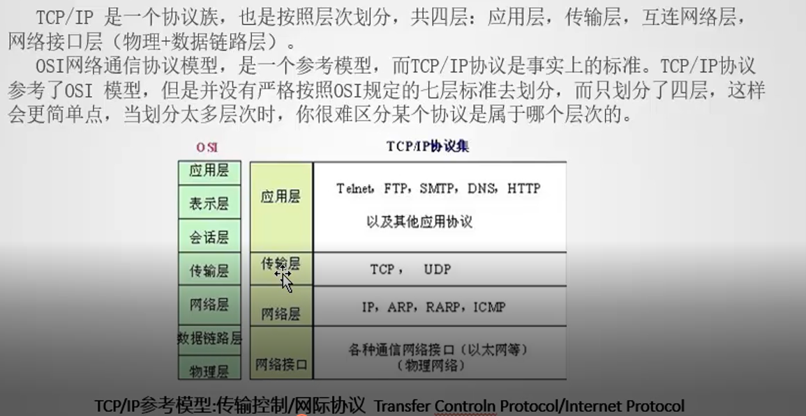


```
数据封装：
```

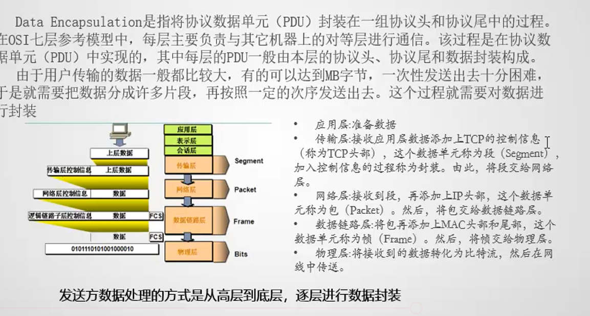

```
数据拆封
```

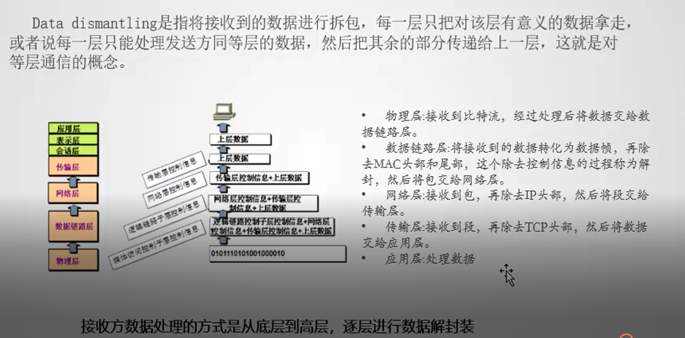


## 12.2 常用类

#关注定位和传输协议

### 1）定位

#1，IP

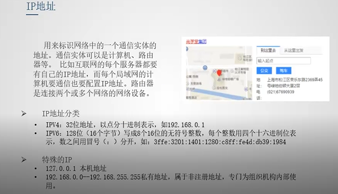

```
#没有构造：通过静态方法返回
java.net.InetAddress;
/**
 * IP:定位一个节点:计算机、路由、通讯设备等
 * InetAddress: 多个静态方法
 * 1、getLocalHost:本机
 * 2、getByName:根据域名DNS |  IP地址 -->IP
 *
 * 两个成员方法
 * 1、getHostAddress: 返回地址
 * 2、getHostName:返回计算机名
 */
 
 //使用getLocalHost方法创建InetAddress对象  本机
		InetAddress addr = InetAddress.getLocalHost();
		System.out.println(addr.getHostAddress());  //返回：192.168.1.110
		System.out.println(addr.getHostName());  //输出计算机名
		
		//根据域名得到InetAddress对象
		addr = InetAddress.getByName("www.XXX.com"); 
		System.out.println(addr.getHostAddress());  //返回 XXXX服务器的ip:
		System.out.println(addr.getHostName());  //输出：www.XXX.com
		
		//根据ip得到InetAddress对象
		addr = InetAddress.getByName("192.168.137.1"); 
		System.out.println(addr.getHostAddress());  //返回 XXX的ip:123.56.138.176
		System.out.println(addr.getHostName());  //如果这个IP地 址不存在或DNS服务器不允许进行IP地址和域名的映射，输出ip而不是域名。
```


#2，端口

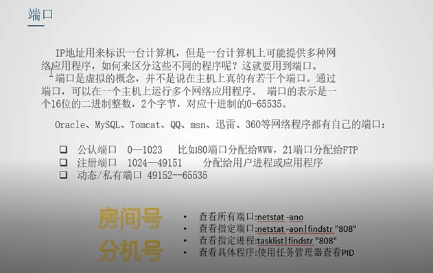

```
#上面的命令可以看哪个程序占了自己想要的端口
#本机配置文件：Windows–System32-drivers–etc  HOSTS文件
#80：http,,8080:tomacat   1521 :oracle   3306:mysql

java.net.InetSocketAddress;（继承SocketAddress）
/**
 * 1、用来区分软件
 * 2、2个字节 0-65535  UDP TCP
 * 3、同一个协议端口不能冲突
 * 4、定义端口越大越好
 
 * InetSocketAddress 
 * 1、构造器
 *   new InetSocketAddress(地址|域名,端口);
 * 2、方法
 *  getAddress()  
 *  getPort()
 *  getHostName()

 */
 
InetSocketAddress socketAddress = new InetSocketAddress("127.0.0.1",8080);
		InetSocketAddress socketAddress2 = new InetSocketAddress("localhost",9000);
		System.out.println(socketAddress.getHostName());
		System.out.println(socketAddress.getAddress());
		System.out.println(socketAddress2.getAddress());
		System.out.println(socketAddress2.getPort());

127.0.0.1
127.0.0.1/127.0.0.1
localhost/127.0.0.1
9000
```


#3，资源

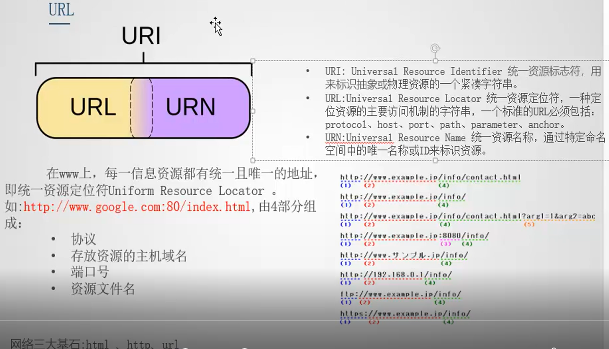

```
#超链接（跳转）：同一网站或不同网站
#锚点（定位）：同一网站或网页

/**http://www.baidu.com:80/index.html?uname=shsxt&age=18#a
 * URL: 统一资源定位器,互联网三大基石之一(html http),区分资源
 * 1、协议
 * 2、域名、计算机
 * 3、端口: 默认80
 * 4、请求资源 
 *5， 参数
 *6， 锚点
 */
 
 URL url = new URL("http://www.baidu.com:80/index.html?uname=shsxt&age=18#a");
		//获取四个值
		System.out.println("协议:"+url.getProtocol());
		System.out.println("域名|ip:"+url.getHost());
		System.out.println("端口:"+url.getPort());
		System.out.println("请求资源1:"+url.getFile());
		System.out.println("请求资源2:"+url.getPath());
		
		//参数
		System.out.println("参数:"+url.getQuery());
		//锚点
		System.out.println("锚点:"+url.getRef());

协议:http
域名|ip:www.baidu.com
端口:80
请求资源1:/index.html?uname=shsxt&age=18
请求资源2:/index.html
参数:uname=shsxt&age=18
锚点:a
```


#4，应用：爬虫

```
四步：获取URL，下载资源，分析，处理
1） 简单爬
public class SpiderTest01 {

	public static void main(String[] args) throws Exception {
		//获取URL
		URL url =new URL("https://www.jd.com");
		//URL url =new URL("https://www.dianping.com");
		//下载资源
		InputStream is = url.openStream();
		BufferedReader br =new BufferedReader(new InputStreamReader(is,"UTF-8"));
		String msg =null;
		while(null!=(msg=br.readLine())) {
			System.out.println(msg);
		}
		br.close();
		//分析
		//处理。。。。
	}

}

2) 模拟浏览器
		//获取URL
		URL url =new URL("https://www.dianping.com");
		//下载资源:     URLConnection to HttpURLConnection,, HTTP和JAR
		HttpURLConnection  conn =(HttpURLConnection) url.openConnection();
		conn.setRequestMethod("GET");    //请求头：get,post
									     //浏览器
		conn.setRequestProperty("User-Agent",  
				"Mozilla/5.0 (Windows NT 10.0; Win64; x64) AppleWebKit/537.36 (KHTML, like Gecko) Chrome/58.0.3029.81 Safari/537.36");
		
		BufferedReader br =new BufferedReader(new InputStreamReader(conn.getInputStream(),"UTF-8"));
		String msg =null; 
		while(null!=(msg=br.readLine())) {
			System.out.println(msg);
		}
		br.close();
		//分析
		//处理。。。。
```


### 2）传输协议

#1，TCP和UDP

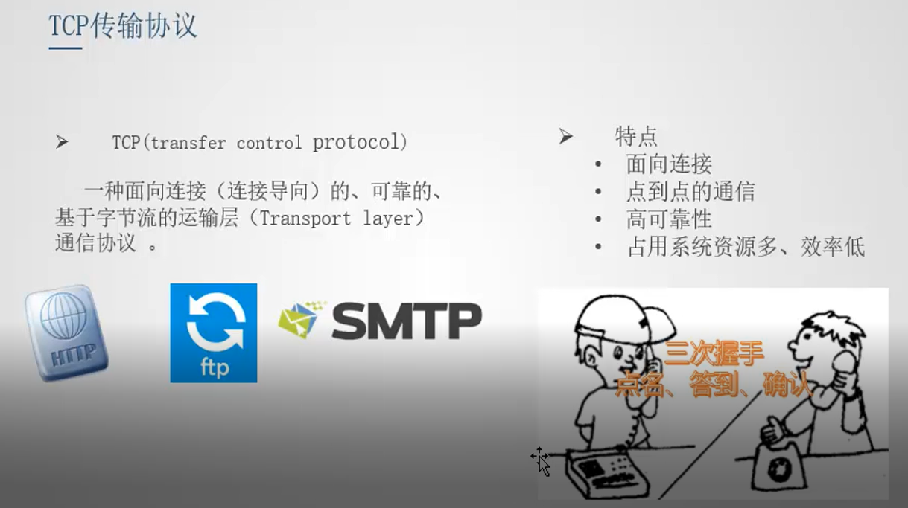


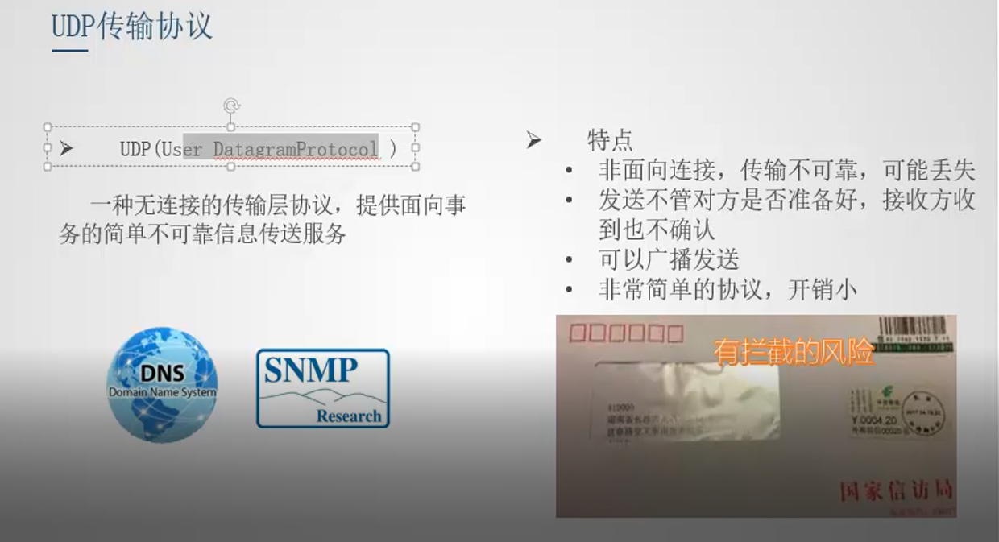


#2，Socket

```
#传输层的tcp，udp和应用层的连接就是Socket
```

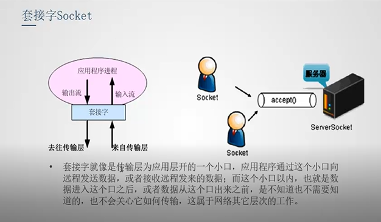

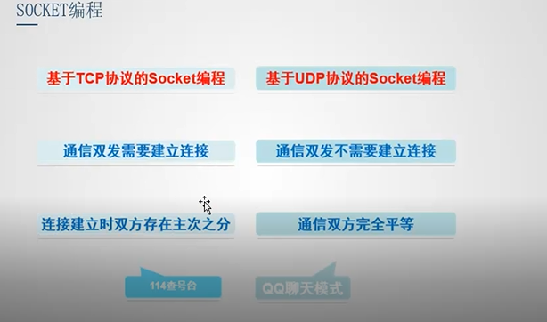


## 12.3 UDP

#不能太大：最多60K。

#不需要利用IO流实现数据传输（注意是数据传输）
#每个数据发送单元被统一封装成数据包的方式，发送方将数据包发送到网络中，数据包在网络中寻找目的地。

### 1）基本步骤

```
没有谁是客户和服务端。只是模拟下主次。

#1，发送

/**
 * 基本流程: 发送端
 * 1、使用DatagramSocket  指定端口 创建发送端 （套接字）
 * 2、准备数据 一定转成字节数组
 * 3、 封装成DatagramPacket 包裹，需要指定目的地
 * 4、发送包裹send(DatagramPacket p) 
 * 5、释放资源
 *
 */
public class UdpClient {
	public static void main(String[] args) throws Exception {
		System.out.println("发送方启动中.....");
		 // 1、使用DatagramSocket  指定端口 创建发送端
		DatagramSocket client =new DatagramSocket(8888);
		 //2、准备数据 一定转成字节数组
		String data = "上海尚学堂";
		byte[] datas = data.getBytes();
		 //3、 封装成DatagramPacket 包裹，需要指定目的地
		DatagramPacket packet =new DatagramPacket(datas,0,datas.length,
				new InetSocketAddress("localhost",6666));
		//4、发送包裹send(DatagramPacket p) * 
		client.send(packet);
		// 5、释放资源
		client.close();
	}

}

#2，接收端
/**
 * 基本流程: 接收端
 * Address already in use: Cannot bind  同一个协议下端口不允许冲突
 * 1、使用DatagramSocket  指定端口 创建接收端
 * 2、准备容器 封装成DatagramPacket 包裹
 * 3、阻塞式接收包裹receive(DatagramPacket p)
 * 4、分析数据
 *    byte[]  getData()
 *            getLength()
 * 5、释放资源

 *
 */
public class UdpServer {
	public static void main(String[] args) throws Exception {
		System.out.println("接收方启动中.....");
		// 1、使用DatagramSocket  指定端口 创建接收端
		DatagramSocket server =new DatagramSocket(6666);
		// 2、准备容器 封装成DatagramPacket 包裹
		byte[] container =new byte[1024*60];
		DatagramPacket packet = new DatagramPacket(container,0,container.length);
		// 3、阻塞式接收包裹receive(DatagramPacket p)
		server.receive(packet); //阻塞式
		// 4、分析数据
		//    byte[]  getData()
		//            getLength()
		 byte[]  datas =packet.getData();
		 int len = packet.getLength();
		 System.out.println(new String(datas,0,len));
		 
		// 5、释放资源
		 server.close();
	}

}

```


### 2）其他类型

#UDP底层不要考虑IO流，但是前一步传收啥要考虑，因为只能包里面包着字节数组。

数据都要变成字节数组。

​		1String 提供了方法，直接变成字符数组、（省得自己写流）

​		2DATA，，基本数据类型--> ouput  写进字节数组     反之亦然

​		3Obj，，类引用类型    都写成字节数组，，，字节数组读成类。

​		4图片：  f-字节数组

​	

```
#1, 传基本数据类型

/**
 * 基本类型: 发送端
 * 1、使用DatagramSocket  指定端口 创建发送端
 * 2、将基本类型  转成字节数组
 * 3、 封装成DatagramPacket 包裹，需要指定目的地
 * 4、发送包裹send(DatagramPacket p) * 
 * 5、释放资源

 */
public class UdpTypeClient {

	public static void main(String[] args) throws Exception {
		System.out.println("发送方启动中.....");
		 // 1、使用DatagramSocket  指定端口 创建发送端
		DatagramSocket client =new DatagramSocket(8888);
		 //2、准备数据 一定转成字节数组
		//写出
		ByteArrayOutputStream baos =new ByteArrayOutputStream();
		DataOutputStream dos =new DataOutputStream(new BufferedOutputStream(baos));
		//操作数据类型 +数据
		dos.writeUTF("编码辛酸泪");
		dos.writeInt(18);
		dos.writeBoolean(false);
		dos.writeChar('a');
		dos.flush();
		byte[] datas =baos.toByteArray();	
		 //3、 封装成DatagramPacket 包裹，需要指定目的地
		DatagramPacket packet =new DatagramPacket(datas,0,datas.length,
				new InetSocketAddress("localhost",6666));
		//4、发送包裹send(DatagramPacket p) * 
		client.send(packet);
		// 5、释放资源
		client.close();
	}

}

/**
 * 基本类型: 接收端
 * Address already in use: Cannot bind  同一个协议下端口不允许冲突
 * 1、使用DatagramSocket  指定端口 创建接收端
 * 2、准备容器 封装成DatagramPacket 包裹
 * 3、阻塞式接收包裹receive(DatagramPacket p)
 * 4、分析数据    将字节数组还原为对应的类型
 *    byte[]  getData()
 *            getLength()
 * 5、释放资源
 *
 */
public class UdpTypeServer {

	public static void main(String[] args) throws Exception {
		System.out.println("接收方启动中.....");
		// 1、使用DatagramSocket  指定端口 创建接收端
		DatagramSocket server =new DatagramSocket(6666);
		// 2、准备容器 封装成DatagramPacket 包裹
		byte[] container =new byte[1024*60];
		DatagramPacket packet = new DatagramPacket(container,0,container.length);
		// 3、阻塞式接收包裹receive(DatagramPacket p)
		server.receive(packet); //阻塞式
		// 4、分析数据    将字节数组还原为对应的类型
		 byte[]  datas =packet.getData();
		 int len = packet.getLength();		 
		DataInputStream dis =new DataInputStream(new BufferedInputStream(new ByteArrayInputStream(datas)));
		//顺序与写出一致
		String msg = dis.readUTF(); 
		int age = dis.readInt();
		boolean flag = dis.readBoolean();
		char ch = dis.readChar();
		System.out.println(msg+"-->"+flag);
		// 5、释放资源
		 server.close();
	}

-----------------------------------
#2，Obj 类型
和上面基本一致，就是多了个类数据。

ByteArrayOutputStream baos =new ByteArrayOutputStream();
ObjectOutputStream oos =new ObjectOutputStream(new BufferedOutputStream(baos));
oos.writeObject(XXX);

ObjectInputStream ois =new ObjectInputStream(new BufferedInputStream(new ByteArrayInputStream(datas)));
Object employee = ois.readObject();

#3，File 文件
Fis--Bao   +  Bai --Fos

?还是老问题，为什么多一步

觉得：如果只要文件拷贝，完全Fin Fos就足够，
但是当你要获得File变成字节数组这个特殊要求，光读，写要Bao才能变成字符数组状态保持。
#（即Fin：file-->字节数组，但是不能把数组直接提出来赋值）
```


### 3）实战

```
#任务要求：互相发送

#封装就是考虑：类有属性，构造方法初始化，类之间关系
#要多线程，多程序（进程）

1,Send:
public class Send implements Runnable{
	private String toIP ;
	private int toPort ;	
	private DatagramSocket client ;
	private BufferedReader reader;
	
	public Send(int port , String toIP,int toPort){
		this.toIP = toIP;
		this.toPort=toPort;
		try {
			client=new DatagramSocket(port);
			reader =new BufferedReader(new InputStreamReader(System.in));
		} catch (SocketException e) {
			e.printStackTrace();
		}
		
	}
	
	@Override
	public void run() {
		
		// TODO Auto-generated method stub
		while(true) {
			String data;
			try {
				data = reader.readLine();
				byte[] datas = data.getBytes();
				 //3、 封装成DatagramPacket 包裹，需要指定目的地
				DatagramPacket packet =new DatagramPacket(datas,0,datas.length,
						new InetSocketAddress(this.toIP,this.toPort));
				//4、发送包裹send​(DatagramPacket p) * 
				client.send(packet);
				if(data.equals("bye")) {
					break;
				}
			} catch (IOException e) {
				e.printStackTrace();
			}
			
		}
		// 5、释放资源
		client.close();
	}

	}
	
}

2,Receive
public class Receive implements Runnable{
	private String from ;
	private DatagramSocket server ;
	
	public Receive(int port,String from) {
		this.from = from ;
		try {
			server=new DatagramSocket(port);
		} catch (SocketException e) {
			e.printStackTrace();
		}
	}

	@Override
	public void run() {
		// TODO Auto-generated method stub
		while(true) {
			// 2、准备容器 封装成DatagramPacket 包裹
			byte[] container =new byte[1024*60];
			DatagramPacket packet = new DatagramPacket(container,0,container.length);
			// 3、阻塞式接收包裹receive​(DatagramPacket p)
			try {
				server.receive(packet);//阻塞式
				// 4、分析数据
				 byte[]  datas =packet.getData();
				 int len = packet.getLength();
				 
				 String data=new String(datas,0,len);
				 System.out.println(from+":"+ data);
				 if(data.equals("bye")) {
					 break;
				 }
			} catch (IOException e) {
				e.printStackTrace();
			} 
		}
		// 5、释放资源
		 server.close();
	}			
}

3,Student
public class TalkStudent {
	public static void main(String[] args) {
		new Thread(new TalkSend(7777,"localhost",9999)).start(); //发送		
		new Thread(new TalkReceive(8888,"老师")).start(); //接收
	}
}
4，Teacher
public class TalkTeacher {
	public static void main(String[] args) {
		new Thread(new TalkReceive(9999,"学生")).start(); //接收
		
		new Thread(new TalkSend(5555,"localhost",8888)).start(); //发送
	}
}
```

#UDP：

都是一个DatagramSocket类型，后面DatagramPacket也同一个。

靠send 和receive


#TCP：

不同类型Socket  ,SeverSocket，先得为客户端，用IO交流。


## 12.4 TCP

### 1）基本概念

```
s开了个口子，等c发连接建立管道  
	#直接靠流沟通，out 对 in  （请求，相应）
	#s要阻塞，等c连接。
```

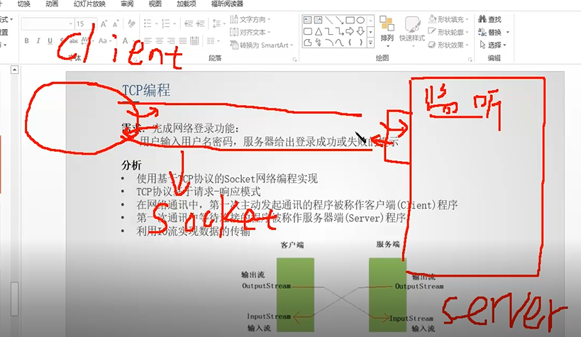

```
#基本步骤
```

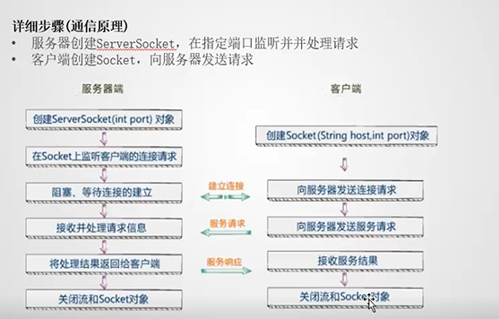

#应用层http 底层tcp


### 2）不同实现


```
#但下面C都是 request，reponse 式，即先发，后收。无多线程
```


```
#1，单向

1）C
/**
 * 熟悉流程
 * 创建客户端
 * 1、建立连接: 使用Socket创建客户端 +服务的地址和端口
 * 2、操作: 输入输出流操作
 * 3、释放资源 
 */
public class Client {

	public static void main(String[] args) throws UnknownHostException, IOException {
		System.out.println("-----Client-----");
		//1、建立连接: 使用Socket创建客户端 +服务的地址和端口
		Socket client =new Socket("localhost",8888);
		//2、操作: 输出流操作：里面包着输出字节流
		DataOutputStream dos =new DataOutputStream(client.getOutputStream());
		String data ="hello";
		dos.writeUTF(data);
		dos.flush();
		//3、释放资源 
		dos.close();
		client.close();
	}

}

2）S
/**
 * 熟悉流程
 * 创建服务器
 * 1、指定端口 使用ServerSocket创建服务器+指定自己端口
 * 2、阻塞式等待连接 accept
 * 3、操作: 输入输出流操作
 * 4、释放资源 
 */
public class Server {

	public static void main(String[] args) throws IOException {
		System.out.println("-----Server-----");
		// 1、指定端口 使用ServerSocket创建服务器
		ServerSocket server =new ServerSocket(8888);
		// 2、阻塞式等待连接 accept
		Socket  client =server.accept(); 
		System.out.println("一个客户端建立了连接");
		// 3、操作: 输入流操作
		DataInputStream dis =new DataInputStream(client.getInputStream());
		String data =dis.readUTF();
		System.out.println(data);
		// 4、释放资源 
		dis.close();
		client.close();
		
		server.close();
	}
}
```


```
#1，双向
#S给了回应：建立了 CO-SI,,SO-CI Socket

1）C

public static void main(String[] args) throws UnknownHostException, IOException {
		System.out.println("-----Client-----");
		//从键盘获得输入。
		BufferedReader console =new BufferedReader(new InputStreamReader(System.in));
		System.out.print("请输入用户名:");
		String uname =console.readLine();
		System.out.print("请输入密码:");
		String upwd =console.readLine();
		
		//1、建立连接: 使用Socket创建客户端 +服务的地址和端口
		Socket client =new Socket("localhost",8888);
		//2、操作: 输出输入流操作
		DataOutputStream dos =new DataOutputStream(client.getOutputStream());		
		dos.writeUTF("uname="+uname+"&"+"upwd="+upwd);
		dos.flush();
		
		DataInputStream dis =new DataInputStream(client.getInputStream());
		String result =dis.readUTF();		
		System.out.println(result);
		//3、释放资源 
		dos.close();
		client.close();
	}


2) S
public static void main(String[] args) throws IOException {
		System.out.println("-----Server-----");
		// 1、指定端口 使用ServerSocket创建服务器
		ServerSocket server =new ServerSocket(8888);
		// 2、阻塞式等待连接 accept
		Socket  client =server.accept(); 
		System.out.println("一个客户端建立了连接");
		// 3、操作: 输入输出流操作
		DataInputStream dis =new DataInputStream(client.getInputStream());
		String datas =dis.readUTF();
		String uname ="";
		String upwd ="";
		//分析
		String[] dataArray = datas.split("&");
		for(String info:dataArray) {
				String[] userInfo =info.split("=");
				if(userInfo[0].equals("uname")) {
					System.out.println("你的用户名为:"+userInfo[1]);
					uname = userInfo[1];
				}else if(userInfo[0].equals("upwd")) {
					System.out.println("你的密码为:"+userInfo[1]);
					upwd = userInfo[1];
				}				
		}
		//输出
		DataOutputStream dos =new DataOutputStream(client.getOutputStream());			
		if(uname.equals("shsxt") && upwd.equals("laopei")) { 				  //成功
			dos.writeUTF("登录成功，欢迎回来");
		}else { //失败
			dos.writeUTF("用户名或密码错误");
		}
		dos.flush();
		// 4、释放资源 
		dis.close();
		client.close();		
		server.close();
	}
```


```
#3, C上传文件
#C中，FI 和 CO 对接上， S SI 和 FO 对接

1）C
public static void main(String[] args) throws UnknownHostException, IOException {
		System.out.println("-----Client-----");
		//1、建立连接: 使用Socket创建客户端 +服务的地址和端口
		Socket client =new Socket("localhost",8888);
		//2、操作: 拷贝 上传
		InputStream is =new BufferedInputStream(new FileInputStream("src/ndl.png"));
		OutputStream os =new BufferedOutputStream(client.getOutputStream());
		byte[] flush =new byte[1024];
		int len = -1;
		while((len=is.read(flush))!=-1) {
			os.write(flush,0,len);
		}
		os.flush();
		//3、释放资源 
		os.close();
		is.close();
		client.close();
	}

2）S
public static void main(String[] args) throws IOException {
		System.out.println("-----Server-----");
		// 1、指定端口 使用ServerSocket创建服务器
		ServerSocket server =new ServerSocket(8888);
		// 2、阻塞式等待连接 accept
		Socket  client =server.accept(); 
		System.out.println("一个客户端建立了连接");
		// 3、操作: 文件拷贝 存储
		InputStream is =new BufferedInputStream(client.getInputStream());
		OutputStream os =new BufferedOutputStream(new FileOutputStream("src/tcp.png"));
		byte[] flush =new byte[1024];
		int len = -1;
		while((len=is.read(flush))!=-1) {
			os.write(flush,0,len);
		}
		os.flush();
		//3、释放资源 
		os.close();
		is.close();		
		// 4、释放资源 
		client.close();		
		server.close();
	}
```


```
#4，一个S为多个C服务
#s端，多线程。。开多个c（不用多线程）模拟。

#用封装思想。

1） C
public class LoginMultiClient {
	public static void main(String[] args) throws UnknownHostException, IOException {		
		System.out.println("-----Client-----");
		//1、建立连接: 使用Socket创建客户端 +服务的地址和端口
		Socket client =new Socket("localhost",8888);
		//2、操作: 输入输出流操作  先请求后响应
		new Send(client).send();
		new Receive(client).receive();		
		client.close();
	}
	
	
	//发送类
	static class Send{
		
		private Socket client;
		private DataOutputStream dos;
		private BufferedReader console ;
		private String msg;
		
		public Send(Socket client) {			
			this.client = client;
			
			//得一些值
			console=new BufferedReader(new InputStreamReader(System.in));
			this.msg =init(); 		
			
			try {
				dos=new DataOutputStream(client.getOutputStream());
			} catch (IOException e) {
				e.printStackTrace();
			}
		}
		private String init() {					
			try {
				System.out.print("请输入用户名:");
				String uname =console.readLine();
				System.out.print("请输入密码:");
				String upwd =console.readLine();
				return "uname="+uname+"&"+"upwd="+upwd;
			} catch (IOException e) {
				e.printStackTrace();
			}
			//骗编译器的
			return "";			
		}
		
		public void send() {
			try {
				dos.writeUTF(msg);
				dos.flush();
			} catch (IOException e) {
				e.printStackTrace();
			}
		}
	}
	
	//接收类
	static class Receive{
		private Socket client;
		private DataInputStream dis;
		
		public Receive(Socket client) {
			this.client = client;
			try {
				dis=new DataInputStream(client.getInputStream());
			} catch (IOException e) {
				e.printStackTrace();
			}
		}		
		public void receive() {
			String result;
			try {
				result = dis.readUTF();
				System.out.println(result);
			} catch (IOException e) {
				e.printStackTrace();
			}		
			
		}
	}
}

2）C
public class LoginMultiServer {
	public static void main(String[] args) throws IOException {
		System.out.println("-----Server-----");
		// 1、指定端口 使用ServerSocket创建服务器
		ServerSocket server =new ServerSocket(8888);
		
		//骗编译器
		boolean isRunning =true;;
		// 2、阻塞式等待连接 accept
		while(isRunning) {
			Socket  client =server.accept(); 
			System.out.println("一个客户端建立了连接");
			new Thread(new Channel(client)).start();
		}
		server.close();
	}
	//一个channel就代表一个客户端
	static class Channel implements Runnable{
		private Socket  client;
		//输入流
		private DataInputStream dis;
		//输出流
		private DataOutputStream dos;
		public Channel(Socket  client) {
			this.client = client;
			try {
				//输入
				dis = new DataInputStream(client.getInputStream());
				//输出
				dos =new DataOutputStream(client.getOutputStream());	
			} catch (IOException e) {
				e.printStackTrace();
				release();
			}
			
		}
		
		//接收数据
		private String receive() {
			String datas ="";
			try {
				datas = dis.readUTF();
			} catch (IOException e) {
				e.printStackTrace();
			}
			return datas;
		}
		//释放资源
		private void release() {
			// 4、释放资源 
			try {
				if(null != dos) {
					dos.close();					
				}
			} catch (IOException e) {
				e.printStackTrace();
			}
			try {
				if(null != dis) {
					dis.close();
				}
			} catch (IOException e) {
				e.printStackTrace();
			}
			try {
				if(null != client) {
					client.close();
				}
			} catch (IOException e) {
				e.printStackTrace();
			}
		}
		//发送数据
		private void send(String msg) {
			try {
				dos.writeUTF(msg);
				dos.flush();
			} catch (IOException e) {
				e.printStackTrace();
			}
		}
		@Override
		public void run() {						
			// 3、操作: 输入输出流操作					
			String uname ="";
			String upwd ="";
			//分析
			String[] dataArray = receive().split("&");
			for(String info:dataArray) {
					String[] userInfo =info.split("=");
					if(userInfo[0].equals("uname")) {
						System.out.println("你的用户名为:"+userInfo[1]);
						uname = userInfo[1];
					}else if(userInfo[0].equals("upwd")) {
						System.out.println("你的密码为:"+userInfo[1]);
						upwd = userInfo[1];
					}				
			}					
			if(uname.equals("shsxt") && upwd.equals("laopei")) { //成功
				send("登录成功，欢迎回来");
			}else { //失败
				send("用户名或密码错误");
			}
			
			release();
			
		}
		
	}
}

#接下来就可以，开一个C，多个S。
#整个思想就是，多线程，不让堵塞，能接受多个连接。
```


## 12.5 TCP聊天室

```
#要求：群聊，私聊

整体思路就是：
S当做转发器（有多个C的容器），多线程。

多个C（多个程序）中有双线程（一个发送，一个接受）

C和S连接：
	C1说话，就是C1输出到S，对谁说就是把S输出，输入到谁。
```


[源代码]: \source\13-tcp	"五个版本"

```
#最后版本：完成群聊私聊

结构：五个文件
1）对C：
一个主文件C：在里面开启两个线程，一个发，一个收  （while写在线程里面）
发类，收类，释放类。

2）对S来说：
while线程在最外，包着内部类（一个类一个C）
				（要有CopyOnWriteArrayList<Channel> 存着C）
```


# 13.http服务器

## 13.1 WebServer

```
服务器：有数据库（存），缓存（性能），WEB
	静态服务器：缓存
	动态服务器：内容


基于请求响应式的WEB服务器：
	需要9个基础： oop,容器，IO，多线程，网络编程，XML，反射，HTML，HTTP
```

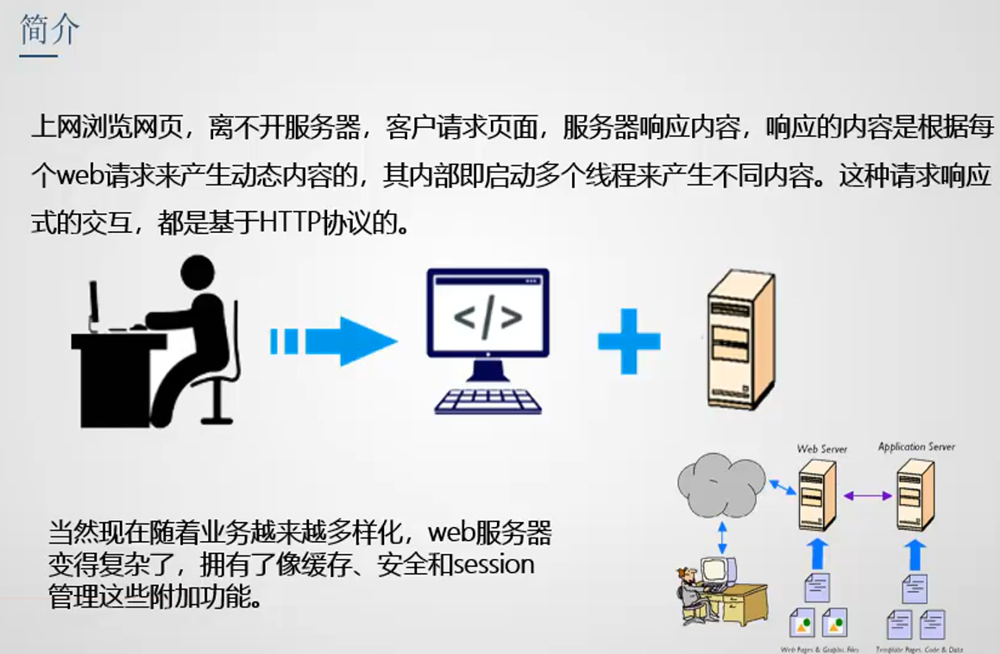

静态：缓存

动态产生内容

服务器：有数据库（存），缓存（性能），WEB


请求响应式：

需要9个基础： oop,容器，IO，多线程，网络编程，XML，反射，HTML，HTTP

两个图

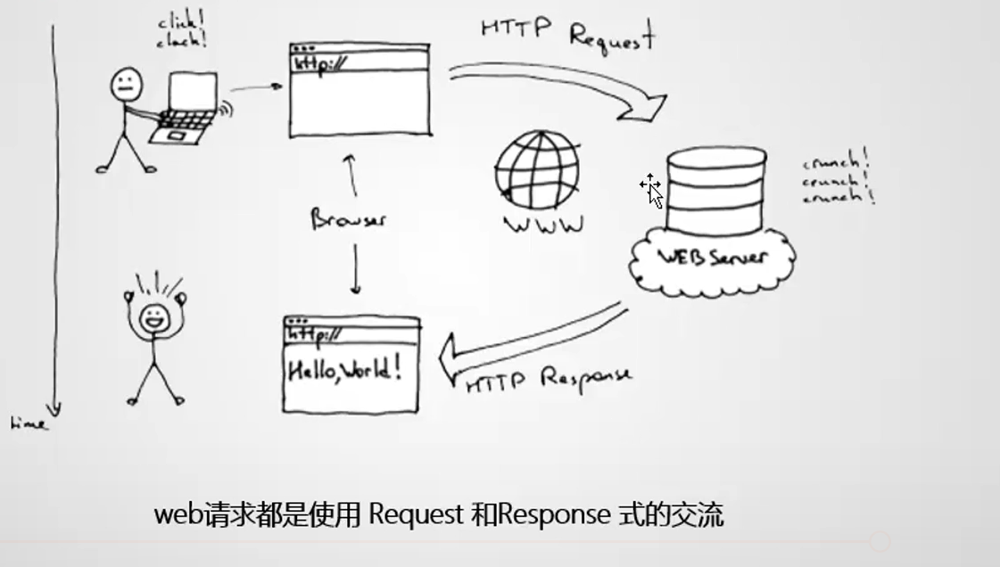


## 13.2 反射

```
（有动态特性）

#1，理解
	new 原来是JVM  在字节码区，弄模子的 ；现在可以在运行中，使用者准备
	将JAVA类中的各种结构（属性，方法，构造器）影响成一个个对象

#即反射对类解剖，是框架的灵魂
#反射让JAVA才具备了动态特性


#2，操作：
/**
 * 反射: 把java类中的各种结构(方法、属性、构造器、类名)映射成一个个的Java对象。
 
 * 1）、获取Class对象
 *三种方式: Class.forName("完整路径"):可以动态传递，类没必要先存在。
 * 2）、可以动态创建对象
 * clz.getConstructor().newInstance() ：更安全而已
 *
 */
public class ReflectTest {

	public static void main(String[] args) throws ClassNotFoundException, InstantiationException, IllegalAccessException, IllegalArgumentException, InvocationTargetException, NoSuchMethodException, SecurityException {
		//三种方式 ：前两者必须要先存在类，才能编译通过
		//1、对象.getClass()
		Iphone iphone =new Iphone();
		Class clz = iphone.getClass();
		//2、类.class()
		clz = Iphone.class;
		//3、Class.forName("包名.类名")
		clz = Class.forName("com.sxt.server.basic.Iphone");
		// Class clz = Class.forName("XXX");  低耦合度 
		
		//创建对象：返回Obj 对象
		/*Iphone iphone2 =(Iphone)clz.newInstance();
		System.out.println(iphone2);*/
		
		Iphone iphone2 =(Iphone)clz.getConstructor().newInstance();
		System.out.println(iphone2);
	}
}
class Iphone{
	public Iphone() {		
	}
}

```


## 13.3 XML

```
#1，概念
#就一个根，多个类，类里面属性
```


```
#2，SAX解析
#流解析SAX解析（还有一种DOM解析：文档树）

#XML：格式
<persons>
    <person>
      <name>至尊宝</name>
      <age>9000</age>
   </person>
   <person>
      <name>白晶晶</name>
      <age>7000</age>
   </person>
</persons>

五步加重写处理器。
处理器：最开始，开始标签，内容，结束标签，最最后。

1）单个person：

/**
 * 熟悉SAX解析流程:(XML空格也有影响:也算标签的内容，结束标签也要算内容）
 * 一点一点流下去，先ps--p --n-n-a-a...
 */
public class XmlTest01 {

	public static void main(String[] args) throws ParserConfigurationException, SAXException, IOException {
		//SAX解析
		//1、获取解析工厂
		SAXParserFactory factory=SAXParserFactory.newInstance();
		//2、从解析工厂获取解析器
		SAXParser parse =factory.newSAXParser();
		//3、编写处理器
		//4、加载文档 Document 注册处理器
		PHandler handler=new PHandler();
		//5、解析
		parse.parse(Thread.currentThread().getContextClassLoader()
		.getResourceAsStream("com/sxt/server/basic/p.xml")
		,handler);

	}

}
class PHandler extends DefaultHandler{
	@Override
	public void startDocument() throws SAXException {
		System.out.println("----解析文档开始----");
	}
	
	@Override    //，标签包括/标签
	public void startElement(String uri, String localName, String qName, Attributes attributes) throws SAXException {
		System.out.println(qName+"-->解析开始");
	}
	
	@Override  //任何两个标签内的内容
	public void characters(char[] ch, int start, int length) throws SAXException {
		String contents = new String(ch,start,length).trim();
		if(contents.length()>0) {
			System.out.println("内容为->"+contents);			
		}else {
			System.out.println("内容为->"+"空");		
		}
	}
	
	@Override
	public void endElement(String uri, String localName, String qName) throws SAXException {
		System.out.println(qName+"-->解析结束开始");
	}
	@Override
	public void endDocument() throws SAXException {
		System.out.println("----解析文档结束----");
	}
}

2）多个person 存在list
public class XmlTest02 {

	public static void main(String[] args) throws ParserConfigurationException, SAXException, IOException {
		//SAX解析
		//1、获取解析工厂
		SAXParserFactory factory=SAXParserFactory.newInstance();
		//2、从解析工厂获取解析器
		SAXParser parse =factory.newSAXParser();
		//3、编写处理器
		//4、加载文档 Document 注册处理器
		PersonHandler handler=new PersonHandler();
		//5、解析
		parse.parse(Thread.currentThread().getContextClassLoader()
		.getResourceAsStream("com/sxt/server/basic/p.xml")
		,handler);
		
		//获取数据
		List<Person> persons = handler.getPersons();
		for(Person p:persons) {
			System.out.println(p.getName()+"-->"+p.getAge());
		}
	}

}
class PersonHandler extends DefaultHandler{
	private List<Person> persons ;
	private Person person ;
	private String tag; //存储操作标签：目的是只在chara中，没法获得qname。同时后面null
	@Override
	public void startDocument() throws SAXException {
		persons = new ArrayList<Person>();
	}
	
	@Override
	public void startElement(String uri, String localName, String qName, Attributes attributes) throws SAXException {
		if(null!=qName) {
			tag = qName; //存储标签名
			if(tag.equals("person")) {
				person = new Person();
			}
		}
	}
	
	@Override
	public void characters(char[] ch, int start, int length) throws SAXException {
		String contents = new String(ch,start,length).trim();
		if(null!=tag) { //处理了空
			if(tag.equals("name")) {
				person.setName(contents);
			}else if(tag.equals("age")) {
				if(contents.length()>0) {
					person.setAge(Integer.valueOf(contents));
				}			
			}
		}
	}
	
	@Override
	public void endElement(String uri, String localName, String qName) throws SAXException {
		if(null!=qName) {    //用qName，不要tag
			if(qName.equals("person")) {
				persons.add(person);
			}
		}

		tag = null; //tag丢弃了：防止结束的时候覆盖原来的
	}
	@Override
	public void endDocument() throws SAXException {
	}

	public List<Person> getPersons() {
		return persons;
	}	
}
```


```
#3，配合反射动态产生。

#最终目标：通过输入的url，能够产生对应的class类。
#结构：
	web.xml，Entity 和Mapping类   （两个这个类的List存整体信息）
		   WebContext （将url，对应类）
	    接口服务类，和两个实现的服务类
	  		   主操作类

1）web.xml
 <web-app>
 <servlet>
  <servlet-name>login</servlet-name>
  <servlet-class>com.sxt.server.basic.servlet.LoginServlet</servlet-class>
 </servlet>
   <servlet>
  <servlet-name>reg</servlet-name>
  <servlet-class>com.sxt.server.basic.servlet.RegisterServlet</servlet-class>
 </servlet>   
 
 
 <servlet-mapping>
  <servlet-name>login</servlet-name>
  <url-pattern>/login</url-pattern> 
  <url-pattern>/g</url-pattern> 
 </servlet-mapping>  
 <servlet-mapping>
  <servlet-name>reg</servlet-name>
  <url-pattern>/reg</url-pattern> 
 </servlet-mapping>
 </web-app>

对于servlet，name对于着类。
对于mapping，url对应着name.

2）Entity 和Mapping类
#存解析出来的数据
	前者：有name和clz(类的字符串)
	后者：有name和patterns(url集合)

3）WebContext
有两个Map ：
	servlet：将entity 的List转成了对应map
	mapping：将map 的List转成了对应map
#get  将url, 对应到类

4）接口服务类，和两个实现的服务类

5）主操作类：
和上面一样，改动就是有两个List存信息，然后有新的功能：

//获取数据
WebContext context = new WebContext(handler.getEntitys(),handler.getMappings());

//假设你输入了 /login  ：反射，动态创建。
String className = context.getClz("/g");
Class clz =Class.forName(className);
Servlet servlet =(Servlet)clz.getConstructor().newInstance();
System.out.println(servlet);
servlet.service();
```

[源代码]: \source


## 13.4 HTML


```
#基本知识：
HTML–发展成html5 和xml

浏览器三部分
	html  骨架
	css	  美化
	js	  交互（动态语言，边解释边执行）

常用标签
	固定结构
	常用标签：
		h:标题  ， p:段落
		div: 块 ，span：普通块 
		form：表单 
```

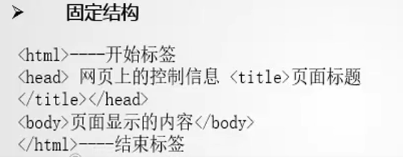

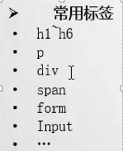

```
<html>
	<head>
		<title>第一个html登录</title>
	</head>
	<body>
		<h1>表单的使用</h1>
		<pre>
				post：提交 ，基于http协议不同提交量大   请求参数url不可见 安全<br/>
				get:  默认，获取，基于http协议不同也提交量小  请求参数url可见 不安全<br/>
				action: 请求web服务器的资源   URL<br/>
				name:作为后端使用，区分唯一: 请求服务器，必须存在，数据不能提交<br/>
				id: 作为前端使用，区分唯一<br/>
		<pre>
		<form method="post" action="http://localhost:8888/index.html">
						用户名:<input type="text" name="uname"  id="uname"/>
						密码:<input type="password" name="pwd"  id="pwd"/>
						<input type="submit" value="登录"/>
		</form>
	</body>
</html>

#name (http传给服务器）  id  (浏览器内部用)
#pre 就会采用你的格式。
```


## 13.5 HTTP


```
#浏览器和服务器交流，应用层（底层tcp/ip）
有请求和响应协议：（注意空格和换行）
1）请求
```


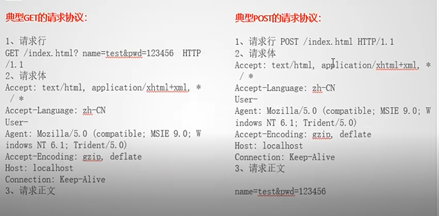

#post  空行

```
2）响应
```

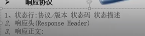

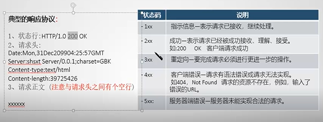


## 13.6 手写服务器

### 1) 请求协议


```
#1，基础
如上面的TCP， 一个客户端就有一个连接：Co （Si输入）就是请求协议
#两种请求协议 在RESTer插件（post参数写在body里，不用？）

/**
 * 目标: 使用ServerSocket建立与浏览器的连接，获取请求协议
 */
public class Server01 {
	private ServerSocket serverSocket ;
	public static void main(String[] args) {
		Server01 server = new Server01();
		server.start();
	}
	//启动服务
	public void start() {
		try {
			serverSocket =  new ServerSocket(8888);
			 receive();
		} catch (IOException e) {
			e.printStackTrace();
			System.out.println("服务器启动失败....");
		}
	}
	//接受连接处理
	public void receive() {
		try {
			Socket client = serverSocket.accept();
			System.out.println("一个客户端建立了连接....");
			//获取请求协议
			InputStream is =client.getInputStream();
			byte[] datas = new byte[1024*1024];
			int len = is.read(datas);
			String requestInfo = new String(datas,0,len);
			System.out.println(requestInfo);
		} catch (IOException e) {
			e.printStackTrace();
			System.out.println("客户端错误");
		}
	}
	//停止服务
	public void stop() {
		
	}
}
#在插件中，尝试不同请求行，得协议的字符串。
#光有请求没有响应
```


```
#2，封装

和2,2 ） 区别在完善请求（单独封装，并且能够提取method uri以及请求参数）

public class Request1 {
	//协议信息
	private String requestInfo;
	//请求方式
	private String method; 
	//请求url
	private String url; 
	//请求参数
	private String queryStr;
	private final  String CRLF = "\r\n";
	public Request1(Socket client) throws IOException {
		this(client.getInputStream());
	}
	public Request1(InputStream is) {		
		byte[] datas = new byte[1024*1024];
		int len;
		try {
			len = is.read(datas);
			this.requestInfo = new String(datas,0,len);			
		} catch (IOException e) {
			e.printStackTrace();
			return ;
		}
		//分解字符串
		parseRequestInfo();
	}
	
	private void parseRequestInfo() {
		System.out.println("------分解-------");
		System.out.println("---1、获取请求方式: 开头到第一个/------");
		this.method = this.requestInfo.substring(0, this.requestInfo.indexOf("/")).toLowerCase();
		this.method=this.method.trim();
		System.out.println("---2、获取请求url: 第一个/ 到 HTTP/------");
		System.out.println("---可能包含请求参数? 前面的为url------");
		//1)、获取/的位置
		int startIdx = this.requestInfo.indexOf("/")+1;
		//2)、获取 HTTP/的位置
		int endIdx = this.requestInfo.indexOf("HTTP/");
		//3)、分割字符串
		this.url = this.requestInfo.substring(startIdx, endIdx).trim();		
		/*
		 * 参数，就是先把url中的提取来，为空的处理方式，
		 * 		 然后再去找body中的，     不为""的处理方式。
		 */
		
		//4)、获取？的位置
		int queryIdx =this.url.indexOf("?");	
		if(queryIdx>=0) {//表示存在请求参数 :0 表示直接就是参数
			String[] urlArray = this.url.split("\\?");  //  \\ = \ ---》 \?  表示是字符?
			this.url =urlArray[0];
			queryStr =urlArray[1];
		}
		System.out.println(this.url);
		
		System.out.println("---3、获取请求参数:如果Get已经获取,如果是post可能在请求体中------");
		
		queryStr = null==queryStr?"":queryStr;
		
		if(method.equals("post")) { // url和请求体里 post都可能有参数。
			String qStr =this.requestInfo.substring(this.requestInfo.lastIndexOf(CRLF)).trim();
			System.out.println(qStr+"-->"); 		
			if (!qStr.equals("")){
				queryStr +="&"+qStr;
			}
		}
		System.out.println(method+"-->"+url+"-->"+queryStr);
	}
}
```


```
#3，进一步封装请求参数为Map

#为了能让响应的时候，带回参数key对应的value
#编码问题！！！！！？？？？

和1,2 ）区别在进一步完善请求（加入map，并且在主文件中，响应部分，能带回参）


public class Request2 {
	//协议信息
	private String requestInfo;
	//请求方式
	private String method; 
	//请求url
	private String url; 
	//请求参数
	private String queryStr;
	//存储参数
	private Map<String,List<String>> parameterMap;
	private final  String CRLF = "\r\n";
	
	public Request2(Socket client) throws IOException {
		this(client.getInputStream());
	}
	public Request2(InputStream is) {		
		parameterMap = new HashMap<String,List<String>>();
		byte[] datas = new byte[1024*1024];
		int len;
		try {
			len = is.read(datas);
			this.requestInfo = new String(datas,0,len);
没效果？？	//requestInfo=new String(requestInfo.getBytes("utf-8"),"utf-8");  
			this.requestInfo=java.net.URLDecoder.decode(requestInfo,"utf-8");
			System.out.println(requestInfo);
没效果？？	/**
			this.requestInfo = new String(datas,0,len,"gbk");
			System.out.println(requestInfo);
			this.requestInfo = new String(datas,0,len,"utf-8");
			System.out.println(requestInfo);
			 * 
			 */
		} catch (IOException e) {
			e.printStackTrace();
			return ;
		}
		//分解字符串
		parseRequestInfo();
	}
	//分解字符串
	private void parseRequestInfo() {
		.....// 和之前一致。
		convertMap();
	}
	//处理请求参数为Map
	private void convertMap() {
		//1、分割字符串 &
		String[] keyValues =this.queryStr.split("&");
		for(String queryStr:keyValues) {
			//2、再次分割字符串  =
			String[] kv = queryStr.split("=");
			kv =Arrays.copyOf(kv, 2);
			//获取key和value
			String key = kv[0];
			System.out.println("key"+"--->"+key);
			
			String value = kv[1];
			System.out.println("value"+"--->"+value);
			//存储到map中
			if(!parameterMap.containsKey(key)) { //第一次
				parameterMap.put(key, new ArrayList<String>());
			}
			parameterMap.get(key).add(value);			
			
		}
	}
	/**
	 * 处理中文  ：可以不要
	 * @return
	 */
	private String decode(String value,String enc) {
		try {
			System.out.println(java.net.URLDecoder.decode(value, enc));
			return java.net.URLDecoder.decode(value, enc);
		} catch (UnsupportedEncodingException e) {
			// TODO Auto-generated catch block
			e.printStackTrace();
		}
		return null;
	}
	/**
	 * 通过name获取对应的多个值
	 * @param key
	 * @return
	 */
	public String[] getParameterValues(String key) {
		List<String> values = this.parameterMap.get(key);
		if(null==values || values.size()<1) {
			return null;
		}
		return values.toArray(new String[0]);
	}
	/**
	 * 通过name获取对应的一个值
	 * @param key
	 * @return
	 */
	public String getParameter(String key) {
		String []  values =getParameterValues(key);
		return values ==null?null:values[0];
	}
	public String getMethod() {
		return method;
	}
	
	public String getUrl() {
		return url;
	}
	
	public String getQueryStr() {
		return queryStr;
	}
	
	
}

```


```
三个黑科技？
ava.net.URLDecoder.decode(requestInfo,"utf-8")
kv =Arrays.copyOf(kv, 2);（让数组变成长度为2，没有补）
values.toArray(new String[0])   （list 变数组，同时规定了返回String）
	#但是不用这个转型，用后面整体转型，String [] XX  又报错？？？ 为啥
```


### 2) 响应协议


```
#1，基础
和1，1 ） 就这个区别，完善响应
public void receive() {
		try {
			Socket client = serverSocket.accept();
			System.out.println("一个客户端建立了连接....");
			//获取请求协议
			InputStream is =client.getInputStream();
			byte[] datas = new byte[1024*1024];
			int len = is.read(datas);
			String requestInfo = new String(datas,0,len);
			System.out.println(requestInfo);
			
			//响应
			StringBuilder content =new StringBuilder();
			content.append("<html>");
			content.append("<head>");
			content.append("<title>");
			content.append("服务器响应成功");
			content.append("</title>");
			content.append("</head>");
			content.append("<body>");
			content.append("shsxt server终于回来了。。。。");
			content.append("</body>");
			content.append("</html>");
			int size = content.toString().getBytes().length; //必须获取字节长度
			
			StringBuilder responseInfo =new StringBuilder();
			String blank =" ";
			String CRLF = "\r\n";
			//返回
			//1、响应行: HTTP/1.1 200 OK
			responseInfo.append("HTTP/1.1").append(blank);
			responseInfo.append(200).append(blank);
			responseInfo.append("OK").append(CRLF);
			//2、响应头(最后一行存在空行):
			/*
			 Date:Mon,31Dec209904:25:57GMT
			Server:shsxt Server/0.0.1;charset=GBK
			Content-type:text/html
			Content-length:39725426
			 */
			responseInfo.append("Date:").append(new Date()).append(CRLF);
			responseInfo.append("Server:").append("shsxt Server/0.0.1;charset=GBK").append(CRLF);
			responseInfo.append("Content-type:text/html").append(CRLF);
			responseInfo.append("Content-length:").append(size).append(CRLF);
			responseInfo.append(CRLF);
			//3、正文
			responseInfo.append(content.toString());
			
			//写出到客户端			
			BufferedWriter bw =new BufferedWriter(new OutputStreamWriter(client.getOutputStream()));
			bw.write(responseInfo.toString());
			bw.flush();
		} catch (IOException e) {
			e.printStackTrace();
			System.out.println("客户端错误");
		}
	}

#响应：行，头 和 正文拼接，最后写出。
```


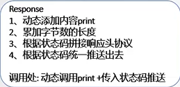

```
#2，封装

#只关注要增加的内容和状态码

#同2,1）区别，，增加了Reponse类，并修改recieve中响应部分。
			
			Response response =new Response(client);
			//关注了内容
			response.print("<html>");
			response.print("<head>");
			response.print("<title>");
			response.print("服务器响应成功");
			response.print("</title>");
			response.print("</head>");
			response.print("<body>");
			response.print("shsxt server终于回来了。。。。");
			response.print("</body>");
			response.print("</html>");
			//关注了状态码
			response.pushToBrowser(200);

-------------------------------------------------
public class Response {
	
	private BufferedWriter bw;
	//正文
	private StringBuilder content;
	//协议头（状态行与请求头 回车）信息
	private StringBuilder headInfo;
	
	
	private int len; //正文的字节数	
	private final String BLANK =" ";
	private final  String CRLF = "\r\n";
	
	private Response() {
		content =new StringBuilder();
		headInfo=new StringBuilder();
		len =0;
	}
	public Response(Socket client) {
		this();//调用无参构造器
		try {
			bw=new BufferedWriter(new OutputStreamWriter(client.getOutputStream()));
		} catch (IOException e) {
			e.printStackTrace();
			headInfo = null;
		}
	}
	
	public Response(OutputStream os) {
		this();
		bw=new BufferedWriter(new OutputStreamWriter(os));
	}
	
	//动态添加内容，链（相对于封了一层append 加上 统计len ）
	public	Response print(String info) {
		content.append(info);
		len+=info.getBytes().length;
		return this;
	}
	public	Response println(String info) {
		content.append(info).append(CRLF);
		len+=(info+CRLF).getBytes().length;
		return this;
	}
	
	//推送响应信息
	public void pushToBrowser(int code) throws IOException {
		if(null ==headInfo) {
			code = 505;
		}
		createHeadInfo(code);
		
		bw.append(headInfo);
		bw.append(content);
		bw.flush();
	}
		
	//构建头信息
	private void createHeadInfo(int code) {
		//1、响应行: HTTP/1.1 200 OK
		headInfo.append("HTTP/1.1").append(BLANK);
		headInfo.append(code).append(BLANK);
		switch(code) {
			case 200:
				headInfo.append("OK").append(CRLF);
				break;
			case 404:
				headInfo.append("NOT FOUND").append(CRLF);
				break;	
			case 505:
				headInfo.append("SERVER ERROR").append(CRLF);
				break;	
		}
		//2、响应头(最后一行存在空行):
		headInfo.append("Date:").append(new Date()).append(CRLF);
		headInfo.append("Server:").append("shsxt Server/0.0.1;charset=GBK").append(CRLF);
		headInfo.append("Content-type:text/html").append(CRLF);
		headInfo.append("Content-length:").append(len).append(CRLF);
		headInfo.append(CRLF);		
	}	
}	
```


### 3) 解耦业务

#请求，响应。已经好了，，现在解决主文件中的业务

​													#（主文件作用接发和附加响应的内容）

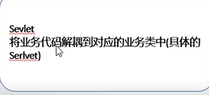

```
#1，通过辑判断，new 对象
同上区别：在主文件中调用接口。。业务代码解耦到，一个接口，和他的实现功能类。

#主：
//更改业务部分
public void receive() {
		try {
			Socket client = serverSocket.accept();
			System.out.println("一个客户端建立了连接....");
			//获取请求协议
			Request request =new Request(client);
			//获取响应协议
			Response response =new Response(client);
			
			Servlet servlet= null;
			if(request.getUrl().equals("login")) {
				servlet= new LoginServlet();
			}else if(request.getUrl().equals("reg")) {
				servlet= new RegisterServlet();
			}else {
				//首页....
			}
			
			servlet.service(request, response);			
			//关注了状态码
			response.pushToBrowser(200);
		} catch (IOException e) {
			e.printStackTrace();
			System.out.println("客户端错误");
		}
	}
	
2) 接口和实现
public interface Servlet {
	void service(Request request,Response response);
}

#实现接口。


```


```
#2，进一步解耦，加入反射。
#不用修改主的程序，有功能时就在配置文件，以及增加新的功能类就行。

结构：（两大部分）
1）WEB服务器的接发主功能：
请求类，响应类，主类。

#主类部分：
public void receive() {
		try {
			Socket client = serverSocket.accept();
			System.out.println("一个客户端建立了连接....");
			//获取请求协议
			Request request =new Request(client);
			//获取响应协议
			Response response =new Response(client);
			
			Servlet servlet= WebApp.getServletFromUrl(request.getUrl());
			if(null!=servlet) {
				servlet.service(request, response);
				//关注了状态码
				response.pushToBrowser(200);
			}else {
				//错误....
				response.pushToBrowser(404);
			}		
		} catch (IOException e) {
			e.printStackTrace();
			System.out.println("客户端错误");
		}
	}
	
2）解耦出的业务：反射，从XML，解析出功能 同13.4
接口，实现类，XML配置文件。
以及实现提取url，反射类功能的几个文件：其他；略
	一个工具类（一个静态初始块，和静态方法）。
	完成静态初始块中初始的类（提取配置映射啥的）
	完成提取的XML解析的处理器类（处理格式）
```


### 4) 分发器和状态 

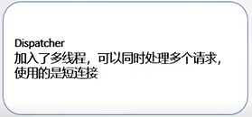

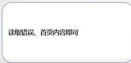

```
#多线程处理加入分发器 和 404 505 及首页
#主文件中，while true  ，并且 receive()（其他函数大体没变） 用多线程类
public void receive() {
			while(isRunning) {
				try {
					Socket client = serverSocket.accept();
					System.out.println("一个客户端建立了连接....");
					//多线程处理
					new Thread(new Dispatcher(client)).start();
				} catch (IOException e) {
					e.printStackTrace();
					System.out.println("客户端错误");
				}
			}	
	}
在类中完成任务：

public class Dispatcher implements Runnable {
	private Socket client;
	private Request request;
	private Response response ;
	public Dispatcher(Socket client) {
		this.client = client;
		try {
			//获取请求协议
			//获取响应协议
			request =new Request(client);
			response =new Response(client);
		} catch (IOException e) {
			e.printStackTrace();
			this.release();
		}
	}
	@Override
	public void run() {	
		
		try {
			if(null== request.getUrl() || request.getUrl().equals("")) {

#jdk8 没有
/*InputStream is =Thread.currentThread().getContextClassLoader().getResourceAsStream("index.html");
response.print((new String(is.readAllBytes())));  
*/

				response.print( new String( Files.readAllBytes(Paths.get("index.html") ) ));

				
				response.pushToBrowser(200);
//is.close();
				return ;
			}
			Servlet servlet= WebApp.getServletFromUrl(request.getUrl());
			if(null!=servlet) {
				servlet.service(request, response);
				//关注了状态码
				response.pushToBrowser(200);
			}else {
				//错误....				
				response.print( new String( Files.readAllBytes(Paths.get("error.html") ) ));
				response.pushToBrowser(404);
				
			}		
		}catch(Exception e) {
			try {
				response.println("你好我不好，我会马上好");
				response.pushToBrowser(500);
			} catch (IOException e1) {
				e1.printStackTrace();
			}
		}finally{
			release();
		}
	}
	//释放资源
	private void release() {
		try {
			client.close();
		} catch (IOException e1) {
			e1.printStackTrace();
		}
	}
}

#短连接：用完就释放。
#多线程读取资源，（src下，类加载器）,9以后用，有Files类似

```


### 5) 综合

```
#前端： html 。

#后端：
	不用动的：
	自己修改的服务类：

#主类（调用线程的）--分发器（核心：请求，用工具类，变成 服务的响应。）
# 资源加载器都在src目录下。。相对路径起点是整个工程目录下。
```

[code]: \source\13-http\Http	" 综合使用"

