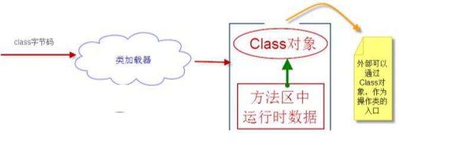
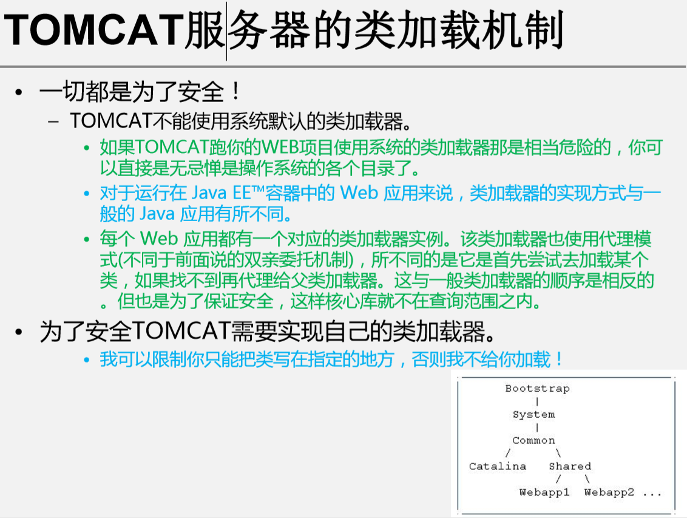

# 14.注·反·字节码·类加载

## 14.1 注解

### 1）概念


### 2）内置注解

```
@Override – 定义在java.lang.Override中，此注释只适用于修辞方法，表示一个方法声明打算重写父超类中的另一个方法声明。

 @Deprecated – 定义在java.lang.Deprecated中，此注释可用于修辞方法、属性、类 ，表示不鼓励程序员使用这样的元素，通常是因为它很危险或存在更 好的选择。

@SuppressWarnings – 定义在java.lang.SuppressWarnings中，用来抑制编译时的警告信息 。 
	– 与前两个注释有所不同，你需要添加一个参数才能正确使用，这些参数值都是已经定义好了的，我们选择性的使用就好了，参数如下：
		#@SuppressWarnings("unchecked") 
		#@SuppressWarnings(value={"unchecked", "deprecation"})
```


### 3）自定义注解

```
#1，格式
使用@interface自定义注解时，自动继承java.lang.annotation.Annotation接口 
• 要点： 
	– @interface用来声明一个注解 
• 格式为： 
	– public @interface 注解名 {定义体} 
	– 其中的每一个方法实际上是声明了一个配置参数。
    – 返回值类型就是参数的类型（返回值类型只能是基本类型、Class、String、enum） 
    – 可以通过default来声明参数的默认值。 – 如果只有一个参数成员，一般参数名为value

• 注意： 如果有注解元素，注释必须要有值。我们定义注解元素时，经常使用空字符串、0作为默认值。 也经常使用负数(比如：-1)表示不存在的含义
```

```
#2，元注释
#注释的注释。@Target – @Retention – @Documented – @Inherited

1）target    用于描述注解的使用范围（即:被描述的注解可以用在什么地方）
2）Retention 表示需要在什么级别保存该注释信息，用于描述注解的生命周期
```


```
#3,code

//自定义
@Target(value={ElementType.METHOD,ElementType.TYPE})
@Retention(RetentionPolicy.RUNTIME)
public @interface SxtAnnotation01 {	
	String studentName() default "";
	int age() default 0;   
	int id() default -1;   //String indexOf("abc")  -1	
	String[] schools() default {"清华大学","北京大学"};	
}

//使用
@SxtAnnotation01
public class Demo02 {
	
	@SxtAnnotation01(age=19,studentName="老高",id=1001,
			schools={"北京大学","北京航空航天大学"})
	public void test(){
	}
}

```


### 4) 反射读取注解信息


//通过反射，可以读取注解，然后JAVA 变 SQL

```
#1，两个自定义注解
1） 类
@Target(value={ElementType.TYPE})
@Retention(RetentionPolicy.RUNTIME)
public @interface SxtTable {
	String value();
}

2） 属性
@Target(value={ElementType.FIELD})
@Retention(RetentionPolicy.RUNTIME)
public @interface SxtField {
	String columnName();
	String type();
	int length();
}

#2，ORM，
@SxtTable("tb_student")
@Deprecated
public class SxtStudent {
	
	@Deprecated
	@SxtField(columnName="id",type="int",length=10)
	private int id;
	@SxtField(columnName="sname",type="varchar",length=10)
	private String studentName;
	@SxtField(columnName="age",type="int",length=3)
	private int age;
		
	public int getId() {
		return id;
	}
	public void setId(int id) {
		this.id = id;
	}
	public String getStudentName() {
		return studentName;
	}
	public void setStudentName(String studentName) {
		this.studentName = studentName;
	}
	public int getAge() {
		return age;
	}
	public void setAge(int age) {
		this.age = age;
	}
	
}

#3,反射提取
public class Demo03 {
	
	public static void main(String[] args) {
		try {
			Class clazz = Class.forName("com.bjsxt.test.annotation.SxtStudent");
			
			//获得类的所有有效注解
			Annotation[] annotations=clazz.getAnnotations();
			for (Annotation a : annotations) {
				System.out.println(a);}
				#难像下面获得值，接口没有属性（没法转型。没有属性）
			//获得类的指定的注解
			SxtTable st = (SxtTable) clazz.getAnnotation(SxtTable.class);
			System.out.println(st)
			System.out.println(st.value());
			
			//获得类的属性的注解
			Field f = clazz.getDeclaredField("studentName");     #定位属性
			SxtField sxtField = f.getAnnotation(SxtField.class); #得到注解
			System.out.println(sxtField.columnName()+"--"+sxtField.type()+"--"+sxtField.length());
			
			//根据获得的表名、字段的信息，拼出DDL语句，然后，使用JDBC执行这个SQL，在数据库中生成相关的表 ？？？ 还没学
			
		} catch (Exception e) {
			e.printStackTrace();
		}
		
	}
}

@com.bjsxt.test.annotation.SxtTable(value=tb_student)
@com.bjsxt.test.annotation.SxtTable(value=tb_student)
tb_student
sname--varchar--10
```


## 14.2 反射

### 1）动态特性


```
#动态语言：运行时，可以改变程序结构，以及变量类型的。
#JAVA，C，C++不是，但是JAVA（反射，字节码）具有动态性
```


### 2）Class对象

```
#1，反射机制

在运行中加载类（原本是编译时加载）
加载完类，在堆内存会有Class对象（一个类，只有一个）
Class对象，包含完整类的结构，就像镜子一样。

#2，获取
对象.getClass()  
类.class 

Class.forName(" ")（最常被使用） !!!

#类型(class,interface,enum,annotation,primitive type,void)对应的
	数组只有当类型和纬度不同才会有不同Class对象.
```


### 3）反射作用

好处：通过传入参数，就可以动态调用类即方法和属性

#### .1 动态（属性、方法、构造器）

```
#1，获取
public static void main(String[] args) {
		String path = "com.bjsxt.test.bean.User";
		
		try {
			Class clazz = Class.forName(path);
			
			//获取类的名字
			System.out.println(clazz.getName());//获得包名+类名：com.bjsxt.test.bean.User
			System.out.println(clazz.getSimpleName());	//获的类名：User
			
			//获取属性信息
//			Field[] fields = clazz.getFields(); //只能获得public的field
			Field[] fields = clazz.getDeclaredFields();//获得所有的field
			Field f = clazz.getDeclaredField("uname");
			System.out.println(fields.length);
			for(Field temp:fields){
				System.out.println("属性："+temp);	//private int com.bjsxt.test.bean.User.id
				System.out.println("属性："+temp.getName());  //id
			}
			//获取方法信息
			Method[] methods = clazz.getDeclaredMethods();
			Method m01 = clazz.getDeclaredMethod("getUname", null);
			//如果方法有参，则必须传递参数类型对应的class对象
			Method m02 = clazz.getDeclaredMethod("setUname", String.class); 
			for(Method m:methods){
				System.out.println("方法："+m);
			}
			
			//获得构造器信息
			Constructor[] constructors = clazz.getDeclaredConstructors();
			Constructor c = clazz.getDeclaredConstructor(int.class,int.class,String.class);
			System.out.println("获得构造器："+c);
			for(Constructor temp:constructors){
				System.out.println("构造器："+temp);
			}
			
			
		} catch (Exception e) {
			e.printStackTrace();
		}
	}

#属性和方法都是靠个属性类和方法类接着，（如果特定就加字符串）
#构造器和方法，区分要加上数据类型  .class （模子）
#注意所有还是public
```

```

#泛型：加入后，类和构造器创建对象在调用时，后面.方法不用转型了
#安全检查和动态操作属性方法的使用：
	#先获取，再激活等操作（并参数）

#2，操作
public static void main(String[] args) {

		String path = "com.bjsxt.test.bean.User";
		
		try {
			Class<User> clazz = (Class<User>) Class.forName(path);
			
			//通过反射API调用构造方法，构造对象
			User u = clazz.newInstance();	//其实是调用了User的无参构造方法
			System.out.println(u);
			
			Constructor<User> c = clazz.getDeclaredConstructor(int.class,int.class,String.class);
			User u2 = c.newInstance(1001,18,"高淇二");
			System.out.println(u2.getUname());
			
			//通过反射API调用普通方法
			User u3 = clazz.newInstance();
			Method method = clazz.getDeclaredMethod("setUname", String.class);
			method.invoke(u3, "高淇三");   //u3.setUname("高淇三");
			System.out.println(u3.getUname());
			
			//通过反射API操作属性
			User u4 = clazz.newInstance();
			Field f = clazz.getDeclaredField("uname");
			f.setAccessible(true); //这个属性不需要做安全检查了，可以直接访问
			f.set(u4, "高淇四");		//通过反射直接写属性
			System.out.println(u4.getUname());	//通过反射直接读属性的值
			System.out.println(f.get(u4));
			
			
		} catch (Exception e) {
			e.printStackTrace();
		}		
	}
```


#### .2 操作泛型


```
public void test01(Map<String,User> map,List<User> list,int a){
		System.out.println("Demo04.test01()");
	}
	
	public Map<Integer,User> test02(){
		System.out.println("Demo04.test02()");
		return null;
	}
	
	public static void main(String[] args) {

		try {
			
			//获得指定方法参数泛型信息
			Method m = Demo04.class.getMethod("test01", Map.class,List.class,int.class);
			Type[] t = m.getGenericParameterTypes();    // 获得方法所有参数
			for (Type paramType : t) {
				System.out.println("#"+paramType);
				if(paramType instanceof ParameterizedType){ //是否有泛型的
					Type[] genericTypes = ((ParameterizedType) paramType).getActualTypeArguments(); //泛型类型
					for (Type genericType : genericTypes) {
						System.out.println("泛型类型："+genericType);
					}
				}
			}
			
			//获得指定方法返回值泛型信息
			Method m2 = Demo04.class.getMethod("test02", null);
			Type returnType = m2.getGenericReturnType();  // 返回值
			if(returnType instanceof ParameterizedType){
					Type[] genericTypes = ((ParameterizedType) returnType).getActualTypeArguments();

					for (Type genericType : genericTypes) {
						System.out.println("返回值，泛型类型："+genericType);
					}
					
			}
			
			
		} catch (Exception e) {
			e.printStackTrace();
		}
	}
```


#### .3 获取注释

#### .4 效率


30--7--1  效率比


```
#14.2 总结：
Class  对象就是类的镜子，里面有类的所有东西。

想要用类的对象的属性方法构造器，则必须先创造对应的属性方法构造器对象，，则用这三对应的对象，调用方法。
```


## 14.3 动态编译运行

```
#1，总起
• JAVA 6.0引入了动态编译机制。
• 动态编译的应用场景：
	– 可以做一个浏览器端编写java代码，上传给服务器编译和运行
	– 服务器动态加载某些类文件进行编译

#java 运行： 文件--编译---字节码.class文件----jvm---运行
```


```
#2，编译
动态编译的两种做法： 
– 通过Runtime调用javac，启动新的进程去操作 （命令行 javac .java 编译）
	Runtime run = Runtime.getRuntime();  
	Process process = run.exec("javac -cp d: HelloWorld.java"); 

– 通过JavaCompiler动态编译
```


```
#3, 运行
```


```
public static void main(String[] args) throws Exception {
		
		//通过IO流操作，将字符串存储成一个临时文件(Hi.java)，然后调用动态编译方法！:完成那个传给服务器编译的效果（直接流写出）
		String str = "public class Hi {public static void main(String[] args){System.out.println(\"HaHa,?!\");}}";
		
		JavaCompiler compiler = ToolProvider.getSystemJavaCompiler();
		int result = compiler.run(null, null, null, "D:\\workspace_8-1\\Study14_1\\HelloWorld.java");
		System.out.println(result==0?"编译成功":"编译失败");  //java 文件变成  .class


		
/*		
		//通过Runtime调用执行类 :要自己输出出来   java 运行 .class （不要后缀）
		Runtime run = Runtime.getRuntime();  
       Process process = run.exec("java -cp d:/  HelloWorld") ;		
        InputStream in = process.getInputStream();
        BufferedReader reader = new BufferedReader(new InputStreamReader(in));
		String info = "";
	while((info=reader.readLine())!=null){
			System.out.println(info);
		}
*/	
		
	
		 try {
	         URL[] urls = new URL[] {new URL("file:/"+"D:/workspace_8-1/Study14_1/")};
	         URLClassLoader loader = new URLClassLoader(urls);
	         Class c = loader.loadClass("HelloWorld");
	         //调用加载类的main方法
	         Method m = c.getMethod("main",String[].class);
	         m.invoke(null, (Object)new String[]{});
	         //由于可变参数是JDK5.0之后才有。
	         //m.invoke(null, (Object)new String[]{});会编成:m.invoke(null,"aa","bb"),就发生了参数个数不匹配的问题。
	         //因此，必须要加上(Object)转型，避免这个问题。
	         //public static void main(String[] args)
	         
	     } catch (Exception e) {
	         e.printStackTrace();
	     }	
	}
```


## 14.4 脚本引擎

JAVA用引擎在内部跑脚本语言。


```
#通过脚本引擎的运行上下文在脚本和 Java 平台间交换数据
#通过 Java 应用程序调用脚本函数


code：
public class Demo02 {
	public static void main(String[] args) throws Exception {
		//1获得脚本引擎
		ScriptEngineManager sem = new ScriptEngineManager();
		ScriptEngine engine = sem.getEngineByName("javascript");
		//2定义变量 ：  引擎put ，get方法操作脚本
		engine.put("msg", "gaoqi is a good man!");// 向上下文中定义一个变量
		System.out.println(engine.get("msg"));
		
	    //3执行脚本  ：eval  ，在java的变量和方法 语句，在引擎中都要eval 执行语句
	    #java的数据
		String str = "var user = { name:'gaoqi',age:18,schools:['清华大学','北京'] };";
		str += "print(user.name);";
		#执行命令
		engine.eval(str);   
		engine.eval("msg='sxt is a good school';");
		System.out.println(engine.get("msg"));
		System.out.println("########################");
		
		// 4定义函数  ：定义eval ，调用接口Invocable使用
		engine.eval("function add (a, b) {var sum = a + b; return sum; }");
		# 取得调用接口
		Invocable jsInvoke = (Invocable) engine;
		#执行脚本中定义的方法
		Object result1 = jsInvoke.invokeFunction("add", new Object[] { 13, 20 });
		System.out.println(result1);

		//5引擎导入其他java包,使用其他包中的java类
	//String jsCode = "importPackage(java.util); var list = Arrays.asList([\"北京尚学堂\",\"清华大学\",\"北京大学\"]); ";
		#JDK1.8
		String jsCode ="var list = java.util.Arrays.asList(\"清华大学\",\"北京大学\",\"a\");";
															//也可以=[a,b,c]，变Alist

		engine.eval(jsCode);
		
		List<String> list2 = (List<String>) engine.get("list");
		for (String temp : list2) {
			System.out.println(temp);
		}

		//6执行一个js文件(我们将a.js至于项目的src下即可)
		URL is = Demo02.class.getClassLoader().getResource("a.js");
		Reader r = new FileReader(is.getPath());
		engine.eval(r);
		
	}
}
#加载器在bin，找，但是放src就行。

a.js:
	//定义test方法
	function test(){
		var a = 3;
		var b = 4;
		print("invoke js file:"+(a+b));
	}
	//执行test方法
	test();
```


## 14.5 字节码

### 1) 总起


#反射：最多也就是只能运行新的类了，不能创造改变。

#最外层API，也有对应的CtClass，方法，属性，构造器（ct）

​	和反射类似，有get，，要是反射想运行，要不生成对象，要不就激活

​														字节码运行：先获取类，然后反射对象。

```
常见的库：
1，是底层指令的，，2，是code 源，，3，是两种都可以有
```


### 2)  操作

#都是暂时的，不改变当前文件。但是可以用。除非写进文件

```
#1, 生成新类
public static void main(String[] args) throws Exception {
		ClassPool pool = ClassPool.getDefault();
		CtClass cc = pool.makeClass("com.bjsxt.bean.Emp");
		
		//创建属性
		CtField f1 = CtField.make("private int empno;", cc);
		CtField f2 = CtField.make("private String ename;", cc);
		cc.addField(f1);
		cc.addField(f2);
		
		//创建方法
		CtMethod m1 = CtMethod.make("public int getEmpno(){return empno;}", cc);
		CtMethod m2 = CtMethod.make("public void setEmpno(int empno){this.empno=empno;}", cc);
		cc.addMethod(m1);
		cc.addMethod(m2);
		
		//添加构造器 :和方法不一样创建 （只有这一种）
					下面引用类型和基本不一样
		CtConstructor constructor = new CtConstructor(new CtClass[]{CtClass.intType,pool.get("java.lang.String")} , cc);
		constructor.setBody("{this.empno=empno; this.ename=ename;}");
		cc.addConstructor(constructor);
		
		cc.writeFile("c:/myjava"); //将上面构造好的类写入到c:/myjava中(生成字节码文件)
		System.out.println("生成类，成功！");
	}


# jar 和 XJad 使用

```


```
#2，详细的API ：获取与创造与修改 ， 配合反射：运行
					（class 的获取都更多是定位用的，方便字节码下一步操作，而反射的可以真正操作）

	1）处理类的基本用法
	public static void test01() throws Exception{
		ClassPool pool = ClassPool.getDefault();
		CtClass cc = pool.get("test1.Emp");
		
		byte[] bytes = cc.toBytecode();
		//打印字节数组内容
		System.out.println(Arrays.toString(bytes));
		
		System.out.println(cc.getName()); //获取类名
		System.out.println(cc.getSimpleName()); //获取简要类名
		System.out.println(cc.getSuperclass()); //获得父类
		System.out.println(cc.getInterfaces()); //获得接口
		
	}


	 2） 测试 产生和运行 新的方法

	public static void test02() throws Exception{
		ClassPool pool = ClassPool.getDefault();
		CtClass cc = pool.get("test1.Emp");
		
		a) 两种方法创建
		//CtMethod m = CtNewMethod.make("public int add(int a,int b){return a+b;}", cc);
		
		//返回值，名字，参数，谁。 加 权限 加方法体 
		//注意参数值引用。
		CtMethod m = new CtMethod(CtClass.intType,"add",
				new CtClass[]{CtClass.intType,CtClass.intType},cc);
		m.setModifiers(Modifier.PUBLIC);
		m.setBody("{System.out.println(\"www.sxt.cn\");return $1+$2;}");
		cc.addMethod(m);
		
		b)反射运行
		//通过反射调用新生成的方法
		Class clazz = cc.toClass();
		Object obj = clazz.newInstance();  //通过调用Emp无参构造器，创建新的Emp对象
		Method method = clazz.getDeclaredMethod("add", int.class,int.class);
		Object result = method.invoke(obj, 200,300);
	}
	

	 3） 修改已有的方法  ： 先获取，然后修改

	public static void test03() throws Exception{
		ClassPool pool = ClassPool.getDefault();
		CtClass cc = pool.get("test1.Emp");
		
		CtMethod cm = cc.getDeclaredMethod("sayHello",new CtClass[]{CtClass.intType});
			 cm.insertBefore("System.out.println($1);System.out.println(\"start!!!\");");
		cm.insertAt(9, "int b=3;System.out.println(\"b=\"+b);");
		cm.insertAfter("System.out.println(\"end!!!\");");
		
		//通过反射调用新生成的方法
		Class clazz = cc.toClass();
		Object obj = clazz.newInstance();  //通过调用Emp无参构造器，创建新的Emp对象
		Method method = clazz.getDeclaredMethod("sayHello", int.class);
		method.invoke(obj, 300);
	}
```


```

	 4） 属性的操作  ：创造 获取  ---并且配合方法生成set,get

	public static void test04() throws Exception{
		ClassPool pool = ClassPool.getDefault();
		CtClass cc = pool.get("test1.Emp");
		
//		CtField f1 = CtField.make("private int empno;", cc);
		CtField f1 = new CtField(CtClass.intType,"salary",cc);
		f1.setModifiers(Modifier.PRIVATE);
		cc.addField(f1,"0");
	
		CtField a =cc.getDeclaredField("ename");   //获取指定的属性
		
		//增加相应的set和get方法
		cc.addMethod(CtNewMethod.getter("getSalary", f1));;
		cc.addMethod(CtNewMethod.getter("setSalary", f1));;
	
	}
	

	 5） 构造方法的操作 ：获取

	public static void test05() throws Exception {
		ClassPool pool = ClassPool.getDefault();
		CtClass cc = pool.get("test1.Emp");
		
		CtConstructor[] cs = cc.getConstructors();
		for (CtConstructor c : cs) {
			System.out.println(c.getLongName());
		}
	}
	
	6）注解
	public static void test06() throws Exception{
		 CtClass cc = ClassPool.getDefault().get("test1.Emp"); 
		 
		 Object[] all = cc.getAnnotations();
		 Author a = (Author)all[0]; 
		 String name = a.name();
		 int year = a.year();
		 System.out.println("name: " + name + ", year: " + year);

	}
	
```


## 14.6 类加载

### 1）过程 ：

​								运行  java XX  ,   

```
#1，类加载机制 ：  用才loading，，不用不  ，直接引用才初始化 ！！！！！！！！！！
 JVM把class文件加载到内存，并对数据进行校验、解析和初始化，最终形成 JVM可以直接使用的Java类型的过程。
```


​													加载----连接----初始化

```
1）加载
将class文件字节码内容加载到内存中，并将这些静态数据转换成方法区中的运行时数据结构，
在堆中生成一个代表这个类的java.lang.Class对象，作为方法区类数据的访问入口。  

// 就是把字面意思弄上内存里，
#这个过程需要类加载器参与。
#class文件  来源多。（文件，网络IO流，等等，变成内存里面。）
```



```
#2，链接：将Java类的二进制代码合并到JVM的运行状态之中的过程 

• 验证： – 确保加载的类信息符合JVM规范，没有安全方面的问题。 
• 准备： – 正式为类变量(static变量)分配内存并设置类变量初始值的阶段，这些内存都将在方法区中进行分配 
• 解析 – 虚拟机常量池内的符号引用替换为直接引用的过程 
#类在方法区，有常量池。------解析。符号引用变成直接引用（抽象---》 具体：不再是表面字符意思了）


#3，初始化：主动引用会发生。
• 初始化阶段是执行类构造器<clinit>()方法的过程。类构造器<clinit>()方法是由编译器自动收集 类中的所有类变量的赋值动作和静态语句块(static块)中的语句合并产生的。 

• 当初始化一个类的时候，如果发现其父类还没有进行过初始化、则需要先出发其父类的初始化 
• 虚拟机会保证一个类的<clinit>()方法在多线程环境中被正确加锁和同步。
```


```
# 实例分析

1）简单过程 
按代码顺序：

-先D1类：方法区加载（并且数据结构），堆生成Class对象
		然后方法区，分初始值，然后解析，抽象变具体使用。

-main函数：栈帧，然后先方法重复加载A，然后堆生成Class对象。
	#a=null;
-构造函数： 栈帧，，生成对象a，   A初始化了。
	#a 赋值地址。

#打印：
A的初始化，然后A的构造方法，然后A.width = 300

2）初始化探究
public class Demo01 {
	static{
		System.out.println("静态初始化Demo01");
	}
	
	
	public static void main(String[] args) throws Exception {
		System.out.println("Demo01的main方法！");
		System.out.println(System.getProperty("java.class.path"));
		
		//主动引用
//		new A();
//		System.out.println(A.width);
//		Class.forName("com.bjsxt.test.A");
		
		
		//被动引用
//		System.out.println(A.MAX);
//		A[] as = new A[10];
		System.out.println(B.width);
		
	}
}

class B  extends A {
	static {
		System.out.println("静态初始化B");
	}
}

class A extends A_Father {
	public static int width=100;   //静态变量，静态域    field
	public static final  int MAX=100; 
	
	static {
		System.out.println("静态初始化类A");
		width=300;
	}
	public A(){
		System.out.println("创建A类的对象");
	}
}

class A_Father extends Object {
	static {
		System.out.println("静态初始化A_Father");
	}
}

```


```
Field f=ClassLoader.class.getDeclaredField("classes");
f.setAccessible(true);
Vector classes=(Vector)f.get(ClassLoader.getSystemClassLoader());
System.out.println(classes);

#能看到哪个类被loading了，能证明，用到了才会了loading，有主动引用才会初始化。
						（被动引用，会loading，但不会初始化）
```


### 2）深入

类缓存 :

标准的Java SE类加载器可以按要求查找类，但一旦某个类被加载到类加载 器中，它将维持加载（缓存）一段时间。不过，JVM垃圾收集器可以回收 这些Class对象。 

#### .1 java.class.ClassLoader

```
#1, 作用： 
– java.lang.ClassLoader类的基本职责就是根据一个指定的类的名称，找到或者生成其对应的字节代码，然后从这些字节代码中定义出一个 Java类，
	#即最后java.lang.Class类的一个实例。 

– 除此之外，ClassLoader还负责加载 Java 应用所需的资源，如图像文件和配置文件等。 


#2，加载器对象的方法  ？？
getParent()   
返回该类加载器的父类加载器。

loadClass(String name)  
加载名称为 name的类，返回的结果是 java.lang.Class类的实例。

findClass(String name)      ：在loadclass中，自定义被重写的东西
查找名称为 name的类，返回的结果是 java.lang.Class类的实例。

findLoadedClass(String name)   
查找名称为 name的已经被加载过的类，返回的结果是 java.lang.Class类实例。

defineClass(String name, byte[] b, int off, int len) 
把字节数组 b中的内容转换成 Java 类，返回的结果是 java.lang.Class类的实例。这个方法被声明为 final的。 

resolveClass(Class<?> c) 
链接指定的 Java 类。 

– 对于以上给出的方法，表示类名称的 name参数的值是类的二进制名称。需要注意的是内部类的表示，如 com.example.Sample$1和com.example.Sample$Inner等表示方式。 


ClassLoader.getSystemClassLoader() ： APP
#System.getProperty("java.class.path") ： xxx/bin(当前项目)
#a.getClass().getClassLoader() ：看加载器
```


#### .2 结构和代理


```
#除了第一个 其他都JAVA 并继承ClassLoader

#子-父-爷-父-子：加载，保证了安全
```


#### .3 自定义加载器


```
#自定义加载器： 重写findClass

loadClass方法中，实现了双亲机制， （若这个也重写，则自己定机制）
有个待实现的findClass,(自己完成，当上面加载器都没有实现时候，所用加载的方法)

```

```
# 实现 给定路径的文件加载器

给定文件地址，生成文件加载器
调用loadClass,通过机制，看调用哪个类加载器。

#.class文件 变 字节数组，然后调用方法，变成Class对象，完成加载。


/**
 * 1,自定义文件系统类加载器

 */
public class FileSystemClassLoader extends ClassLoader {
	
	//com.bjsxt.test.User   --> d:/myjava/  com/bjsxt/test/User.class      
	private String rootDir;
	
	public FileSystemClassLoader(String rootDir){
		this.rootDir = rootDir;
	}
	
	@Override
	protected Class<?> findClass(String name) throws ClassNotFoundException {
	
	System.out.println("1");
	
	byte[] classData = getClassData(name);
	if(classData==null){
	throw new ClassNotFoundException();
	}else{
		Class<?> c = defineClass(name, classData, 0,classData.length);
		return c;
		}
		}
		

	private byte[] getClassData(String classname){   //com.bjsxt.test.User   d:/myjava/  com/bjsxt/test/User.class
		String path = rootDir +"/"+ classname.replace('.', '/')+".class";
		
//		IOUtils,可以使用它将流中的数据转成字节数组
		InputStream is = null;
		ByteArrayOutputStream baos = new ByteArrayOutputStream();
		try{
			is  = new FileInputStream(path);
			
			byte[] buffer = new byte[1024];
			int temp=0;
			while((temp=is.read(buffer))!=-1){
				baos.write(buffer, 0, temp);
			}
			
			return baos.toByteArray();
		}catch(Exception e){
			e.printStackTrace();
			return null;
		}finally{
			try {
				if(is!=null){
					is.close();
				}
			} catch (IOException e) {
				e.printStackTrace();
			}
			try {
				if(baos!=null){
					baos.close();
				}
			} catch (IOException e) {
				e.printStackTrace();
			}
		}
		
	}
	
}

/**
 * 2,测试自定义的FileSystemClassLoader

 */
public class Demo03 {
	public static void main(String[] args) throws Exception{
		FileSystemClassLoader loader = new FileSystemClassLoader("C:/myjava");
		FileSystemClassLoader loader2 = new FileSystemClassLoader("C:/myjava");
		
		//new HelloWorld();
		
	Class<?> c =loader.loadClass("C:/myjava/c1/HelloWorld");
		Class<?> c2 = loader.loadClass("HelloWorld");
		Class<?> c3 = loader2.loadClass("HelloWorld");


		Class<?> c4 = loader2.loadClass("java.lang.String");
		Class<?> c5 = loader2.loadCla1ss("com.bjsxt.test.Demo01");
		
		
		System.out.println(c.hashCode());
		System.out.println(c2.hashCode());
		System.out.println(c3.hashCode());	//同一个类，被不同的加载器加载，JVM认为也是不相同的类
		System.out.println(c4.hashCode());
		
		
		System.out.println(c.getClassLoader());	
		System.out.println(c2.getClassLoader());	
		System.out.println(c3.getClassLoader());    //自定义的类加载器
		System.out.println(c4.getClassLoader());	//引导类加载器	
		System.out.println(c5.getClassLoader());	//系统默认的类加载器
		
	}
}

```

```
1							// 说明，第二次没有进去加载				
1

1550089733     
1550089733
865113938


1442407170
com.bjsxt.test.FileSystemClassLoader@6d06d69c
com.bjsxt.test.FileSystemClassLoader@6d06d69c
com.bjsxt.test.FileSystemClassLoader@4e25154f
null
sun.misc.Launcher$AppClassLoader@73d16e93

1550089733
1550089733
865113938
1442407170

com.bjsxt.test.FileSystemClassLoader@6d06d69c
com.bjsxt.test.FileSystemClassLoader@6d06d69c
com.bjsxt.test.FileSystemClassLoader@4e25154f
null
sun.misc.Launcher$AppClassLoader@73d16e93
```

```
结论：
不同加载器，加载的Class对象，不是同一个.

问题：
只能实现，loadClass一层目录下的.class文件，调用，不然报错原因？？
		(地址好几层都没事，目录只能一层)
		
！！ 解决：那个函数defineClass，，只能一层，因而提取个类名就行。
#加个 className 属性。收类名
1）修改
Class<?> c = defineClass(className, classData, 0,classData.length);

2）加
className = path.substring( path.lastIndexOf("/")+1 ,
							path.lastIndexOf(".") ) ;


#网络类加载器：  就输入换下。
URL url = new URL(path);
is  = url.openStream();
			
```


#### .4 加密解密加载

```
把.class文件，用工具类加密，放在另一个文件夹中。
在解密加载器解密。

1） 加密工具类
public class EncrptUtil {
	
	public static void main(String[] args) {
		encrpt("c:/myjava/HelloWorld.class", "c:/myjava/temp/HelloWorld.class");
	}
	
	public static void encrpt(String src, String dest){
		FileInputStream fis = null;
		FileOutputStream fos = null;
		
		try {
			fis = new FileInputStream(src);
			fos = new FileOutputStream(dest);
			
			int temp = -1;
			
			//一个字节一个字节读
			while((temp=fis.read())!=-1){
				fos.write(temp^0xff);  //取反操作
			}
			
		} catch (Exception e) {
			e.printStackTrace();
		}finally{
			try {
				if(fis!=null){
					fis.close();
				}
			} catch (IOException e) {
				e.printStackTrace();
			}
			try {
				if(fos!=null){
					fos.close();
				}
			} catch (IOException e) {
				e.printStackTrace();
			}
		}	
	}
}


2）解密加载器：和上面那个文件加载器的类似
public class DecrptClassLoader  extends ClassLoader {
	
	//com.bjsxt.test.User   --> d:/myjava/  com/bjsxt/test/User.class      
	private String rootDir;
	private String className;
	public DecrptClassLoader(String rootDir){
		this.rootDir = rootDir;
	}
	
	@Override
	protected Class<?> findClass(String name) throws ClassNotFoundException {
		
		
		byte[] classData = getClassData(name);
				if(classData==null){
					System.out.println("---");
					throw new ClassNotFoundException();
				}else{
					Class<?> c = defineClass(className, classData, 0,classData.length);
					return c;
				}
	}
	
	private byte[] getClassData(String name){   //com.bjsxt.test.User   d:/myjava/  com/bjsxt/test/User.class
		String path = rootDir +"/"+ name.replace('.', '/')+".class";
		className = path.substring( path.lastIndexOf("/")+1 ,
				path.lastIndexOf(".") ) ;
//		IOUtils,可以使用它将流中的数据转成字节数组
		InputStream is = null;
		ByteArrayOutputStream baos = new ByteArrayOutputStream();
		try{
			is  = new FileInputStream(path);	
			int temp = -1;
			while((temp=is.read())!=-1){
				baos.write(temp^0xff);  //取反操作,相当于解密
			}			
			return baos.toByteArray();
		}catch(Exception e){
			e.printStackTrace();
			return null;
		}finally{
			try {
				if(is!=null){
					is.close();
				}
			} catch (IOException e) {
				e.printStackTrace();
			}
			try {
				if(baos!=null){
					baos.close();
				}
			} catch (IOException e) {
				e.printStackTrace();
			}
		}		
	}
}

3）主类
public class Demo04 {
	public static void main(String[] args) throws Exception {
		//测试取反操作
//		int a = 3; //0000011
//		System.out.println(Integer.toBinaryString(a^0xff));
		
		//加密后的class文件，正常的类加载器无法加载，报classFormatError
//		FileSystemClassLoader loader = new FileSystemClassLoader("c:/myjava/temp");
//		Class<?> c = loader.loadClass("HelloWorld");
//		System.out.println(c);
		
		DecrptClassLoader loader = new DecrptClassLoader("c:/myjava/temp");
		Class<?> c = loader.loadClass("HelloWorld");
		System.out.println(c);
		
	}
}
```


#### .5其他

```
#1，线程上下文类加载器

解决双亲只能让关系类同种加载器加载的问题。
自己指定。
```


```
ClassLoader loader = Demo05.class.getClassLoader();
System.out.println(loader);
				
ClassLoader loader2 = Thread.currentThread().getContextClassLoader();
System.out.println(loader2);
		
Thread.currentThread().setContextClassLoader(new FileSystemClassLoader("c:/myjava/"));
		System.out.println(Thread.currentThread().getContextClassLoader());
		
Class<Demo01> c = (Class<Demo01>) Thread.currentThread().getContextClassLoader().loadClass("com.bjsxt.test.Demo01");
System.out.println(c);
System.out.println(c.getClassLoader());


sun.misc.Launcher$AppClassLoader@73d16e93
sun.misc.Launcher$AppClassLoader@73d16e93
com.bjsxt.test.FileSystemClassLoader@6d06d69c
class com.bjsxt.test.Demo01
sun.misc.Launcher$AppClassLoader@73d16e93 
（虽然用指定加载，但是没有重写那个加载类，（应该改掉双亲机制，即重写整个classLoad方法））


```


```
#2，tomcat
不能用默认加载器，要指定位置，每个web用一个定义加载器，并重写机制。
```




```
#3，OSGI原理介绍
open service gateway initative  
#组件联合工作
	谁定义谁加载。，可以共享
	tocat 独立
```


# 15 正则表达式

## 15.1 介绍

```
#1，
先是分析下怎么写，，

然后用软件（RegexBuddy），初步实现下

然后用正则表达式程序
```


```
#2，正则知识
七大类：
1）普通字符  和  简单转义字符

2）标准字符集：  \d  \w \s .（无\n）

3）自定义字符集：[]  (除了 ^ 和 - 全部都是变成一般字符 ， 配合除了.的标准字符 )

4）量词 ：配合非贪婪（？）

5) 
字符边界：^   $    \b(哪边加了，哪边一定要是字符边界)
匹配模式：忽略大小写  ，单行（. 可以匹配\n） ，多行（还需要每行开头结尾\A\Z））

6)
选择符 | 或
分组 ：
（）  功能： 整体，，配合find group 特定圈出，，反向引用（解决特定要求字符重复）
(?:exp)  不会进内存，，没有()的特殊功能了  ？

7) 预搜索
也是判断位置，确保前后 (?=)(?<=)  (?!) (?<)   右，左 ，，，出现，不出

```


## 15.2 实践

```

java 实现：
1）
java.util.regex包下面 
• 类 Pattern： 
– 正则表达式的编译表示形式。
– Pattern p = Pattern. compile（）
 //建立正则表达式，并启用相应模式

• 类 Matcher： 
– 通过解释 Pattern 对 character sequence 执行匹配操作的引擎 
– Matcher m = p.matcher(str); 
//匹配str字符串

2）具体操作：
#匹配：
m.matches()，，就全文看，有就返回true，，没有其他功能

#find 配合 group  ( while m.find()打印)

	abcd123****abc123***asd12 
	([a-z]+)([0-9]+)   find走三次，，，group 有两组
m.find(): 有就返回true，并且往下走，看看符不符合
m.group() :  按照括号分组，，没有就都是 group() 或者 group(0) 

#代替 切割：
String = m.replaceAll("#")
str.split("\\d+")  
	JAVA 一定都是  \\ (正则里的任何东西和JAVA地址)   除非字符串里的转义\”


3) 网络爬虫：
URL url = new URL(urlStr);
BufferedReader reader = new BufferedReader(new InputStreamReader(url.openStream(),Charset.forName(charset)));

然后再，通过 readLine ，append 到 sb 中

再正则处理
```

