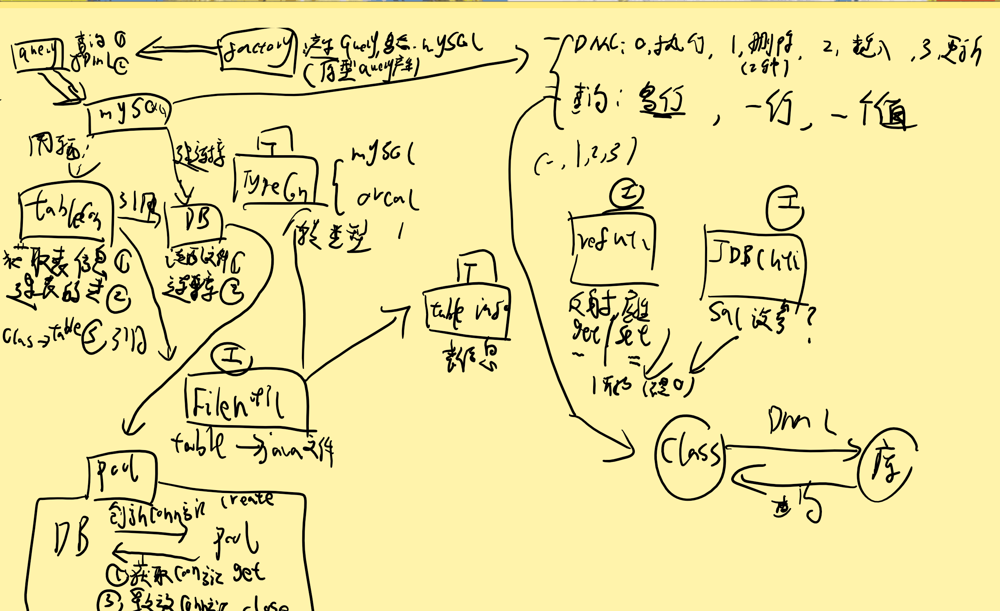
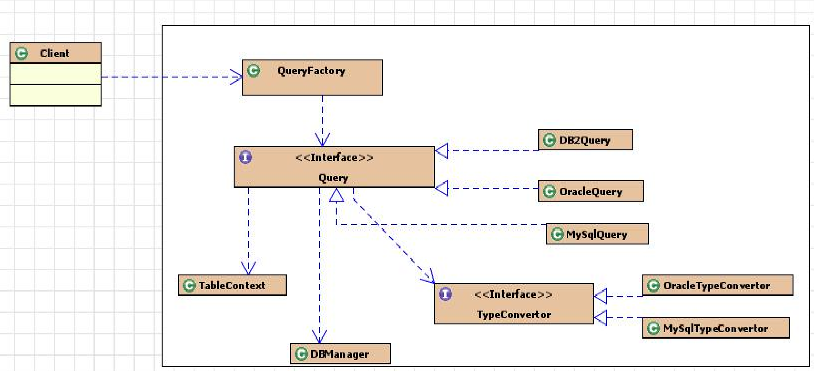
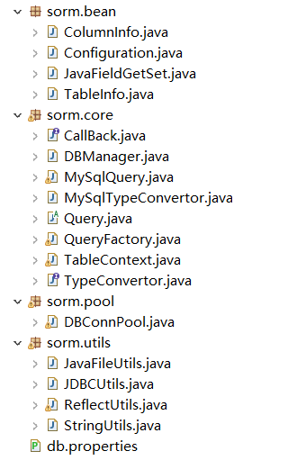

# SORM

## 零，总起

```
核心想法：

​	1，能在JAVA中，DML操作数据库。

​	2，同时，又能把数据库查询回JAVA对象。

类：

​	1，核心：Query 抽象类 及其 特定数据库继承类。  （提供查询以及DML操作）

​	2，配合类：

​			DBmanager 和 pool：自动读资源配置 和 定义了连接数据库 
​			Tablecontext :	自动获取表信息 和  手动建立表对应类  和  手动映射Class 和 表信息。
	3，工具类：
	JDBCUtils封装常用JDBC操作    ：sql设置参数
	StringUtils封装常用字符串操作 ：首字母大写
	JavaFileUtils封装java文件操作 ：完成table--> 类
	ReflectUtils封装常用反射操作  ：通过列信息调用Set，get方法
```






-----------------------------



## 一 ，从数据库折射到JAVA程序

1，

bean  Configura —-core DB    (读配置文件和连接和关闭)

bean ColonmInfo,bean TableInfo  

– core TableContext  (map1：tables  主键和表信息对应  )

​									（调用DB 连接和数据库元信息，，使得获得tables）

#目前，能够打印出所有表的信息


2，

#core TypeConvertor  和 MySqlTypeConvertor （ 表信息数据库字段类型变JAVA）

#为了生成源代码


3，

bean JAVAFieldGetSet   （为了封装 数据库字段变JAVA 源代码 的 数据） 

utils ：StringUTI  （首字母变大写）

JAVAFILEUti : 1）得到类属性方法变成代码

​						2）得到完成类代码

​						3）把生成类，写到指定位置

#JAVA的\ 都变成\\ \   ，，除了自己字符串简单转义

​										

TableContext ：  补充以下操作

​							利用fileutil 的创建类方法   （手动建立表对应类  ）

​							#updateJavaPOFile();

​							map2，将po的class对象和表信息对象关联起来（和  手动映射Class 和 表信息）

​						 #loadPOTables();


#目前，完成表类的创建


-------------------------------------

## 二，在JAVA上，操作，然后影响数据库

1

core:query  接口，，

mysql:实现类，，

0)   execuDML,,,  最终 执行DML语句的方法  （有个JDBC 工具类，设置参数用的）

1）delete，， 直接Class对象和ID，，能转化成tableinfo，，直接得到语句并返回参数

​					如果穿的是 OBJ，要调用上面的，则先得到Class，然后需要ID，

​								（只能通过反射工具类，util:REflec）

2）insert,,  OBJ,,得到Class，得到表信息，拼接SQL， 看看参数是不是空，不是空，拼接同时，

​						存下值。。最调用1） 执行，

​						（反射工具类，util:REflec得参数）

3）update，传入OBJ，和要改变的Str数组  ：

​		得到Class，得到表信息，拼接SQL，得到str的名字和反射得值。再拼接主键。

​		调用DML执行、

 

2，查询

1），queryRows 查询多行，传入语句，类，参数。

​			设参数，执行返回 Result,对象rs  （里面有满足要求的所有东西）

​			遍历一边，rs.next ：得到行，，

​			然后遍历每一列，用rs元信息得名称，用rs.getObj得值。

​										再反射set，把值注入名称里。

​			然后加入list ： 有多少行，就有多少对象


1.2）复杂的查询，例如join 先vo 下，建个新类，封装数据

SELECT e.id,salary+bonus 'all',d.dname 'deptName' 

 FROM emp e  JOIN dept d  ON e.deptId=d.id "


2）， 一行，调用1，返回[0]

3），一个值：Obj 或者 NUM : 就是不要双重循环了，不要元信息了，直接返回Obj 或Num

#Number 是基本和包装的父类，，得到后，随意转型


------------------------------------------------------------------

## 三，加GOF23 优化

1，重写query，把基础操作移到该类，同时模板查询方法

把query 重写变成抽象类，把Mysql基础操作全部移走。

同时增加查询的模板方法。：  运用匿名内部类完成那部分不同的重写：遍历行列，还是遍历一列


2，加入工厂类，对外都是通过工厂类来创建特定的Query 对象。

#工厂类，不能创建对象。。。创建Query的对象，用原型模式。


测试类中：

Query q = QueryFactory.createQuery();

q.XX

这样如果要修改程序效率。完全不影响调用。（去修改工厂。）


3，加入连接池：保持连接数，在一定范围，，要就拿走，不要就返回。 节省反复创建时间

DBManager： 提供创建一个conn的方法。

pool：  初始化时，一次性创建好。。

​			然后提供取走的方法  和 关闭的方法。


-----------------------------------

## 四，打包JAR，，和DOC

-------------------------------------------

## 五，调试bug:

1，当查询时候，多行多列，，反射设置对象的各个属性值，有空，空指针

1，，单列，那个bug，逻辑问题

2，，BY ID